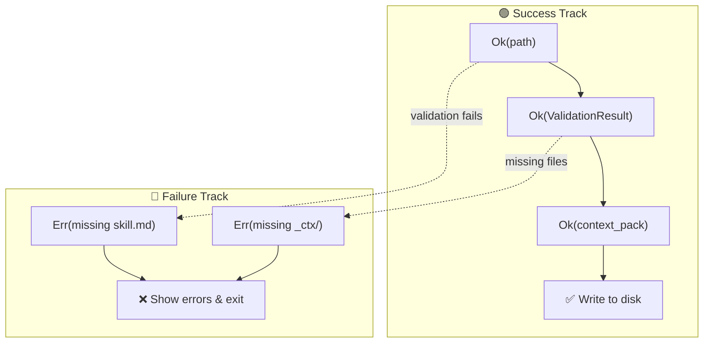

### Railway Oriented Programming

```mermaid
flowchart TD
    subgraph SUCCESS_TRACK["🟢 Success Track"]
        S1["Ok(path)"] --> S2["Ok(ValidationResult)"]
        S2 --> S3["Ok(context_pack)"]
        S3 --> S4["✅ Write to disk"]
    end
    
    subgraph FAILURE_TRACK["🔴 Failure Track"]
        F1["Err(missing skill.md)"]
        F2["Err(missing _ctx/)"]
        F3["❌ Show errors & exit"]
    end
    
    S1 -.->|"validation fails"| F1
    S2 -.->|"missing files"| F2
    F1 --> F3
    F2 --> F3
```
