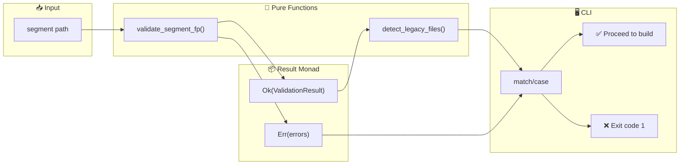

### Pipeline de Validación

```mermaid
flowchart LR
    subgraph INPUT["📥 Input"]
        PATH["segment path"]
    end

    subgraph PURE["🔷 Pure Functions"]
        V1["validate_segment_fp()"]
        V2["detect_legacy_files()"]
    end

    subgraph RESULT["📦 Result Monad"]
        OK["Ok(ValidationResult)"]
        ERR["Err(errors)"]
    end

    subgraph CLI["🖥️ CLI"]
        MATCH["match/case"]
        SUCCESS["✅ Proceed to build"]
        FAIL["❌ Exit code 1"]
    end

    PATH --> V1
    V1 --> OK
    V1 --> ERR
    OK --> V2
    V2 --> MATCH
    ERR --> MATCH
    MATCH --> SUCCESS
    MATCH --> FAIL
```
