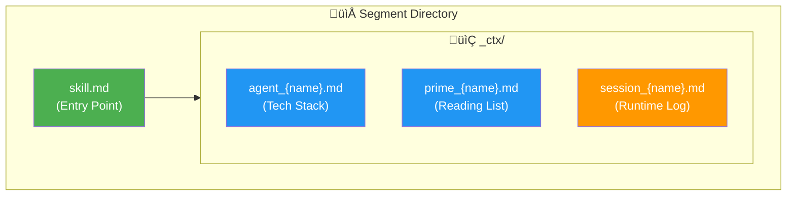

### North Star Structure (3+1 Files)

```mermaid
graph TB
    subgraph SEGMENT["📁 Segment Directory"]
        SKILL["skill.md<br/>(Entry Point)"]
        subgraph CTX["📂 _ctx/"]
            AGENT["agent_{name}.md<br/>(Tech Stack)"]
            PRIME["prime_{name}.md<br/>(Reading List)"]
            SESSION["session_{name}.md<br/>(Runtime Log)"]
        end
    end

    SKILL --> CTX

    style SKILL fill:#4CAF50,color:white
    style AGENT fill:#2196F3,color:white
    style PRIME fill:#2196F3,color:white
    style SESSION fill:#FF9800,color:white
```

---

**No `try/except` en el flujo principal.** Los errores son valores de primera clase.
