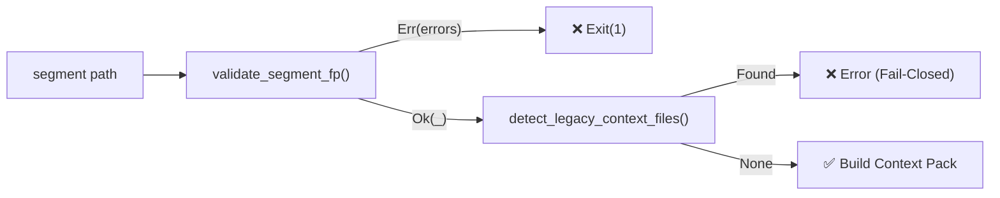

### 📊 Strict Control Flow Diagram

```mermaid
flowchart LR
    INPUT["segment path"] --> VALIDATE["validate_segment_fp()"]
    VALIDATE --"Err(errors)"--> EXIT_FAIL["❌ Exit(1)"]
    VALIDATE --"Ok(_)"--> LEGACY["detect_legacy_context_files()"]
    LEGACY --"Found"--> EXIT_LEGACY["❌ Error (Fail-Closed)"]
    LEGACY --"None"--> PROCEED["✅ Build Context Pack"]
```
