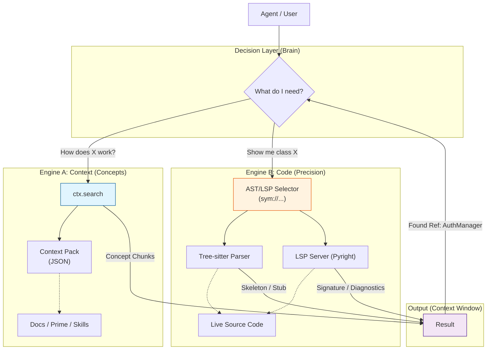

```mermaid
flowchart TB
    User[Agent / User]

    subgraph DecisionLayer ["Decision Layer (Brain)"]
        Intent{"What do I need?"}
    end

    subgraph EngineA ["Engine A: Context (Concepts)"]
        direction TB
        Search[ctx.search]
        Pack["Context Pack\n(JSON)"]
        Docs["Docs / Prime / Skills"]
    end

    subgraph EngineB ["Engine B: Code (Precision)"]
        direction TB
        Selector["AST/LSP Selector\n(sym://...)"]
        AST[Tree-sitter Parser]
        LSP["LSP Server (Pyright)"]
        LiveCode[Live Source Code]
    end

    subgraph Output ["Output (Context Window)"]
        Result
    end

    User --> Intent

    %% Path A: Conceptual Search
    Intent -- "How does X work?" --> Search
    Search --> Pack
    Pack -.-> Docs
    Search -- "Concept Chunks" --> Result

    %% Path B: Code Navigation
    Intent -- "Show me class X" --> Selector
    Selector --> AST
    Selector --> LSP
    AST -.-> LiveCode
    LSP -.-> LiveCode
    AST -- "Skeleton / Stub" --> Result
    LSP -- "Signature / Diagnostics" --> Result

    %% Interaction
    Result -- "Found Ref: AuthManager" --> Intent

    style Search fill:#e1f5fe,stroke:#01579b
    style Selector fill:#fff3e0,stroke:#e65100
    style Result fill:#f3e5f5,stroke:#4a148c
```
