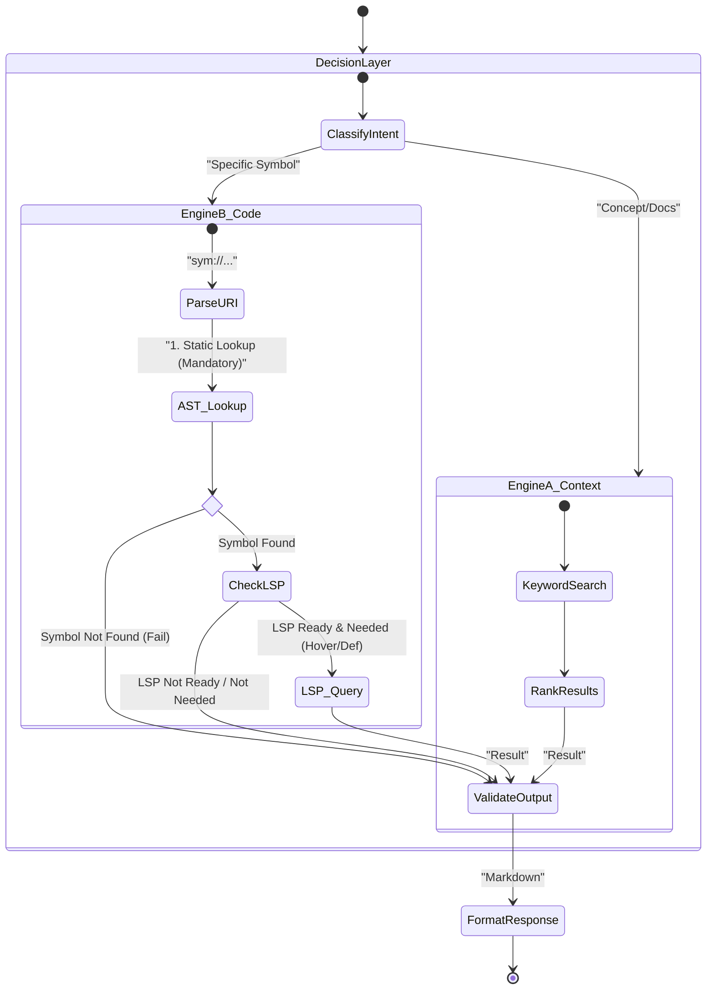

## 2. State Machine (Flow)

The system operates as a **Parallel Dispatch** based on Intent, with AST serving as the mandatory gate for Code Engine operations.

```mermaid
stateDiagram-v2
    [*] --> DecisionLayer

    state DecisionLayer {
        [*] --> ClassifyIntent
        ClassifyIntent --> EngineA_Context : "Concept/Docs"
        ClassifyIntent --> EngineB_Code : "Specific Symbol"
    }

    state EngineB_Code {
        [*] --> ParseURI : "sym://..."
        ParseURI --> AST_Lookup : "1. Static Lookup (Mandatory)"

        state ast_check <<choice>>
        AST_Lookup --> ast_check

        ast_check --> ValidateOutput : Symbol Not Found (Fail)
        ast_check --> CheckLSP : Symbol Found

        state CheckLSP <<choice>>
        CheckLSP --> ValidateOutput : LSP Not Ready / Not Needed
        CheckLSP --> LSP_Query : LSP Ready & Needed (Hover/Def)

        LSP_Query --> ValidateOutput : "Result<Hover>"
    }

    state EngineA_Context {
        [*] --> KeywordSearch
        KeywordSearch --> RankResults
        RankResults --> ValidateOutput : "Result<Hit>"
    }

    ValidateOutput --> FormatResponse: "Markdown"
    FormatResponse --> [*]
```

---
