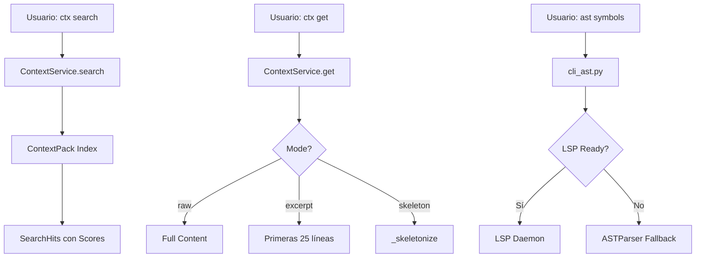

### 1.2 Flujo de Datos

```mermaid
graph TD
    A[Usuario: ctx search] --> B[ContextService.search]
    B --> C[ContextPack Index]
    C --> D[SearchHits con Scores]

    E[Usuario: ctx get] --> F[ContextService.get]
    F --> G{Mode?}
    G -->|raw| H[Full Content]
    G -->|excerpt| I[Primeras 25 líneas]
    G -->|skeleton| J[_skeletonize]

    K[Usuario: ast symbols] --> L[cli_ast.py]
    L --> M{LSP Ready?}
    M -->|Sí| N[LSP Daemon]
    M -->|No| O[ASTParser Fallback]
```

---
