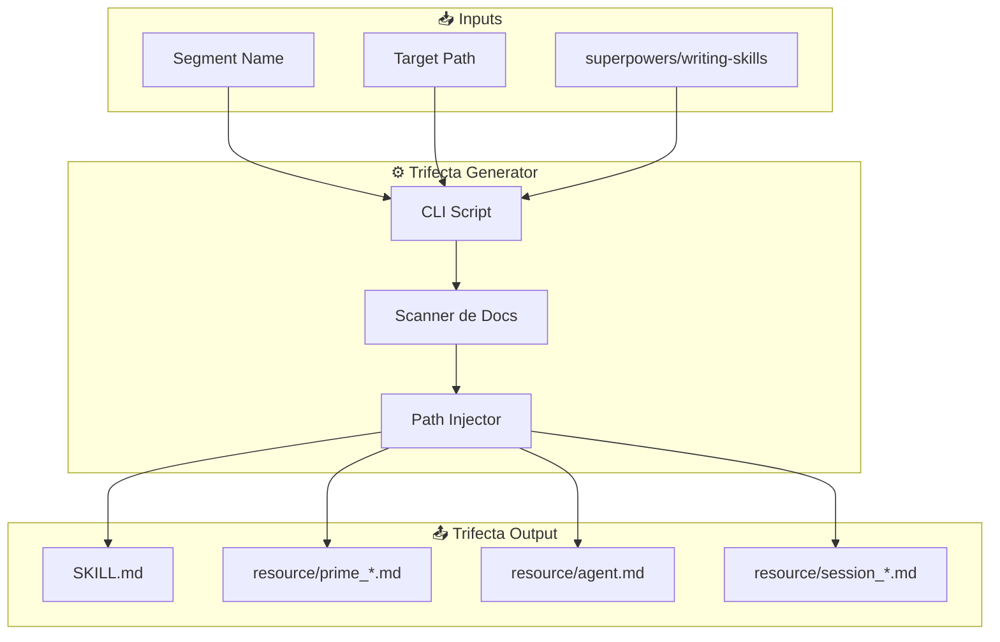

# 2) Flujo del Sistema Trifecta

```mermaid
flowchart TD
    subgraph INPUT["📥 Inputs"]
        SCOPE["Segment Name"]
        TARGET["Target Path"]
        SKILL_WRITER["superpowers/writing-skills"]
    end

    subgraph GENERATOR["⚙️ Trifecta Generator"]
        CLI["CLI Script"]
        SCAN["Scanner de Docs"]
        INJECT["Path Injector"]
    end

    subgraph OUTPUT["📤 Trifecta Output"]
        SKILL["SKILL.md"]
        PRIME["resource/prime_*.md"]
        AGENT["resource/agent.md"]
        SESSION["resource/session_*.md"]
    end

    SCOPE --> CLI
    TARGET --> CLI
    SKILL_WRITER --> CLI
    CLI --> SCAN
    SCAN --> INJECT
    INJECT --> SKILL
    INJECT --> PRIME
    INJECT --> AGENT
    INJECT --> SESSION
```

---
