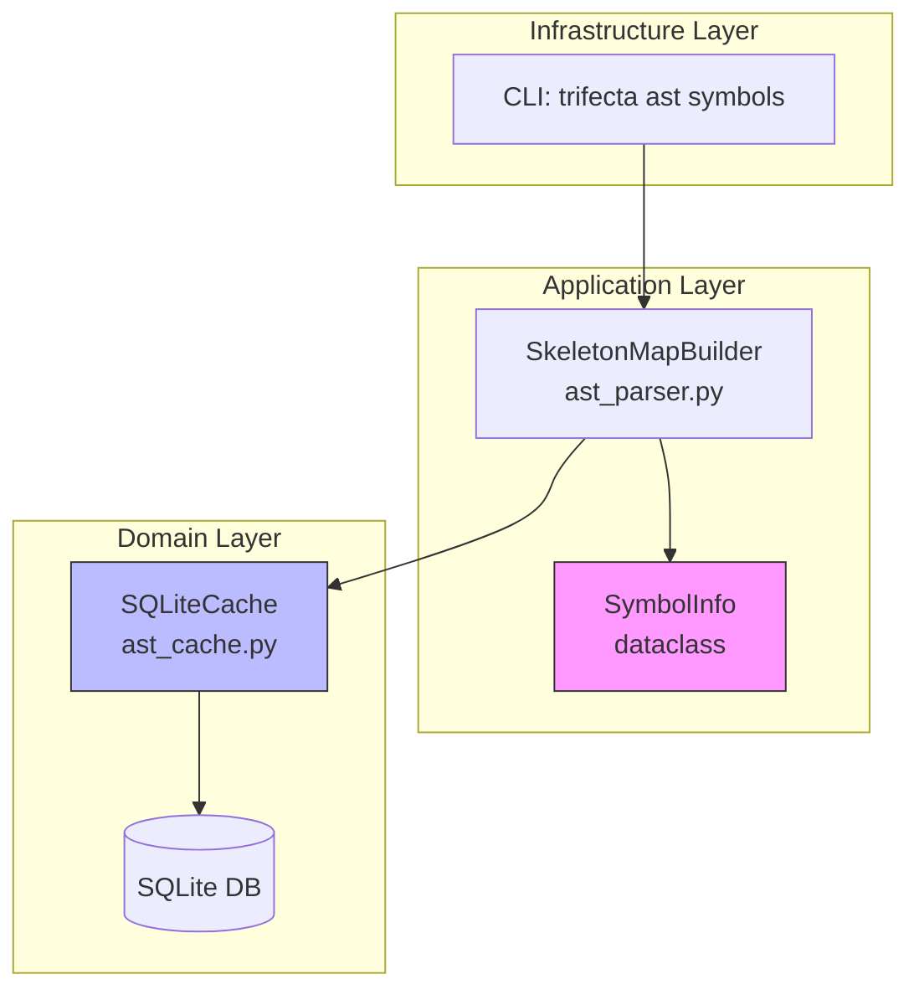
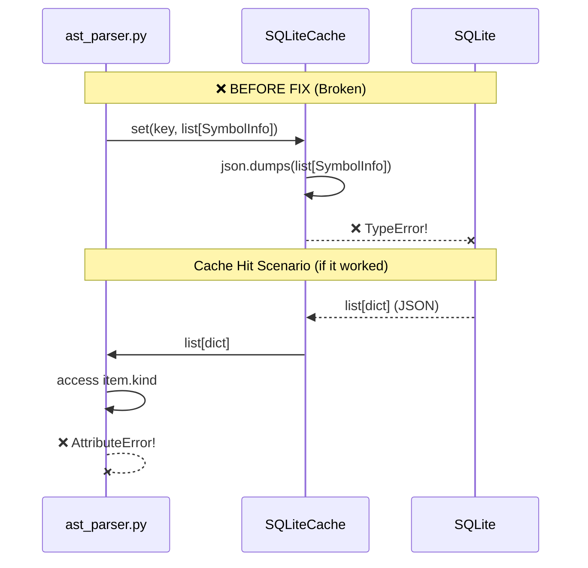
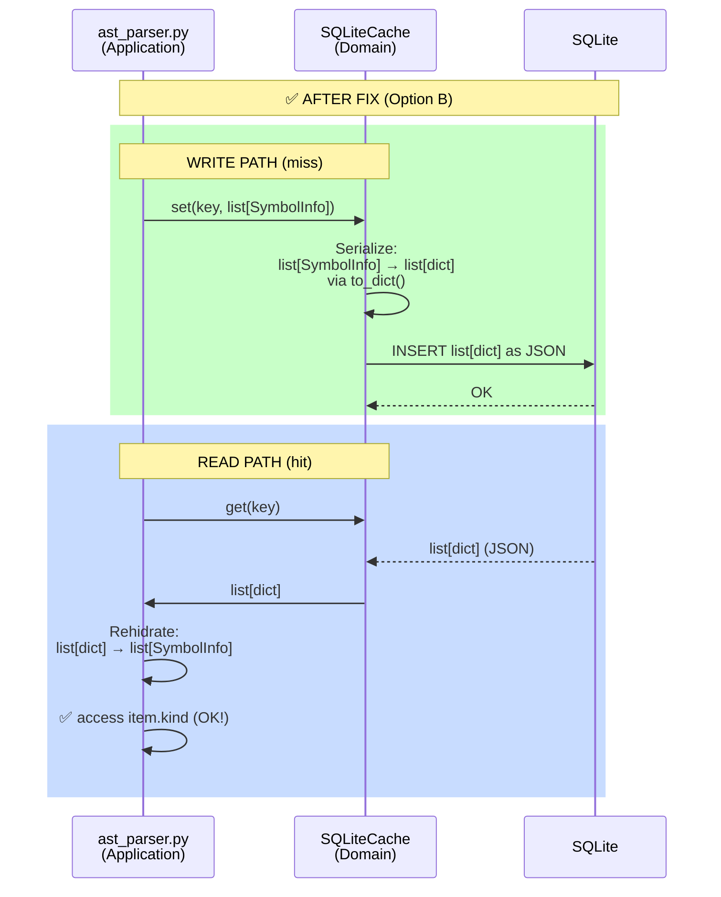

# ADR: AST Cache Semantic Roundtrip Contract

**Date**: 2026-01-05  
**Status**: Implemented  
**Context**: Fix for `--persist-cache` bug (SymbolInfo serialization)

## Architecture Overview



## Problem: Broken Roundtrip



## Problem

`SQLiteCache` was calling `json.dumps()` directly on `list[SymbolInfo]` dataclass objects, causing:
```
TypeError: Object of type SymbolInfo is not JSON serializable
```

Additionally, even if serialization worked, `cache.get()` would return `list[dict]`, but downstream consumers (`ast_parser.py`, `cli_ast.py`) expected `list[SymbolInfo]` with `.kind`, `.name`, `.start_line` attributes → would cause `AttributeError` on cache hit.

## Decision

**Implemented Option B: Caller-side Rehidration**

- **SQLiteCache.set()**: Serialize `list[SymbolInfo]` → `list[dict]` using `.to_dict()` or `asdict()`
- **ast_parser.py**: Rehidrate `list[dict]` → `list[SymbolInfo]` after `cache.get()`



### Rationale for Option B (vs Option A: Cache-side rehidration)

- SymbolInfo is in Application layer (`src/application/ast_parser.py`)
- SQLiteCache is in Domain layer (`src/domain/ast_cache.py`)
- **Clean Architecture**: Domain must NOT import Application
- Therefore: rehidration happens in caller (ast_parser.py)

## Implementation

**Files Modified**:
1. `src/domain/ast_cache.py` (+14 LOC in SQLiteCache.set, +3 LOC in _evict_if_needed)
2. `src/application/ast_parser.py` (+15 LOC for dict→SymbolInfo conversion)
3. `tests/unit/test_ast_cache_persist_fix.py` (+88 LOC new tests)

**Total**: ~120 LOC

## Verification

✅ Unit tests (2/2 passing)  
✅ Run #1 (miss): `{"status": "ok", "cache_status": "miss"}`  
✅ SQLite rows: 1  
✅ Run #2 (hit): `{"status": "ok", "cache_status": "hit"}` (no AttributeError)  
✅ Gate: 349 unit + 33 integration + 41 acceptance tests passing

## Consequences

- Cache semantic contract: consumers receive `list[SymbolInfo]`, not raw dicts
- Slight overhead: rehidration on cache hit (1-2ms for typical symbol counts)
- Tech debt: if SymbolInfo moves to Domain, refactor to Option A (cache-side rehidration) to reduce coupling
