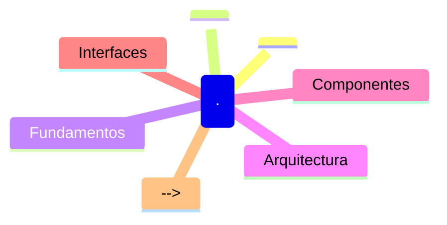

# Prime . - Lista de Lectura

> **REPO_ROOT**: `/Users/felipe_gonzalez/Developer/agent_h`
> Todas las rutas son relativas a esta raíz.
>
> **Orden de lectura**: Fundamentos → Implementación → Referencias

## 🔴 Prioridad ALTA - Fundamentos

**Leer primero para entender el contexto del segmento.**

<!-- Agregar documentos obligatorios -->

## 🟡 Prioridad MEDIA - Implementación

<!-- Documentación de implementación específica -->
<!-- Ejemplos: guías de uso, patrones de diseño -->

## 🟢 Prioridad BAJA - Referencias

<!-- Documentación de referencia, archivada -->
<!-- Ejemplos: API docs, especificaciones -->

## 🗺️ Mapa Mental

## 📚 Glosario

| Término | Definición |
|---------|------------|
| <!-- Agregar términos clave del segmento --> | <!-- Definiciones breves --> |

## 📝 Notas

- **Fecha última actualización**: 2025-12-29
- **Mantenedor**: <!-- Agregar si aplica -->
- **Ver también**: [skill.md](../skill.md) | [agent.md](./agent.md)
