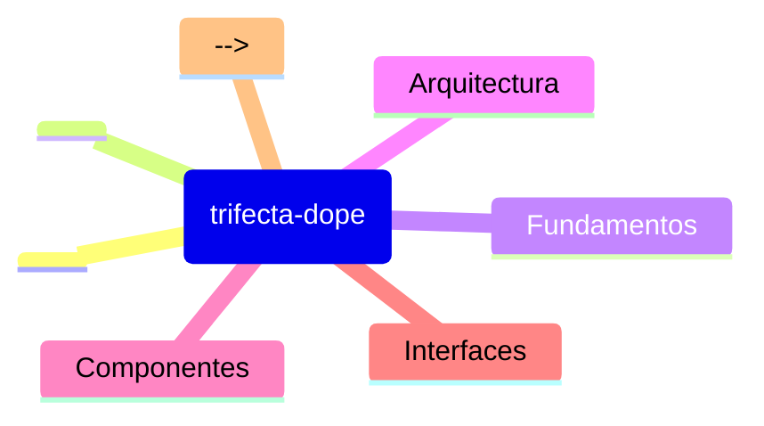

# Prime Trifecta Dope - Lista de Lectura

> **REPO_ROOT**: `/Users/felipe_gonzalez/Developer/agent_h/trifecta_dope`
> Todas las rutas son relativas a esta raiz.
>
> **Orden de lectura**: Fundamentos -> Implementacion -> Referencias

## [HIGH] Prioridad ALTA - Fundamentos

**Leer primero para entender el contexto del segmento.**

1. `README.md` - Visión general del proyecto y CLI
2. `skill.md` - Reglas de oro y protocolos de sesión
3. `RELEASE_NOTES_v1.md` - Estado actual y cambios recientes (T7/T8 Hardening)

## [MED] Prioridad MEDIA - Implementacion

<!-- Documentacion de implementacion especifica -->
<!-- Ejemplos: guias de uso, patrones de disenio -->

## [LOW] Prioridad BAJA - Referencias

<!-- Documentacion de referencia, archivada -->
<!-- Ejemplos: API docs, especificaciones -->

## [MAP] Mapa Mental

## [DICT] Glosario

| Termino | Definicion |
|---------|------------|
| <!-- Agregar terminos clave del segmento --> | <!-- Definiciones breves --> |

## [NOTE] Notas

- **Fecha ultima actualizacion**: 2025-12-31
- **Mantenedor**: <!-- Agregar si aplica -->
- **Ver tambien**: [skill.md](../skill.md) | [agent.md](./agent.md)

---

## [INDEX] Index para ctx.plan

### index.entrypoints

Puntos de entrada principales del segmento:

| Path | Razón |
|------|-------|
| `README.md` | Visión general del proyecto |
| `skill.md` | Reglas de oro y protocolos |
| `RELEASE_NOTES_v1.md` | Estado actual y cambios recientes |
| `src/infrastructure/cli.py` | CLI commands (ctx, telemetry) |
| `src/application/use_cases.py` | Use cases (Build, Stats, Load, Validate) |
| `src/infrastructure/telemetry.py` | Telemetry system |

### index.feature_map

Mapa de características → chunks relacionados:

| Feature | Chunk IDs | Paths | Keywords |
|---------|-----------|-------|-----------|
| telemetry | `skill:*`, `agent:*`, `ref:RELEASE_NOTES_v1.md` | `README.md`, `RELEASE_NOTES_v1.md`, `src/infrastructure/telemetry.py` | telemetry, events, metrics, token tracking |
| context_pack | `skill:*`, `prime:*`, `agent:*` | `src/application/use_cases.py`, `src/domain/context_models.py` | context pack, build, sync, validate |
| cli_commands | `skill:*` | `src/infrastructure/cli.py` | ctx.search, ctx.get, ctx.sync, ctx.stats, load |
| search | `skill:*`, `agent:*` | `src/application/search_get_usecases.py` | SearchUseCase, search, query |
| stats | `skill:*`, `agent:*` | `src/application/use_cases.py` | StatsUseCase, statistics, zero-hits |
