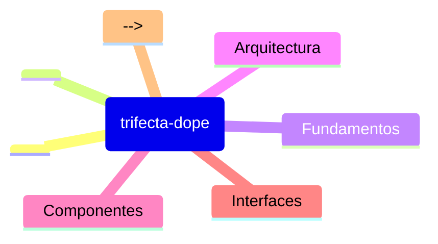

# Prime Trifecta Dope - Lista de Lectura

> **REPO_ROOT**: `/Users/felipe_gonzalez/Developer/agent_h/trifecta_dope`
> Todas las rutas son relativas a esta raiz.
>
> **Orden de lectura**: Fundamentos -> Implementacion -> Referencias

## [HIGH] Prioridad ALTA - Fundamentos

**Leer primero para entender el contexto del segmento.**

1. `README.md` - Visión general del proyecto y CLI
2. `skill.md` - Reglas de oro y protocolos de sesión
3. `RELEASE_NOTES_v1.md` - Estado actual y cambios recientes (T7/T8 Hardening)

## [MED] Prioridad MEDIA - Implementacion

<!-- Documentacion de implementacion especifica -->
<!-- Ejemplos: guias de uso, patrones de disenio -->

## [LOW] Prioridad BAJA - Referencias

<!-- Documentacion de referencia, archivada -->
<!-- Ejemplos: API docs, especificaciones -->

## [MAP] Mapa Mental

## [DICT] Glosario

| Termino | Definicion |
|---------|------------|
| <!-- Agregar terminos clave del segmento --> | <!-- Definiciones breves --> |

## [NOTE] Notas

- **Fecha ultima actualizacion**: 2025-12-29
- **Mantenedor**: <!-- Agregar si aplica -->
- **Ver tambien**: [skill.md](../skill.md) | [agent.md](./agent.md)
