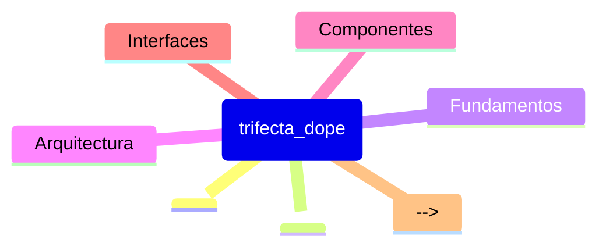

# Prime Trifecta_Dope - Lista de Lectura

> **REPO_ROOT**: `/Users/felipe_gonzalez/Developer/agent_h`
> Todas las rutas son relativas a esta raiz.
>
> **PRIME CONTRACT**:
> Prime contiene SOLO paths (1 línea por path) ordenados por prioridad.
> Prohibido incluir chunks, texto largo o comentarios inline.
> 1 línea = 1 Path Autoritativo.

## [HIGH] Prioridad ALTA - Fundamentos

**Leer primero para entender el contexto del segmento.**

1. `trifecta_dope/src/infrastructure/lsp_daemon.py`
2. `trifecta_dope/src/infrastructure/cli.py`
3. `trifecta_dope/src/infrastructure/lsp_client.py`
4. `trifecta_dope/src/infrastructure/telemetry.py`
5. `trifecta_dope/tests/integration/test_lsp_daemon.py`
6. `trifecta_dope/src/application/use_cases.py`
7. `trifecta_dope/src/domain/ast_models.py`
8. `trifecta_dope/.github/copilot-instructions.md`
9. `trifecta_dope/src/infrastructure/cli_ast.py`
10. `trifecta_dope/README.md`

## [MED] Prioridad MEDIA - Implementacion

<!-- Documentacion de implementacion especifica -->
<!-- Ejemplos: guias de uso, patrones de disenio -->

## [LOW] Prioridad BAJA - Referencias

<!-- Documentacion de referencia, archivada -->
<!-- Ejemplos: API docs, especificaciones -->

## [MAP] Mapa Mental

## [DICT] Glosario

| Termino | Definicion |
|---------|------------|
| <!-- Agregar terminos clave del segmento --> | <!-- Definiciones breves --> |

## [NOTE] Notas

- **Fecha ultima actualizacion**: 
- **Mantenedor**: <!-- Agregar si aplica -->
- **Ver tambien**: [skill.md](../skill.md) | [agent.md](./agent.md)
