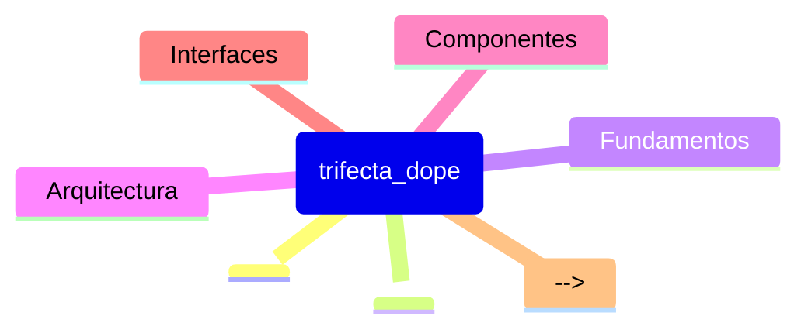

# Prime Trifecta_Dope - Lista de Lectura

> **REPO_ROOT**: `/Users/felipe_gonzalez/Developer/agent_h`
> Todas las rutas son relativas a esta raiz.
>
> **PRIME CONTRACT**:
> Prime contiene SOLO paths (1 línea por path) ordenados por prioridad.
> Prohibido incluir chunks, texto largo o comentarios inline.
> 1 línea = 1 Path Autoritativo.

## [HIGH] Prioridad ALTA - Fundamentos

**Leer primero para entender el contexto del segmento.**
1. `_ctx/generated/repo_map.md`
2. `_ctx/generated/symbols_stub.md`

1. `src/infrastructure/lsp_daemon.py`
2. `src/infrastructure/cli.py`
3. `src/infrastructure/lsp_client.py`
4. `src/infrastructure/telemetry.py`
5. `tests/integration/test_lsp_daemon.py`
6. `src/application/use_cases.py`
7. `src/domain/ast_models.py`
8. `.github/copilot-instructions.md`
9. `src/infrastructure/cli_ast.py`
10. `README.md`
11. `src/cli/error_cards.py`
12. `tests/acceptance/test_ctx_sync_preconditions.py`
13. `src/domain/naming.py`
14. `src/infrastructure/daemon_paths.py`

## [MED] Prioridad MEDIA - Implementación

**Leer para entender bugs recientes y testing.**

1. `docs/bugs/create_cwd_bug.md`
2. `tests/integration/test_lsp_telemetry.py`
3. `src/application/telemetry_reports.py`
4. `tests/integration/test_daemon_paths_constraints.py`

## [LOW] Prioridad BAJA - Referencias

<!-- Documentacion de referencia, archivada -->
<!-- Ejemplos: API docs, especificaciones -->

## [MAP] Mapa Mental

## [DICT] Glosario

| Término | Definición |
|---------|------------|
| **LSP Daemon** | Servidor LSP persistente con UNIX socket IPC, 180s TTL |
| **Error Card** | Sistema de errores estructurados con códigos estables (TRIFECTA_ERROR_CODE) |
| **Context Pack** | Archivo JSON con chunks de documentación indexados |
| **Segment** | Directorio de proyecto con `_ctx/` y configuración Trifecta |
| **Prime File** | `_ctx/prime_{segment_id}.md` - Lista de lectura prioritizada |
| **Dogfooding** | Testing real del CLI usando workflows completos (create→refresh-prime→sync) |

## [NOTE] Notas

- **Fecha ultima actualizacion**:
- **Mantenedor**: <!-- Agregar si aplica -->
- **Ver tambien**: [skill.md](../skill.md) | [agent.md](./agent.md)
