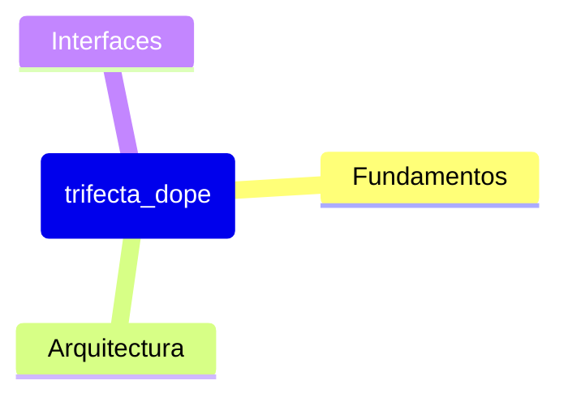

# Prime Trifecta_Dope - Lista de Lectura

> **SEGMENT_ROOT**: `.` (all paths relative to segment root)
>
> **Orden de lectura**: Fundamentos -> Implementacion -> Referencias

## [HIGH] Prioridad ALTA - Fundamentos

**Leer primero para entender el contexto del segmento.**

<!-- Agregar documentos obligatorios -->

## [MED] Prioridad MEDIA - Implementacion

<!-- Documentacion de implementacion especifica -->

## [LOW] Prioridad BAJA - Referencias

<!-- Documentacion de referencia, archivada -->

## [MAP] Mapa Mental

```mermaid
mindmap
  root(trifecta_dope)
    Fundamentos
    Arquitectura
    Interfaces
```

## [DICT] Glosario

| Termino | Definicion |
|---------|------------|
| <!-- Terminos clave --> | <!-- Definiciones --> |

## [NOTE] Notas

- **Fecha ultima actualizacion**: 2026-03-06
- **Mantenedor**: <!-- Agregar si aplica -->
- **Ver tambien**: [skill.md](skill.md) | [AGENTS.md](AGENTS.md)
