# Prime Trifecta_Dope - Lista de Lectura

> **REPO_ROOT**: `/Users/felipe_gonzalez/Developer/agent_h`
> Todas las rutas son relativas a esta raiz.
>
> **PRIME CONTRACT**:
> Prime contiene SOLO paths (1 línea por path) ordenados por prioridad.
> Prohibido incluir chunks, texto largo o comentarios inline.
> 1 línea = 1 Path Autoritativo.

## [HIGH] Prioridad ALTA - Fundamentos

**Leer primero para entender el contexto del segmento.**

### Entry Points & CLI
1. `trifecta_dope/skill.md`
2. `trifecta_dope/README.md`
3. `trifecta_dope/src/infrastructure/cli.py`
4. `trifecta_dope/src/infrastructure/cli_ast.py`

### Domain Layer (Pure Business Logic)
5. `trifecta_dope/src/domain/ast_models.py`
6. `trifecta_dope/src/domain/ast_cache.py`
7. `trifecta_dope/src/domain/models.py`
8. `trifecta_dope/src/domain/naming.py`
9. `trifecta_dope/src/domain/result.py`
10. `trifecta_dope/src/domain/constants.py`

### Application Layer (Use Cases)
11. `trifecta_dope/src/application/use_cases.py`
12. `trifecta_dope/src/application/context_service.py`
13. `trifecta_dope/src/application/search_get_usecases.py`
14. `trifecta_dope/src/application/ast_parser.py`
15. `trifecta_dope/src/application/pr2_context_searcher.py`

### Infrastructure Layer (Adapters)
16. `trifecta_dope/src/infrastructure/lsp_daemon.py`
17. `trifecta_dope/src/infrastructure/lsp_client.py`
18. `trifecta_dope/src/infrastructure/telemetry.py`
19. `trifecta_dope/src/infrastructure/factories.py`
20. `trifecta_dope/src/infrastructure/file_locked_cache.py`
21. `trifecta_dope/src/infrastructure/daemon_paths.py`

### Error Handling & Contracts
22. `trifecta_dope/src/cli/error_cards.py`
23. `trifecta_dope/src/application/exceptions.py`

### Testing - Critical Gates
24. `trifecta_dope/tests/acceptance/test_ctx_sync_preconditions.py`
25. `trifecta_dope/tests/integration/test_lsp_daemon.py`
26. `trifecta_dope/tests/integration/test_ast_cache_persist_cross_run_cli.py`

### Configuration & Contracts
27. `trifecta_dope/Makefile`
28. `trifecta_dope/pyproject.toml`
29. `trifecta_dope/docs/CLI_WORKFLOW.md`
30. `trifecta_dope/.github/copilot-instructions.md`

## [MED] Prioridad MEDIA - Implementación

**Leer para entender features específicos y testing.**

### Telemetry System
1. `trifecta_dope/src/application/telemetry_pr2.py`
2. `trifecta_dope/src/application/telemetry_reports.py`
3. `trifecta_dope/src/application/telemetry_charts.py`
4. `trifecta_dope/src/infrastructure/telemetry_cache.py`
5. `trifecta_dope/tests/integration/test_lsp_telemetry.py`

### Query Processing
6. `trifecta_dope/src/application/query_expander.py`
7. `trifecta_dope/src/application/query_normalizer.py`
8. `trifecta_dope/src/domain/query_linter.py`
9. `trifecta_dope/src/domain/anchor_extractor.py`

### Context & Search
10. `trifecta_dope/src/domain/context_models.py`
11. `trifecta_dope/src/application/chunking.py`
12. `trifecta_dope/src/infrastructure/file_system.py`

### Bug Documentation
13. `trifecta_dope/docs/bugs/create_cwd_bug.md`

### Integration Tests
14. `trifecta_dope/tests/integration/test_daemon_paths_constraints.py`
15. `trifecta_dope/tests/integration/test_ast_telemetry_consistency.py`

## [LOW] Prioridad BAJA - Referencias

**Documentación de referencia, archivada.**

1. `trifecta_dope/braindope.md`
2. `trifecta_dope/docs/CONTRACTS.md`
3. `trifecta_dope/CLAUDE.md`
4. `trifecta_dope/docs/adr/`

## [MAP] Architecture Diagram

```mermaid
flowchart TD
    subgraph DOMAIN["🏛️ Domain Layer"]
        direction LR
        D1[ast_models.py]
        D2[ast_cache.py]
        D3[models.py]
        D4[naming.py]
        D5[result.py]
        D6[constants.py]
    end

    subgraph APP["⚙️ Application Layer"]
        direction LR
        A1[use_cases.py]
        A2[context_service.py]
        A3[search_get_usecases.py]
        A4[ast_parser.py]
        A5[pr2_context_searcher.py]
    end

    subgraph INFRA["🔧 Infrastructure Layer"]
        direction LR
        I1[cli.py]
        I2[cli_ast.py]
        I3[lsp_daemon.py]
        I4[lsp_client.py]
        I5[factories.py]
        I6[telemetry.py]
    end

    subgraph FEATURES["📦 Core Features"]
        F1["Context Pack<br/>(sync/search/get/validate)"]
        F2["AST Symbols M1<br/>(symbols/cache-stats/clear)"]
        F3["Telemetry<br/>(report/chart/health)"]
        F4["LSP Integration<br/>(daemon 180s/hover/snippet)"]
    end

    subgraph QUALITY["🛡️ Quality Gates"]
        Q1["Testing<br/>(Unit/Integration/Acceptance)"]
        Q2["Type Safety<br/>(Pyright/Pyrefly)"]
        Q3["Linting<br/>(Ruff)"]
    end

    subgraph STORAGE["💾 Storage"]
        S1[(SQLite Cache)]
        S2[Events JSONL]
        S3[Segment Dirs]
    end

    subgraph CTX["📄 Context System"]
        C1[prime.md]
        C2[agent.md]
        C3[session.md]
        C4[skill.md]
    end

    %% Relationships
    DOMAIN --> APP
    APP --> INFRA
    INFRA --> FEATURES
    INFRA --> STORAGE
    QUALITY -.-> APP
    QUALITY -.-> DOMAIN
    CTX --> APP

    %% Styling
    style DOMAIN fill:#4CAF50,color:white
    style APP fill:#2196F3,color:white
    style INFRA fill:#FF9800,color:white
    style FEATURES fill:#9C27B0,color:white
    style QUALITY fill:#00BCD4,color:white
    style STORAGE fill:#607D8B,color:white
    style CTX fill:#795548,color:white
```

## [DICT] Glosario

| Término | Definición |
|---------|------------|
| **AST Symbols M1** | Sistema de extracción de símbolos Python vía AST (Production Ready) |
| **LSP Daemon** | Servidor LSP persistente con UNIX socket IPC, 180s TTL |
| **Error Card** | Sistema de errores estructurados con códigos estables (TRIFECTA_ERROR_CODE) |
| **Context Pack** | Archivo JSON con chunks de documentación indexados (digest + index + chunks) |
| **Segment** | Directorio de proyecto con `_ctx/` y configuración Trifecta |
| **Prime File** | `_ctx/prime_{segment_id}.md` - Lista de lectura prioritizada |
| **Skill File** | `skill.md` - Reglas operativas del segmento (MAX 100 líneas) |
| **Session File** | `_ctx/session_{segment_id}.md` - Log append-only de handoffs |
| **Dogfooding** | Testing real del CLI usando workflows completos (create→refresh-prime→sync) |
| **STALE FAIL-CLOSED** | Protocolo: si `ctx validate` falla, STOP → sync → re-validate |
| **Zero-Hit** | Búsqueda sin resultados - requiere refinamiento de query |
| **AST Cache** | Sistema de cache persistente SQLite para análisis AST |
| **PCC** | Programming Context Calling - paradigma meta-first, código on-demand |
| **WO** | Work Order - sistema de trabajo aislado vía git worktrees |
| **Telemetry** | Sistema de eventos audit-grade (events.jsonl, last_run.json) |

## [NOTE] Notas

- **Fecha ultima actualizacion**: 2026-02-16
- **Mantenedor**: Trifecta Core Team
- **Ver tambien**: [skill.md](../skill.md) | [agent.md](./agent.md) | [session.md](./session_trifecta_dope.md)
- **Schema Version**: v2.0 (Post-AST-Cache-Persist)
- **Total Paths**: 30 HIGH + 15 MED + 4 LOW
