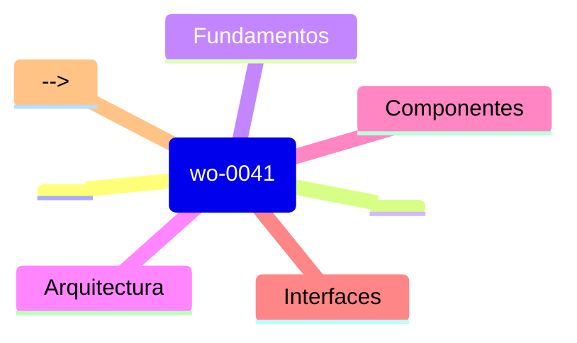

# Prime Wo 0041 - Lista de Lectura

> **REPO_ROOT**: `/Users/felipe_gonzalez/Developer/agent_h/.worktrees/WO-0041`
> Todas las rutas son relativas a esta raiz.
>
> **Orden de lectura**: Fundamentos -> Implementacion -> Referencias

## [HIGH] Prioridad ALTA - Fundamentos

**Leer primero para entender el contexto del segmento.**

<!-- Agregar documentos obligatorios -->

## [MED] Prioridad MEDIA - Implementacion

<!-- Documentacion de implementacion especifica -->
<!-- Ejemplos: guias de uso, patrones de disenio -->

## [LOW] Prioridad BAJA - Referencias

<!-- Documentacion de referencia, archivada -->
<!-- Ejemplos: API docs, especificaciones -->

## [MAP] Mapa Mental

## [DICT] Glosario

| Termino | Definicion |
|---------|------------|
| <!-- Agregar terminos clave del segmento --> | <!-- Definiciones breves --> |

## [NOTE] Notas

- **Fecha ultima actualizacion**: 2026-03-06
- **Mantenedor**: <!-- Agregar si aplica -->
- **Ver tambien**: [skill.md](skill.md) | [_ctx/agent_wo-0041.md](_ctx/agent_wo-0041.md)
