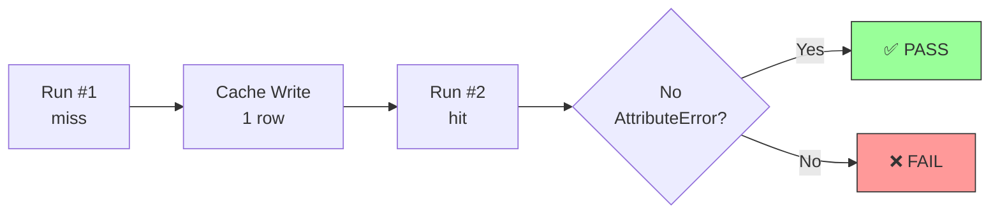

# PR: Fix AST Cache --persist-cache Serialization Bug

## Problem

`trifecta ast symbol... --persist-cache` crashed with:
```
TypeError: Object of type SymbolInfo is not JSON serializable
```

Additionally, even if serialization worked, the cache would return `list[dict]` but consumers expected `list[SymbolInfo]` with `.kind`, `.name`, `.start_line` attributes → would cause `AttributeError` on cache hit.

## Verification Flow



## Solution

**Implemented Option B: Caller-side Rehidration** (per Clean Architecture)

1. **SQLiteCache.set()** (`src/domain/ast_cache.py`):
   - Added serialization logic before `json.dumps()`
   - Checks for `.to_dict()` or dataclass fields
   - Converts `list[SymbolInfo]` → `list[dict]`

2. **ast_parser.py** (`src/application/ast_parser.py`):
   - Rehidrates `list[dict]` → `list[SymbolInfo]` after `cache.get()`
   - Maintains semantic contract for downstream consumers

3. **Bugfix** (`src/domain/ast_cache.py`):
   - Fixed pre-existing bug in `_evict_if_needed`: `current_bytes` was None when DB empty
   - Added `current_bytes = current_bytes or 0` guard

## Rationale for Option B

- SymbolInfo is in Application layer
- SQLiteCache is in Domain layer
- **Clean Architecture forbids Domain importing Application**
- Therefore: rehidration happens in caller (ast_parser.py)

## Changes

**Files Modified**:
- `src/domain/ast_cache.py` (+17 LOC)
- `src/application/ast_parser.py` (+15 LOC)
- `tests/unit/test_ast_cache_persist_fix.py` (+88 LOC new tests)
- `docs/adr/ADR-005-ast-cache-roundtrip.md` (documentation)

**Total**: ~120 LOC

## Verification

✅ **Unit Tests**: 2/2 passing  
✅ **Run #1 (miss)**: `{"status": "ok", "cache_status": "miss"}`  
✅ **Cache Write**: 1 row in SQLite  
✅ **Run #2 (hit)**: `{"status": "ok", "cache_status": "hit"}` (no AttributeError)  
✅ **Gate**: 428 tests passing (349 unit + 38 integration + 41 acceptance)

**Evidence Logs**:
- `/tmp/tf_pytest_ast_cache_fix.log`
- `/tmp/tf_post_fix_run1.log`
- `/tmp/tf_db_path.log`
- `/tmp/tf_cache_rowcount.log`
- `/tmp/tf_post_fix_run2.log`
- `/tmp/tf_gate_all.log`

## Tech Debt (Future Work)

See `docs/tech_debt_ast_cache.md` for:
- P2: Type safety enhancement in SQLiteCache.set()
- P3: Test for _evict_if_needed empty DB handling

## ADR

Documented in: `docs/adr/ADR-005-ast-cache-roundtrip.md`
