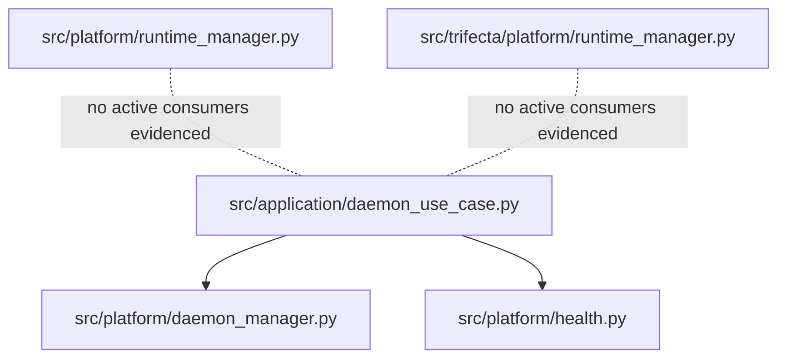

# ADR-004: Runtime surface SSOT and ownership

## Status

**PROPOSED** (2026-03-27)

## Context

Batch 2D was reopened as a documentation-first architecture decision, not as a runtime bugfix.

At current HEAD, runtime-related ownership is ambiguous across two surface families:

- `src/platform/*`
- `src/trifecta/platform/*`

The ambiguity is most visible in:

- `src/platform/runtime_manager.py` — protocol-only skeleton for runtime/daemon/health concerns
- `src/trifecta/platform/runtime_manager.py` — abstract/factory surface for runtime management in the `trifecta.platform` namespace

However, the active daemon control path evidenced in this worktree does **not** currently flow through either `runtime_manager` module. The current operational path is anchored in:

- `src/application/daemon_use_case.py`
- `src/platform/daemon_manager.py`
- `src/platform/health.py`

The Batch 2D checkpoint/handoff bundle also preserves the prior evidence that neither `src/platform/runtime_manager.py` nor `src/trifecta/platform/runtime_manager.py` has active consumers in `src/` or non-fixture tests at this time.

This creates a governance problem more than an implementation bug:

- two runtime surfaces can be mistaken as co-equal authorities
- opportunistic cleanup could target the wrong layer
- signature alignment between the two `runtime_manager` modules would be speculative without a live consumer
- missing support reports referenced in prior handoffs mean the decision must avoid fabricating stronger evidence than is available in this worktree

## Current authority snapshot

## Decision

For the current repository state:

1. **`src/platform/*` is the authoritative runtime surface for active daemon lifecycle and health behavior.**
   - This is an operational authority decision for the current codebase state, not a blanket statement about all future packaging.
2. **Neither `src/platform/runtime_manager.py` nor `src/trifecta/platform/runtime_manager.py` is SSOT for active runtime behavior in this phase.**
   - They must be treated as deferred or non-authoritative surfaces until a separate migration or consumer-driven change proves otherwise.
3. **This phase remains documentation-only.**
   - Do **not** edit `src/platform/runtime_manager.py`.
   - Do **not** edit `src/trifecta/platform/runtime_manager.py`.
   - The only exception is new, verifiable evidence of active consumers that turns the issue into a real behavior or contract bug.
4. **Any future attempt to make `src/trifecta/platform/*` the canonical runtime namespace requires an explicit follow-up change.**
   - That follow-up must identify active consumers, migration steps, verification scope, and the blast radius before code changes begin.

## Decision authority for Batch 2D

This ADR is the **authoritative decision record** for Batch 2D runtime SSOT/ownership.

The supporting artifacts for this batch are subordinate and must not silently redefine the decision:

| Artifact | Role | Authority |
|----------|------|-----------|
| `docs/adr/ADR-004-runtime-surface-ssot.md` | Runtime SSOT/ownership decision | **Authoritative** |
| `docs/plans/2026-03-27-batch-2d-runtime-ssot-design-plan.md` | Execution framing for the documentary task | Derived — cannot override this ADR |
| `_ctx/checkpoints/...batch-2d-runtime-manager-ssot-handoff.md` | Session recovery snapshot | Derived — context transfer only |
| `_ctx/handoff/...batch-2d-runtime-manager-ssot-design.md` | Next-agent continuity notes | Derived — context transfer only |
| `_ctx/handoff/...next-agent-checklist...md` | Operational checklist / guardrails | Derived — operational aid only |
| `docs/reports/*.md` | Evidence consolidation, if created later | Derived — evidence, not decision authority |

**Conflict rule:** if any supporting artifact conflicts with this ADR on scope, ownership, or whether runtime code should change, this ADR wins until a later ADR supersedes it.

## Irreversible decisions for this phase

The following Batch 2D decisions are intentionally sticky for the current documentary phase:

- Batch 2D is a **documentation/ownership task**, not a runtime bugfix.
- No one should edit `src/platform/runtime_manager.py` or `src/trifecta/platform/runtime_manager.py` without new, verifiable active-consumer evidence.
- Existing handoffs, plans, and checklists may refine execution order, but not weaken the no-patch guardrail.
- Any future runtime consolidation must be opened as an explicit follow-up, not smuggled in as cleanup.

## Alternatives considered

### Alternative A — Make `src/trifecta/platform/*` canonical now

- **Pros:** aligns with the packaged `trifecta.platform` namespace and could simplify future architecture storytelling
- **Cons:** no active-consumer evidence justifies a migration now; would force speculative code work; risks converting a documentation decision into an unjustified refactor

### Alternative B — Keep `src/platform/*` and `src/trifecta/platform/*` as co-equal runtime authorities

- **Pros:** avoids making an explicit choice today
- **Cons:** preserves the exact ambiguity causing Batch 2D drift; leaves room for conflicting patches and weak ownership assumptions

### Alternative C — Defer the decision entirely and document only that the area is ambiguous

- **Pros:** avoids overcommitting while evidence is incomplete
- **Cons:** still leaves no durable SSOT for reviewers and future contributors; does not reduce the chance of speculative runtime_manager cleanup

## Consequences

### Positive

- active daemon behavior now has a documented authority anchor: `src/platform/daemon_manager.py` + `src/platform/health.py`
- Batch 2D is explicitly closed as an ownership/SSOT decision, not reopened as a bugfix by inertia
- future runtime changes must justify themselves against real consumers instead of placeholder symmetry
- reviewers gain a durable citation for why `runtime_manager.py` was intentionally left untouched

### Negative

- the repository still contains two runtime_manager surfaces whose long-term consolidation is unresolved
- if the desired end-state is `trifecta.platform` ownership, a later migration ADR or implementation plan is still required
- support reports mentioned in prior handoffs are still missing in this worktree, so this ADR intentionally stays conservative about historical evidence claims

### Follow-up implications

- if a new consumer starts importing either `runtime_manager` module, re-open this decision with fresh evidence
- if runtime behavior must be unified under a single abstraction, create a dedicated implementation follow-up instead of patching opportunistically under Batch 2D
- if missing historical reports later appear, they may strengthen or refine this ADR, but they do not change the current no-patch guardrail by themselves

## Guardrails

- Treat this ADR as the primary decision record for Batch 2D runtime SSOT/ownership.
- Do not treat duplicate interface shape as sufficient reason to align or merge the two `runtime_manager` modules.
- Do not claim a runtime bugfix unless there is both:
  1. an active consumer, and
  2. an observable behavior or contract failure.
- Keep work isolated to the clean worktree used for this decision task.
- Do not invent or backfill missing support reports; reference their absence as a caveat until they actually exist.

## Non-goals

This ADR does **not**:

- implement a runtime-manager consolidation
- deprecate or delete either `runtime_manager` module in code
- rename packages or move modules between `src/platform/` and `src/trifecta/platform/`
- treat Batch 2D as a cleanup patch for unused runtime skeletons

## Re-open triggers

Revisit this ADR only if at least one of the following becomes true:

- new, verifiable active consumers depend on `src/platform/runtime_manager.py`
- new, verifiable active consumers depend on `src/trifecta/platform/runtime_manager.py`
- a scoped migration plan is approved to consolidate runtime authority under a single namespace
- a runtime contract failure is observed and traced back to the current SSOT ambiguity

## References

- `docs/plans/2026-03-27-batch-2d-runtime-ssot-design-plan.md`
- `docs/plans/2026-03-26-lsp-daemon-followup-batches.md`
- `_ctx/checkpoints/2026-03-27/checkpoint_132457_batch-2d-runtime-manager-ssot-handoff.md`
- `_ctx/handoff/handoff_2026-03-27_batch-2d-runtime-manager-ssot-design.md`
- `_ctx/handoff/next-agent-checklist_2026-03-27_batch-2d-runtime-manager-ssot-design.md`

## Notes

The support paths `docs/reports/2026-03-26-daemon-drift-code-audit.md` and `docs/reports/2026-03-26-lsp-daemon-comprehensive-review.md` were still absent in this worktree when this ADR was created. Their absence is a caveat, not a gap to be silently filled with assumptions.
