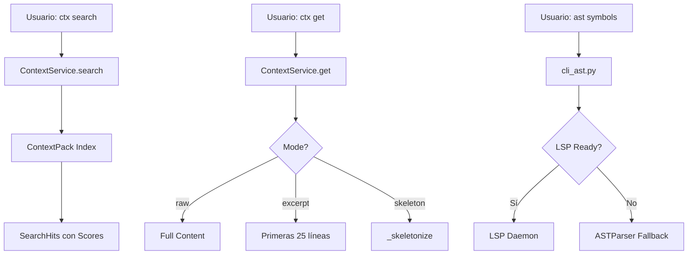

# Informe Técnico: Progressive Disclosure en Trifecta

**Fecha**: 2026-01-02
**Autor**: Análisis técnico del código fuente
**Versión**: v1.0

---

## Resumen Ejecutivo

Trifecta implementa un sistema de **Progressive Disclosure (PD)** de 2 capas funcionales (L0 y L1) con mecanismos de presupuesto de tokens y fallback robusto. Este documento detalla la arquitectura actual, implementación, gaps identificados y roadmap.

---

## Tabla de Contenidos

1. [Arquitectura General](#1-arquitectura-general)
2. [Capa L0: Skeleton Mode](#2-capa-l0-skeleton-mode)
3. [Capa L1: AST y LSP](#3-capa-l1-ast-y-lsp)
4. [Capa L2: Estado Actual](#4-capa-l2-estado-actual)
5. [CLI y Ejemplos de Uso](#5-cli-y-ejemplos-de-uso)
6. [Gaps y Recomendaciones](#6-gaps-y-recomendaciones)
7. [Anexos](#7-anexos)

---

## 1. Arquitectura General

### 1.1 Componentes Principales

```
┌─────────────────────────────────────────────────────────────┐
│                     Trifecta CLI                            │
├─────────────────────────────────────────────────────────────┤
│  ┌───────────────┐  ┌───────────────┐  ┌───────────────┐   │
│  │   ctx sync    │  │   ctx search  │  │    ctx get    │   │
│  │   (Build)     │  │  (Discovery)  │  │  (Retrieval)  │   │
│  └───────┬───────┘  └───────┬───────┘  └───────┬───────┘   │
│          │                  │                  │           │
│          └──────────────────┴──────────────────┘           │
│                             │                               │
│                    ┌────────▼────────┐                      │
│                    │ ContextService  │                      │
│                    │  (L0 Logic)     │                      │
│                    └────────┬────────┘                      │
│                             │                               │
│              ┌──────────────┴──────────────┐               │
│              │                             │               │
│      ┌───────▼────────┐          ┌────────▼──────┐        │
│      │ context_pack   │          │   LSP Daemon   │        │
│      │   (Index)      │          │   (L1 Logic)   │        │
│      └────────────────┘          └───────────────┘        │
└─────────────────────────────────────────────────────────────┘
```

### 1.2 Flujo de Datos



---

## 2. Capa L0: Skeleton Mode

### 2.1 Definición

**L0 Skeleton** es una transformación del contenido que extrae únicamente la estructura esencial:
- Encabezados Markdown (`#`)
- Marcadores de bloques de código (```)
- Primeras líneas de bloques que contienen firmas de funciones/clases

### 2.2 Implementación

**Ubicación**: `src/application/context_service.py:265-301`

```python
def _skeletonize(self, text: str) -> str:
    """
    Extract headings and code block markers to create a structure view.
    """
    skeleton_lines = []
    in_code_block = False

    for line in text.splitlines():
        line_strip = line.strip()

        # Keep headings
        if line_strip.startswith("#"):
            skeleton_lines.append(line)
            continue

        # Keep code block markers
        if line_strip.startswith("```"):
            skeleton_lines.append(line)
            in_code_block = not in_code_block
            continue

        # If inside code block, keep first line (signature)
        if (
            in_code_block
            and len(skeleton_lines) > 0
            and skeleton_lines[-1].strip().startswith("```")
        ):
            if any(
                kw in line
                for kw in ["def ", "class ", "interface ", "function ", "const ", "var "]
            ):
                skeleton_lines.append(f"  {line_strip}")

    return "\n".join(skeleton_lines) if skeleton_lines else text[:200] + "..."
```

### 2.3 Ejemplo de Salida

**Entrada** (Archivo completo de 200 líneas):
```python
"""
Módulo de ejemplo con muchas funciones.
"""

def suma(a, b):
    """Suma dos números."""
    return a + b

# [50 líneas más de implementación...]

class Calculadora:
    """Clase principal."""

    def __init__(self):
        self.valor = 0

    # [100 líneas más de métodos...]
```

**Salida Skeleton**:
```python
"""
Módulo de ejemplo con muchas funciones.
"""

def suma(a, b):

class Calculadora:
```

### 2.4 Modos de Operación L0

| Modo | Parámetro | Comportamiento | Tokens Típicos |
|------|-----------|----------------|----------------|
| **raw** | `mode="raw"` | Contenido completo con guardrail de budget | 100% |
| **excerpt** | `mode="excerpt"` | Primeras 25 líneas | ~15-25% |
| **skeleton** | `mode="skeleton"` | Solo estructura (L0 puro) | ~5-10% |
| **auto** | (no implementado) | Basado en score del chunk | - |

### 2.5 Presupuesto de Tokens (Backpressure)

**Ubicación**: `src/application/context_service.py:111-223`

```python
def get(
    self,
    ids: list[str],
    mode: Literal["raw", "excerpt", "skeleton"] = "raw",
    budget_token_est: Optional[int] = None,
    max_chunks: Optional[int] = None,
    stop_on_evidence: bool = False,
    query: Optional[str] = None,
) -> GetResult:
```

**Comportamiento**:
- Default budget: 1200 tokens
- Si un chunk excede el presupuesto en modo `raw`, se reduce a 20 líneas
- Se deja de procesar IDs cuando se alcanza el presupuesto
- `stop_reason`: `"complete"`, `"budget"`, `"max_chunks"`, `"evidence"`

---

## 3. Capa L1: AST y LSP

### 3.1 Arquitectura L1

```
┌─────────────────────────────────────────────────────────┐
│                    Capa L1                              │
├─────────────────────────────────────────────────────────┤
│                                                          │
│  ┌──────────────┐      ┌──────────────────────┐        │
│  │ cli_ast.py   │──────│ SymbolResolver       │        │
│  │              │      │ (URI → File)         │        │
│  └──────┬───────┘      └──────────────────────┘        │
│         │                                                 │
│         ├──► LSP Daemon (si READY)                       │
│         │    └─> textDocument/hover                     │
│         │                                                 │
│         └──► ASTParser (fallback)                       │
│              └─> tree-sitter (o stub)                   │
│                                                          │
└─────────────────────────────────────────────────────────┘
```

### 3.2 LSP Daemon

**Ubicación**: `src/infrastructure/lsp_daemon.py`

**Características**:
- **Socket IPC**: Comunicación vía Unix socket
- **TTL**: 180 segundos de inactividad antes de shutdown
- **Lifecycle**: `connect_or_spawn()` → Spawn único → Warm wait → Ready
- **Telemetría**: Eventos `lsp.daemon_status`, `lsp.request`, `lsp.fallback`

**Flujo de Conexión**:

```python
# cli_ast.py:41-44
from src.infrastructure.lsp_daemon import LSPDaemonClient

client = LSPDaemonClient(root)
client.connect_or_spawn()  # Fire & Forget spawn if needed
```

**Estado del Daemon**:
```
SPAWNED → WARMING → READY → (TTL) → SHUTDOWN
         ↑                        ↓
         └────────── fallback ────┘
```

### 3.3 AST Parser

**Ubicación**: `src/application/ast_parser.py`

**Estado Actual**: Implementación simplificada (stub)

```python
class ASTParser:
    def parse(self, file_path: Path) -> Tuple[List[ChildSymbol], str]:
        content = file_path.read_text(errors="replace")
        sha8 = hashlib.sha256(content.encode()).hexdigest()[:8]

        # Fake children para demostración
        children = [
            ChildSymbol(
                name="example_func",
                kind="function",
                range=Range(start_line=1, end_line=10),
                signature_stub="def example_func():",
            ),
        ]
        return children, sha8
```

**Nota**: El código indica que tree-sitter fue usado en "Phase 2a" pero fue simplificado para "restoration risk management".

### 3.4 Comandos CLI L1

#### `ast symbols`
```bash
uv run trifecta ast symbols sym://python/mod/context_service/ContextService
```

**Flujo**:
1. Parse URI → `SymbolQuery`
2. `SymbolResolver` resuelve a archivo
3. Check LSP readiness → Fallback a AST si no ready
4. Parse con ASTParser → Output skeleton JSON

#### `ast hover`
```bash
uv run trifecta ast hover src/application/context_service.py -l 50 -c 15
```

**Flujo**:
1. Spawn/connect LSP Daemon
2. Warm wait hasta 200ms
3. Si READY → `textDocument/hover` request
4. Si no → Fallback a AST skeleton

---

## 4. Capa L2: Estado Actual

### 4.1 ¿Existe L2?

**Respuesta**: **NO**, L2 no está implementado actualmente.

**Evidencia**:
- No hay mención de L2 en el código fuente
- `SCOPE_PD_L0_REPORT.md` solo documenta L0 y L1
- No hay comandos CLI que correspondan a L2

### 4.2 ¿Qué sería L2?

Basado en la arquitectura, L2 potencialmente sería:
- **Full content retrieval**: Sin skeletonización ni truncado
- **Multi-file context**: Chunks de múltiples archivos relacionados
- **Deep analysis**: Información de tipos, referencias cruzadas, call graphs

### 4.3 Implementación Implícita

El modo `raw` con `budget_token_est` alto podría considerarse una forma de L2:

```python
# Equivalente a L2 "de facto"
ctx.get(ids=["chunk_id"], mode="raw", budget_token_est=10000)
```

Sin embargo, esto no es una "capa" arquitectónica, solo un parámetro de configuración.

---

## 5. CLI y Ejemplos de Uso

### 5.1 Comandos Disponibles

```bash
# Build & Index
uv run trifecta ctx sync -s .

# Search (L0)
uv run trifecta ctx search -s . -q "Verification"

# Get con modos (L0)
uv run trifecta ctx get -s . -i "skill:abc123" --mode skeleton
uv run trifecta ctx get -s . -i "skill:abc123" --mode excerpt
uv run trifecta ctx get -s . -i "skill:abc123" --mode raw

# AST/LSP (L1)
uv run trifecta ast symbols sym://python/mod/context_service
uv run trifecta ast hover src/application/context_service.py -l 50 -c 15
```

### 5.2 Ejemplo Completo de Uso

```bash
# 1. Sincronizar contexto
$ uv run trifecta ctx sync -s .
🔄 Running build...
✅ Build complete. Validating...
✅ Validation Passed
🔄 Regenerating stubs...
   ✅ Regenerated: repo_map.md, symbols_stub.md

# 2. Buscar chunks relevantes
$ uv run trifecta ctx search -s . -q "telemetry"
Search Results (3 hits):
1. [skill:abc123] telemetry.md
   Score: 1.00 | Tokens: ~450
2. [prime:def456] prime_telemetry.md
   Score: 0.75 | Tokens: ~200

# 3. Obtener L0 skeleton
$ uv run trifecta ctx get -s . -i "skill:abc123" --mode skeleton
Selected Chunks (1):
1. [skill:abc123] telemetry.md
   ## Overview
   ## Usage
   def record_event():
   def flush():
   ...
Total Tokens: ~45

# 4. Obtener L1 hover info
$ uv run trifecta ast hover src/infrastructure/telemetry.py -l 42 -c 10
{
  "status": "ok",
  "kind": "skeleton",
  "data": {
    "uri": "src/infrastructure/telemetry.py",
    "range": {"start_line": 42, "end_line": 52},
    "children": []
  }
}
```

---

## 6. Gaps y Recomendaciones

### 6.1 Gaps Identificados

| Gap | Severidad | Ubicación | Impacto |
|-----|-----------|-----------|---------|
| **Score-based Auto PD** | Alta | `ContextService.get` | El agente debe elegir modo manualmente |
| **LSP value prop** | Media | `cli_ast.py` | LSP se usa pero output es siempre AST skeleton |
| **AST Parser stub** | Media | `ast_parser.py` | tree-sitter fue removido por "risk management" |
| **L2 no existe** | Alta | Arquitectura | No hay capa de análisis profundo |
| **Cross-file skeleton** | Baja | `context_pack.json` | No hay skeleton pre-calculado en index |

### 6.2 Roadmap Sugerido

#### Corto Plazo (Sprints 1-2)
1. **Score-based Auto PD**
   ```python
   def get(self, ..., auto_mode=True):
       if auto_mode and score < 0.6:
           mode = "skeleton"  # L0 auto
   ```

2. **LSP Real Output**
   ```python
   # En hover, retornar resultado real de LSP
   if result := client.request("textDocument/hover", ...):
       return ASTResponse(kind="lsp", data=result)
   ```

#### Medio Plazo (Sprints 3-4)
3. **Restore tree-sitter** o parser robusto
4. **L2 Definition**: Diseñar qué significa L2 (multi-file? types?)

#### Largo Plazo (Sprints 5+)
5. **Cross-file Index**: Skeletons pre-calculados en `context_pack.json`
6. **Semantic Search**: Embeddings + similarity vs keyword matching

---

## 7. Anexos

### 7.1 Modelos de Dominio

**Ubicación**: `src/domain/context_models.py`

```python
class ContextChunk(BaseModel):
    id: str
    doc: str
    title_path: List[str]
    text: str
    token_est: int
    source_path: str

class GetResult(BaseModel):
    chunks: List[ContextChunk]
    total_tokens: int
    stop_reason: str  # "complete", "budget", "max_chunks", "evidence"
    evidence_metadata: dict
```

### 7.2 Referencias de Archivos

| Componente | Archivo Principal |
|------------|-------------------|
| L0 Logic | `src/application/context_service.py` |
| L1 CLI | `src/infrastructure/cli_ast.py` |
| LSP Daemon | `src/infrastructure/lsp_daemon.py` |
| AST Parser | `src/application/ast_parser.py` |
| Domain Models | `src/domain/context_models.py` |
| Telemetry | `src/infrastructure/telemetry.py` |

### 7.3 Métricas de Telemetría

| Evento | Props | Métricas |
|--------|-------|----------|
| `selector.resolve` | `symbol_query`, `resolved` | `duration_ms` |
| `ast.parse` | `file`, `symbols_count` | `cache_hit` |
| `lsp.request` | `method`, `resolved` | `duration_ms` |
| `lsp.fallback` | `reason`, `fallback_to` | `warm_wait_ms` |
| `lsp.daemon_status` | `state` | `warm_wait_ms` |

---

## Conclusión

Trifecta tiene **L0 funcional** (skeletonization sólida) y **L1 parcial** (LSP daemon + AST fallback). **L2 no existe** como capa arquitectónica.

Los gaps principales son:
1. Auto-selección de modo basado en score
2. LSP no aporta valor real en el output
3. Falta definición de qué es L2

El sistema es **auditable**, **robusto** (fallbacks), y **telemetrizado** bien, pero necesita iteración para cumplir la visión completa de Progressive Disclosure.
