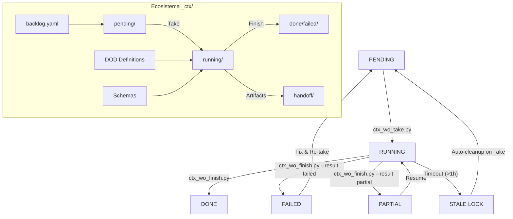

# Manual Operativo: Work Orders (WO) en Trifecta Dope

Este documento describe el ciclo de vida, los procesos técnicos y las herramientas para la gestión de Work Orders (WO) garantizando un estándar de **grado auditoría**.

---

## 0. EntryPoints Oficiales (Single Source of Truth)

Los siguientes comandos son los **únicos mecanismos válidos** para interactuar con WOs:

| Acción    | Comando Oficial            | Observación                      |
| --------- | ------------------------- | -------------------------------- |
| Crear WO  | `make wo-new`            | Usa `ctx_wo_bootstrap.py`        |
| Preflight | `make wo-preflight`       | Usa `ctx_wo_preflight.py`        |
| Tomar WO  | `ctx_wo_take.py WO-XXXX` | No se mueve YAML manualmente      |
| Cerrar WO | `ctx_wo_finish.py WO-XXXX` | Único mecanismo válido de cierre |

### Prohibido

* Editar `_ctx/jobs/done/` manualmente
* Ejecutar `wo_verify.sh` directamente
* Usar `verify.sh` como sustituto de `ctx_wo_finish.py`
* Mover YAML entre estados manualmente

Si se detecta bypass → el estado se considera corrupto.

---

## 1. Ciclo de Vida del WO (Máquina de Estados)

Cada WO sigue una máquina de estados inmutable definida en el dominio (`wo_entities.py`).



### Estados Detallados

* **PENDING**: Identificado en el backlog. Invariante: No puede tener `started_at`.
* **RUNNING**: En ejecución activa. Invariante: OBLIGATORIO tener `started_at` y `.lock`.
* **DONE / FAILED / PARTIAL**: Estados terminales o estables. Invariante: OBLIGATORIO tener `finished_at` posterior a `started_at` y `verified_at_sha`.

### WOs Stale (Sin Lock)

Los WOs en estado `running` deben tener un archivo `.lock` asociado. El hook `trifecta_integrity_check.py` valida esto en cada commit:

* **< 24h sin lock**: **FAIL** - El commit se bloquea (protección activa)
* **> 24h sin lock**: **WARN** - El commit permite continuar pero muestra advertencia

Esto permite que WOs interrumpidos (crashes, sessions terminadas abruptamente) no bloqueen indefinidamente el trabajo, mientras protege contra WOs activos sin lock.

**Acción recomendada para WOs stale**: Ejecutar `ctx_reconcile_state.py` o `ctx_wo_finish.py` según corresponda.

---

## 2. Invariantes de Seguridad y Transacciones

El sistema Trifecta utiliza un enfoque **Fail-Closed** basado en transacciones atómicas.

### A. Transacciones y Rollback (LIFO)

Tanto el `take` como el `finish` operan bajo un esquema de transacciones. Si un paso falla (ej: error al crear el worktree), el sistema ejecuta una compensación en orden inverso (**LIFO - Last In, First Out**):

1. Si falló el movimiento del YAML, se intenta restaurar desde el estado anterior.
2. Si falló la creación del worktree, se elimina el branch generado.
3. Finalmente, se libera el lock atómico.

### B. Locking Atómico de Grado Industrial

El sistema evita condiciones de carrera (race conditions) mediante dos mecanismos:

* **Principal**: `os.link()` para crear hard-links, una operación atómica a nivel de kernel.
* **Fallback**: `os.rename()` si el filesystem no soporta hard-links.
* **Heartbeat**: Los procesos largos actualizan el timestamp del archivo `.lock` para evitar ser marcados como persistencia huérfana.

### C. Filtrado por Políticas (`ctx_finish_ignore.yaml`)

Durante el cierre, Trifecta valida que no se hayan modificado archivos sensibles al contrato del sistema:

* **Ignorados**: Telemetría, logs, handoffs, y el propio YAML en ejecución.
* **Bloqueantes**: Si el `git diff` detecta cambios en `_ctx/backlog/`, `_ctx/schemas/` o `_ctx/dod/`, el cierre se bloquea automáticamente para evitar "split-brain" en la gobernanza.

---

## 3. Flujo Técnico: Tomar un WO (Take)

### Proceso Interno

1. **Linter Strict**: Valida que el YAML cumpla con el `work_order.schema.json` y que las dependencias estén en `done`.
2. **Transaction Start**: Registra el inicio de la operación.
3. **Atomic Lock**: Crea `_ctx/jobs/running/WO-XXXX.lock`.
4. **Worktree Isolation**: Crea un directorio físico fuera del repo principal para aislamiento total de procesos git.

---

## 4. Definición de Hecho (DoD) y Evidencia

El cierre de un WO requiere el cumplimiento de un **Catálogo DoD** (`_ctx/dod/*.yaml`).

### Artefactos Mandatorios (DOD-DEFAULT)

Ubicados en `_ctx/handoff/WO-XXXX/`:

* `tests.log`: Auditoría de ejecución de pruebas.
* `lint.log`: Conformidad de estilo y análisis estático.
* `diff.patch`: Registro inmutable de los cambios realizados.
* `handoff.md`: Narrativa humana y evidencia de micro-tareas.
* `verdict.json`: Veredicto estructurado compatible con el schema de auditoría.

---

## 4.1. Flujo Real de Cierre (Finish) — Secuencia Obligatoria

```
[Worktree] 
   ↓
ctx_wo_finish.py
   ↓
1) Generate DoD artifacts
   ↓
2) Run WO-scoped verify.commands
        └── ctx_verify_run.sh
                └── wo_verify.sh (motor interno)
   ↓
3) Run repo-wide gates (verify.sh)
   ↓
4) Atomic state transition (running → done/failed)
```

### Orden de Precedencia

1. `verify.commands` del WO (obligatorio)
2. Gates globales (`verify.sh`)
3. Session Evidence markers
4. Transacción atómica

Si cualquiera falla → estado `FAILED`, no `DONE`.

---

## 5. Referencia de Scripts Operativos

### EntryPoints Oficiales (SSOT)

| Comando | Script | Uso Primario |
| :--- | :--- | :--- |
| **Take** | `ctx_wo_take.py` | Tomar WO y crear entorno aislado. |
| **Finish** | `ctx_wo_finish.py` | Cerrar WO, generar DoD y consolidar. |
| **Preflight** | `ctx_wo_preflight.py` | Validar antes de take/finish (fail-closed). |
| **Bootstrap** | `ctx_wo_bootstrap.py` | Crear nuevo WO desde scaffold canónico. |
| **Rescate** | `ctx_reconcile_state.py`| Sincronizar estado si el proceso fue interrumpido. |
| **Backlog** | `ctx_backlog_validate.py`| Validar integridad del backlog global y epics. |
| **Higiene** | `ctx_wo_fmt.py` | Mantener formato canónico de YAMLs. |
| **Higiene** | `ctx_wo_lint.py` | Validar contratos YAML (Strict Mode). |
| **Limpieza** | `wo_retention_gc.py` | GC de artefactos antiguos en handoff/ (90 días). |

### Retention GC (Limpieza de Evidencia Antigua)

El script `wo_retention_gc.py` limpia artefactos viejos del directorio `_ctx/handoff/`:

**Archivos Elegibles (pueden borrarse):**

* `dirty.*.patch` — Patches hasheados (ej: `dirty.abc123.patch`)
* `dirty.patch.sha256` — Checksums de patches

**Archivos Protegidos (NUNCA se borran):**

* `decision.md` — Registro de decisiones
* `handoff.md` — Notas de handoff
* `verdict.json` — Veredicto del WO
* `diff.patch` — Patch limpio (no hasheado)
* `dirty.patch` — Symlink al patch actual

**Protecciones Adicionales:**

* WOs activos (running/pending) nunca se tocan
* WOs con decisión incompleta (ACTION_REQUIRED) se protegen

```bash
# Ver qué se borraría (dry-run)
make wo-retention-gc

# Aplicar limpieza
make wo-retention-gc-apply

# Con período personalizado
uv run python scripts/wo_retention_gc.py --apply --days 30
```

### Gates Automáticos (Hooks)

Todos los hooks están ubicados en `scripts/hooks/`:

| Hook | Script | Qué hace | Bloquea |
| :--- | :--- | :--- | :--- |
| **Sync** | `scripts/hooks/ctx_sync_hook.sh` | Sincroniza contexto | Si falla sync |
| **Format/Lint** | `scripts/hooks/wo_fmt_lint.sh` | Formatea + valida YAMLs WO | Si hay errores |
| **Test Gate** | `scripts/hooks/pre_commit_test_gate.sh` | Tests rápidos | Si tests fallan |
| **WO Closure** | `scripts/hooks/prevent_manual_wo_closure.sh` | Bloquea done manual | Si alguien intenta |
| **Integrity** | `scripts/hooks/trifecta_integrity_check.py` | Consistencia ctx/code | Si hay drift |
| **Common** | `scripts/hooks/common.sh` | Funciones compartidas | N/A (librería) |

### Bypass de Emergencia (Solo para Casos Críticos)

Si es absolutamente necesario hacer un cambio manual en `_ctx/jobs/done/` o `_ctx/jobs/failed/` (por ejemplo, para reparar estado corrupto):

```bash
git commit -m "fix: [emergency] reason for manual WO closure"
# o
git commit -m "fix: [bypass] emergency state repair"
```

⚠️ **Seguridad**: El bypass por variable de entorno (`TRIFECTA_ALLOW_MANUAL_WO_CLOSURE=1`) fue **removido**. Ahora requiere explícitamente `[emergency]` o `[bypass]` en el mensaje del commit, creando trazabilidad de auditoría.

### Optimización: Context Sync Condicional

El hook `pre-commit` solo ejecuta `trifecta ctx sync` cuando hay cambios en archivos relevantes:

* `skill.md`, `prime_*.md`, `agent.md`, `session_*.md`
* `README.md`
* `_ctx/*` (cualquier archivo en el directorio de contexto)

Esto evita regenerar el context pack en commits que solo modifican código fuente (`src/`, `tests/`), mejorando el rendimiento.

---

## 6. Directorio Contextual (`_ctx/`): El Cerebro del Sistema

El directorio `_ctx/` no es solo almacenamiento; es la base de datos de estado y el registro de auditoría del proyecto.

### Estructura y Responsabilidades

| Directorio / Archivo | Rol | Descripción |
| :--- | :--- | :--- |
| `backlog/backlog.yaml` | **SSOT** | Single Source of Truth. Define Epics y la cola de WOs. |
| `jobs/pending/` | **Entrada** | WOs listos para ser tomados pero no iniciados. |
| `jobs/running/` | **Activo** | WOs en ejecución. Contiene archivos `.lock` y YAMLs activos. |
| `jobs/done/` | **Histórico** | WOs completados con éxito. Registro inmutable. |
| `jobs/failed/` | **Fallos** | WOs que fallaron los gates o fueron cancelados. |
| `dod/` | **Contratos** | Definiciones de qué evidencia es necesaria para cerrar un WO. |
| `handoff/` | **Evidencia** | Almacena logs, parches y veredictos por cada WO cerrado. |
| `policy/` | **Reglas** | Define qué cambios en `_ctx/` son legales durante un cierre. |
| `telemetry/` | **Métricas** | Logs de performance, hits de búsqueda y eventos del sistema. |
| `schemas/` | **Garantía** | Esquemas JSON para validar veredictos y transacciones. |

### Flujo de Datos Contextual

1. **Planificación**: Se define el WO en `backlog.yaml` y se crea en `jobs/pending/`.
2. **Activación**: `ctx_wo_take.py` mueve el YAML a `jobs/running/` y crea el `.lock`.
3. **Ejecución**: Se genera evidencia dinámica en `_ctx/logs/` y telemetría en `_ctx/telemetry/`.
4. **Consolidación**: `ctx_wo_finish.py` lee el DoD de `_ctx/dod/`, genera el handoff en `_ctx/handoff/`, y mueve el YAML a `jobs/done/`.

---

## 7. Troubleshooting y Códigos de Error

### Errores Comunes

* `WO_NOT_RUNNING`: El YAML no está en la carpeta de ejecución.
* `UNSATISFIED_DEPENDENCIES`: Estás intentando tomar un WO cuyo padre no ha terminado.
* `UNKNOWN_PATHS`: Has modificado archivos en `_ctx/` no clasificados. **Acción**: Clasificar en `ctx_finish_ignore.yaml`.
* `INVALID_STATE_TRANSITION`: Intento de pasar de `done` a `running` directamente.
* `WO_IN_MULTIPLE_STATES`: El mismo WO existe en más de un directorio de estado (ej: `pending/` y `done/`). **Acción**: Eliminar duplicado manualmente o usar `ctx_reconcile_state.py`.
* `MISSING_LOCK_FOR_RUNNING`: WO en `running/` sin archivo `.lock`. **Acción**: Si es reciente (<24h), el commit se bloquea. Si es stale (>24h), solo warning - completar o marcar como failed.
* `HOOK_FAILED`: Uno de los hooks falló. Revisar output del hook específico.

---

## 8. Integración Sidecar (WoW)

El sistema exporta un índice en `_ctx/index/wo_worktrees.json` cada vez que se toma o cierra un WO. Este índice es consumido por la UI de **WoW (Work Order Web)** y el plugin Sidecar para mostrar el estado actual del desarrollador en tiempo real.

---

## 9. Reglas de Oro (Policy)

> El manual define el entrypoint SSOT y prohibe los bypass.

1. Cerrar WO = solo con `ctx_wo_finish.py`
2. wo_verify.sh es interno - no usar directo
3. Todo commit pasa por hooks
4. No existe DONE sin SHA/verdict
5. Preflight es obligatorio antes de take
6. Main debe estar limpio para operar

---

## Principio Rector

> Si el sistema permite bypass sin dolor, el bypass se convierte en el camino principal.

Trifecta es **workflow como contrato ejecutable**, no sugerencia.

