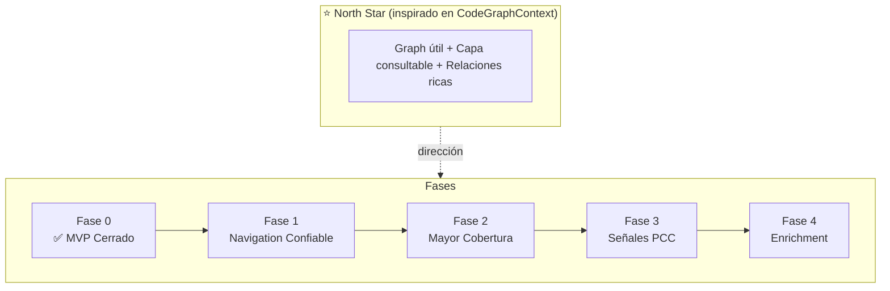

# Trifecta Graph North Star Roadmap

Fecha: 2026-03-14
Estado base: MVP Graph funcionalmente cerrado

---

## 1. Proyecto de Referencia

El proyecto de referencia para Trifecta Graph es:

- **CodeGraphContext (CGC)**  
  https://github.com/CodeGraphContext/CodeGraphContext

CGC es la referencia de direccion, no una plantilla para copiar uno a uno.

Lo que tomamos como norte desde ese proyecto es:

- un graph util para navegacion real de codigo
- una capa consultable por herramientas y agentes
- relaciones mas ricas que un indice local minimo
- integracion con flujos de exploracion, no solo storage

Lo que **no** asumimos por defecto como mandato inmediato:

- copiar su arquitectura completa
- meter MCP ahora
- abrir multi-lenguaje ahora
- abandonar el enfoque local-first de Trifecta

---

## 2. North Star

El north star de Trifecta Graph es:

**pasar de un indice navegable local a una capa estructural confiable para explorar codigo y orientar decisiones de lectura.**

En Trifecta, eso significa:

- Graph como capa de navegacion y señales
- PCC y Context Pack como capa de evidencia textual
- LSP como enrichment opcional, no como dependencia dura
- honestidad semantica antes que cobertura artificial

En una frase:

**Graph debe ayudar a encontrar, relacionar y priorizar codigo; no debe convertirse en retrieval textual disfrazado.**

---

## 3. Donde Estamos Hoy

Hoy Trifecta Graph ya tiene un MVP usable y acotado.

Capacidades entregadas:

- AST-only
- SQLite-only
- Python-only
- `graph index`
- `graph status`
- `graph search`
- `graph callers`
- `graph callees`
- SegmentRef V1 como binding operativo
- contratos visibles de salida y error ya congelados

Limites actuales aceptados:

- top-level only
- relaciones conservadoras
- sin symbol↔chunk linking
- sin LSP en el critical path
- sin MCP
- graph como señal, no como retrieval textual

Conclusión:

- **ya no estamos en exploración**
- **ya no estamos en diseño puro**
- **estamos al final del MVP y antes de una fase de expansión controlada**

---

## 4. Que Ya Hicimos

La investigación previa dejó claro qué era viable y qué no debía mezclarse en el MVP:

- [04-graph-pcc-boundary-audit.md](./04-graph-pcc-boundary-audit.md)
  - fijó que Graph debe operar como señal y no como proveedor de texto
  - confirmó que hoy no existe contrato seguro de symbol↔chunk linking

- [05-module-reuse-audit.md](./05-module-reuse-audit.md)
  - definió qué piezas del stack actual eran reutilizables para Graph
  - dejó claro que `context_models.py` no debía usarse como base del graph

- [06-mvp-launch-synthesis.md](./06-mvp-launch-synthesis.md)
  - cerró el orden de ataque del MVP
  - fijó el MVP inicial como CLI + AST + SQLite + SegmentRef V1

Sobre esa base, el trabajo ejecutado del MVP fue:

- crear el namespace `graph`
- crear el store SQLite del graph
- indexar nodos y edges desde AST
- fijar `status/search/callers/callees`
- endurecer read paths sin side effects
- centralizar resolución exacta de símbolos
- congelar exit codes y error envelope
- dejar explícita la frontera entre DB parcial recuperable y DB inválida
- fijar el binding operativo a SegmentRef V1

Commits de cierre del MVP:

- `53a0977` `feat(graph): add AST-backed graph MVP`
- `d12b103` `fix(graph): close first review batch`
- `69b3f20` `fix(graph): harden read path contracts`
- `6b3f94f` `fix(graph): harden graph db error handling`
- `a0c0b21` `fix(graph): close MVP contract matrix`
- `c160995` `docs(graph): prepare MVP merge closeout`

Resumen:

- **el MVP ya no es una intención**
- **es una slice funcional cerrada**

---

## 5. Brecha Frente a CodeGraphContext

Trifecta Graph hoy **no** es todavía el equivalente de CGC.

La brecha principal está en cuatro cosas:

### 5.1 Cobertura estructural

Hoy el graph es top-level y conservador. Sirve para navegar, pero no para capturar una red estructural más amplia.

### 5.2 Precisión operativa

El MVP ya distingue estados y errores relevantes, pero todavía no ofrece una historia más madura de frescura, reindex, confianza y enriquecimiento progresivo.

### 5.3 Integración con exploración

Graph ya puede existir como slice independiente, pero todavía no está integrado como capa de ayuda concreta para exploración y decisión dentro del flujo PCC.

### 5.4 Amplitud del sistema

CGC apunta a una superficie más amplia: tooling/agent integration, relaciones más ricas y mayor alcance operativo. Trifecta Graph todavía está en una etapa deliberadamente local, mínima y controlada.

---

## 6. Fases del Camino

### Fase 0: MVP Cerrado

Estado:

- **completada**

Incluye:

- CLI `graph`
- store SQLite
- indexación AST
- `index/status/search/callers/callees`
- contratos de error y exit codes
- SegmentRef V1 explícito

Salida:

- feature local usable y mergeable

### Fase 1: Navigation Graph Confiable

Objetivo:

- pasar de MVP correcto a herramienta confiable de uso cotidiano

Qué falta:

- endurecer lifecycle de indexación
- consolidar historia de frescura y reindex
- hacer más claro el estado operativo del graph
- reducir zonas grises del store sin cambiar el alcance semántico

Resultado esperado:

- graph confiable para navegación local diaria

### Fase 2: Mayor Cobertura Estructural

Objetivo:

- ampliar relaciones sin perder honestidad

Qué entra:

- mejores relaciones entre símbolos
- más cobertura cuando la evidencia estructural lo permita
- enrichment semántico opcional y controlado

Resultado esperado:

- aquí empieza el parecido real con CGC en utilidad estructural

### Fase 3: Graph como Capa de Señales para PCC

Objetivo:

- integrar Graph en el flujo de exploración sin romper el paradigma meta-first

Qué entra:

- ranking hints
- sugerencias de exploración
- señales de impacto
- apoyo a rutas de lectura

Regla:

- Graph no reemplaza `ctx search`
- Graph no reemplaza `ctx get`
- Graph no entrega contexto textual como si fuera evidencia

### Fase 4: Enrichment de Precisión

Objetivo:

- acercarse más al valor operativo de un graph tipo CGC

Qué podría entrar:

- LSP como enrichment opcional
- mejor resolución cross-file cuando sea verificable
- niveles de confianza para relaciones
- ampliación futura de alcance, si el producto la justifica

Resultado esperado:

- graph más rico, pero todavía coherente con la arquitectura de Trifecta

---

## 7. Seguimiento Claro

Estado del camino:

- **Hecho**
  - investigación de límites y boundary
  - definición del slice MVP
  - implementación funcional del MVP
  - endurecimiento de contratos visibles

- **Siguiente**
  - decidir la primera fase post-MVP sin reabrir scope incorrecto

- **Todavía no**
  - MCP
  - symbol↔chunk linking
  - multi-lenguaje
  - LSP como dependencia central
  - Graph como retrieval textual

Lectura correcta del momento actual:

- **ya existe un MVP real**
- **todavía no existe un “CGC dentro de Trifecta”**
- **el siguiente paso no es meter de todo**
- **el siguiente paso es elegir con disciplina la primera expansión post-MVP**

---

## 8. Guardrails

Para no perder el norte, Trifecta Graph debe mantener estas reglas:

- **AST-first antes que LSP-first**
- **local-first antes que infraestructura externa**
- **señal antes que retrieval**
- **honestidad antes que cobertura falsa**
- **integración progresiva antes que acoplamiento apurado**

Mientras no se complete al menos Fase 1 o 2, no conviene:

- meter MCP
- abrir V2 grande
- improvisar symbol↔chunk linking
- rediseñar el sistema alrededor de LSP
- inflar el graph para hacer cosas que le corresponden a PCC

---

## 9. Resumen Ejecutivo

Mapa corto:

- **Referencia**: CodeGraphContext
- **Hoy**: MVP Graph cerrado, local, conservador y usable
- **Brecha**: cobertura estructural, integración operativa y mayor riqueza de relaciones
- **Próximo paso sano**: Fase 1, volverlo una herramienta confiable de navegación
- **Más adelante**: acercarse al valor de CGC sin abandonar la arquitectura ni los guardrails de Trifecta

En una frase:

**Trifecta Graph ya dejó de ser una idea; ahora el reto es evolucionarlo hacia algo más parecido a CodeGraphContext sin romper el diseño local, honesto y meta-first del sistema.**
