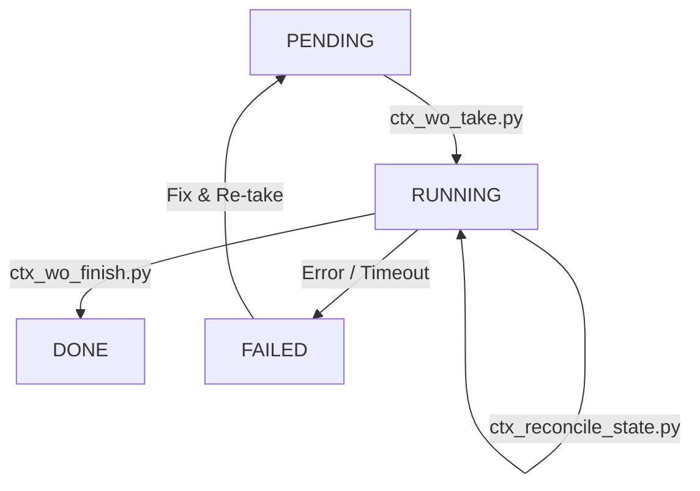

# Manual Operativo: Work Orders (WO) en Trifecta Dope

Este documento describe el ciclo de vida, los procesos técnicos y las herramientas para la gestión de Work Orders (WO) en el proyecto `trifecta_dope`.

## 1. Ciclo de Vida del WO (Máquina de Estados)

Cada WO sigue una transición de estados estricta para garantizar la trazabilidad y el aislamiento.



### Estados

* **PENDING**: Identificado en el backlog, YAML reside en `_ctx/jobs/pending/`.
* **RUNNING**: En ejecución activa, YAML reside en `_ctx/jobs/running/`. Posee un lock atómico y un worktree dedicado.
* **DONE**: Finalizado con éxito, YAML reside en `_ctx/jobs/done/`. Contiene el SHA de verificación.
* **FAILED**: Finalizado con errores insalvables o abortado.

---

## 2. Flujo Técnico: Tomar un WO (Take)

El proceso de "Take" transforma un requerimiento estático en un entorno de desarrollo activo.

### Scripts Involucrados

- `scripts/ctx_wo_take.py`: Orquestador principal.
* `scripts/helpers.py`: Utilidades de git worktree y locking.

### Diagrama de Proceso (Take)

```text
[Backlog YAML] -> [ctx_wo_take.py]
      |
      v
1. Validación Schema & Contract (fail-closed)
      |
      v
2. Adquisición de Lock Atómico (_ctx/jobs/running/WO-XXXX.lock)
      |
      v
3. Creación de Branch (feat/wo-WO-XXXX)
      |
      v
4. Creación de Worktree (.worktrees/WO-XXXX)
      |
      v
5. Movimiento de YAML (pending/ -> running/) + Metadata (owner, started_at)
      |
      v
[Worktree Listo para Desarrollo]
```

### Requisitos para Take

- Main repo debe estar en estado limpio (sin cambios sin commit).
* El ID del WO debe existir en `_ctx/jobs/pending/`.
* Las dependencias del WO deben estar en estado `done` (validación de dominio).

---

## 3. Desarrollo Aislado (Worktree)

El sistema utiliza **Git Worktrees** para evitar la contaminación entre tareas.

* **Ubicación**: `.worktrees/WO-XXXX`
* **Aislamiento**: Cada worktree tiene su propia copia del working directory y su propia branch. Puedes cambiar de contexto (CD) a otro worktree sin afectar el trabajo actual.
* **Git Context**: Git detecta automáticamente que estás en un worktree y apunta al `.git` común del repositorio raíz.

---

## 4. Flujo Técnico: Cerrar un WO (Finish)

El cierre es la etapa más crítica, encargada de generar evidencia (DoD) y consolidar el estado.

### Scripts Involucrados

- `scripts/ctx_wo_finish.py`: Generación de artefactos y transacción de cierre.
* `scripts/verify.sh`: Gate de verificación global.

### Diagrama de Proceso (Finish)

```text
[Trabajo en Worktree] -> [ctx_wo_finish.py]
      |
      v
1. Generación de Artefactos DoD (logs, patches, verdict)
      |
      v
2. Verificación de Gates (verdicts & session evidence)
      |
      v
3. Transacción de Cierre (Atomic):
   a. Write result YAML a done/ o failed/
   b. Remove running YAML
   c. Delete WO Lock
      |
      v
[WO Consolidado]
```

### Artefactos Creados (DoD)

Ubicados en `_ctx/handoff/WO-XXXX/`:
* `tests.log`: Salida completa de la suite de tests.
* `lint.log`: Resultado del análisis estático (Ruff).
* `diff.patch`: Patch del trabajo realizado (filtrado por política de seguridad).
* `handoff.md`: Resumen narrativo del trabajo y micro-tareas.
* `verdict.json`: Veredicto final estructurado (PASS/FAIL).

---

## 5. Formatos y Contratos

### Job YAML (`_ctx/jobs/{state}/WO-XXXX.yaml`)

```yaml
id: WO-XXXX
epic_id: E-XXXX
status: running
owner: felipe_gonzalez
execution:
  engine: trifecta
  segment: .
  required_flow:
    - session.append:intent
    - ctx.sync
    - ...
verify:
  commands:
    - uv run pytest tests/specific_test.py
```

### Verificación de Gates

El sistema activa los gates de cierre mediante:

1. **Session Evidence**: Busca marcadores `[WO-XXXX] intent:` y `[WO-XXXX] result:` en `_ctx/session_trifecta_dope.md`.
2. **Verify Script**: Ejecuta `scripts/verify.sh` que centraliza tests y linters.

---

## 6. Resolución de Problemas (Troubleshooting)

| Problema | Herramienta / Solución |
| :--- | :--- |
| **Estado Corrupto** | Ejecutar `uv run python scripts/ctx_reconcile_state.py` para sincronizar YAMLs vs Worktrees. |
| **Lock Stale** | Los locks de más de 1 hora se limpian automáticamente en el siguiente `take`. |
| **Main Sucio** | `ctx_wo_finish.py` bloqueará el cierre. Debes hacer commit o stash en el repo principal. |
| **Schema Error** | Validar contra `docs/backlog/schema/` usando `ctx_backlog_validate.py`. |

---

## 7. Resumen de Comandos Rápidos

```bash
# Listar pendientes
uv run python scripts/ctx_wo_take.py --list

# Tomar WO
uv run python scripts/ctx_wo_take.py WO-XXXX

# Cerrar WO
uv run python scripts/ctx_wo_finish.py WO-XXXX

# Generar solo evidencia (sin cerrar)
uv run python scripts/ctx_wo_finish.py WO-XXXX --generate-only
```
