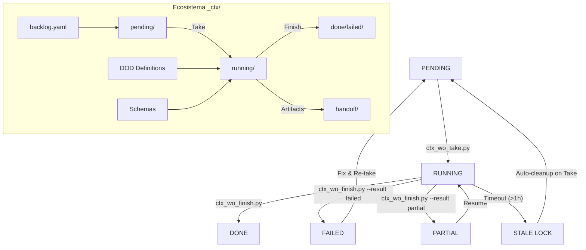

# Manual Operativo: Work Orders (WO) en Trifecta Dope

Este documento describe el ciclo de vida, los procesos técnicos y las herramientas para la gestión de Work Orders (WO) garantizando un estándar de **grado auditoría**.

---

## 0. Creación y Preparación (OBLIGATORIO)

### Bootstrap: Crear nuevo WO

```bash
# Crear WO desde scaffold canónico (OBLIGATORIO para WOs nuevos)
make wo-new ARGS='--id WO-XXXX --epic E-XXXX --title "Descripcion" --priority P1'

# Con opciones completas
uv run python scripts/ctx_wo_bootstrap.py \
  --id WO-XXXX \
  --epic E-XXXX \
  --title "Descripcion" \
  --priority P1 \
  --dod DOD-DEFAULT \
  --verify-cmd "uv run pytest tests/..."
```

### Preflight: Validar antes de Tomar (OBLIGATORIO)

```bash
# Validar WO antes de take (fail-closed)
make wo-preflight WO=WO-XXXX

# JSON para CI
uv run python scripts/ctx_wo_preflight.py WO-XXXX --json
```

**Politica**: Todo WO nuevo debe pasar por bootstrap + preflight antes del take. No se permite take directo sin validacion.

---

## 1. Ciclo de Vida del WO (Máquina de Estados)

Cada WO sigue una máquina de estados inmutable definida en el dominio (`wo_entities.py`).



### Estados Detallados

* **PENDING**: Identificado en el backlog. Invariante: No puede tener `started_at`.
* **RUNNING**: En ejecución activa. Invariante: OBLIGATORIO tener `started_at`.
* **DONE / FAILED / PARTIAL**: Estados terminales o estables. Invariante: OBLIGATORIO tener `finished_at` posterior a `started_at` y `verified_at_sha`.

---

## 2. Invariantes de Seguridad y Transacciones

El sistema Trifecta utiliza un enfoque **Fail-Closed** basado en transacciones atómicas.

### A. Transacciones y Rollback (LIFO)

Tanto el `take` como el `finish` operan bajo un esquema de transacciones. Si un paso falla (ej: error al crear el worktree), el sistema ejecuta una compensación en orden inverso (**LIFO - Last In, First Out**):

1. Si falló el movimiento del YAML, se intenta restaurar desde el estado anterior.
2. Si falló la creación del worktree, se elimina el branch generado.
3. Finalmente, se libera el lock atómico.

### B. Locking Atómico de Grado Industrial

El sistema evita condiciones de carrera (race conditions) mediante dos mecanismos:

* **Principal**: `os.link()` para crear hard-links, una operación atómica a nivel de kernel.
* **Fallback**: `os.rename()` si el filesystem no soporta hard-links.
* **Heartbeat**: Los procesos largos actualizan el timestamp del archivo `.lock` para evitar ser marcados como persistencia huérfana.

### C. Filtrado por Políticas (`ctx_finish_ignore.yaml`)

Durante el cierre, Trifecta valida que no se hayan modificado archivos sensibles al contrato del sistema:

* **Ignorados**: Telemetría, logs, handoffs, y el propio YAML en ejecución.
* **Bloqueantes**: Si el `git diff` detecta cambios en `_ctx/backlog/`, `_ctx/schemas/` o `_ctx/dod/`, el cierre se bloquea automáticamente para evitar "split-brain" en la gobernanza.

---

## 3. Flujo Técnico: Tomar un WO (Take)

### Proceso Interno

1. **Linter Strict**: Valida que el YAML cumpla con el `work_order.schema.json` y que las dependencias estén en `done`.
2. **Transaction Start**: Registra el inicio de la operación.
3. **Atomic Lock**: Crea `_ctx/jobs/running/WO-XXXX.lock`.
4. **Worktree Isolation**: Crea un directorio físico fuera del repo principal para aislamiento total de procesos git.

---

## 4. Definición de Hecho (DoD) y Evidencia

El cierre de un WO requiere el cumplimiento de un **Catálogo DoD** (`_ctx/dod/*.yaml`).

### Artefactos Mandatorios (DOD-DEFAULT)

Ubicados en `_ctx/handoff/WO-XXXX/`:

* `tests.log`: Auditoría de ejecución de pruebas.
* `lint.log`: Conformidad de estilo y análisis estático.
* `diff.patch`: Registro inmutable de los cambios realizados.
* `handoff.md`: Narrativa humana y evidencia de micro-tareas.
* `verdict.json`: Veredicto estructurado compatible con el schema de auditoría.

---

## 5. Referencia de Scripts Operativos

### EntryPoints Oficiales (SSOT)

| Comando | Script | Uso Primario |
| :--- | :--- | :--- |
| **Take** | `ctx_wo_take.py` | Tomar WO y crear entorno aislado. |
| **Finish** | `ctx_wo_finish.py` | Cerrar WO, generar DoD y consolidar. |
| **Preflight** | `ctx_wo_preflight.py` | Validar antes de take/finish (fail-closed). |
| **Bootstrap** | `ctx_wo_bootstrap.py` | Crear nuevo WO desde scaffold canónico. |
| **Rescate** | `ctx_reconcile_state.py`| Sincronizar estado si el proceso fue interrumpido. |
| **Backlog** | `ctx_backlog_validate.py`| Validar integridad del backlog global y epics. |
| **Higiene** | `ctx_wo_fmt.py` | Mantener formato canónico de YAMLs. |
| **Higiene** | `ctx_wo_lint.py` | Validar contratos YAML (Strict Mode). |

### Gates Automáticos (Hooks)

| Hook | Script | Qué hace | Bloquea |
| :--- | :--- | :--- | :--- |
| **Sync** | `ctx_sync_hook.sh` | Sincroniza contexto | Si falla sync |
| **Format** | `ctx_wo_fmt.py` | Formatea YAMLs | Si hay drift |
| **Lint** | `ctx_wo_lint.py` | Valida contrato WO | Si schema invalido |
| **Test Gate** | `pre_commit_test_gate.sh` | Tests rápidos | Si tests fallan |
| **WO Closure** | `prevent_manual_wo_closure.sh` | Bloquea done manual | Si alguien intenta |
| **Integrity** | `trifecta_integrity_check.py` | Consistencia ctx/code | Si hay drift |

---

## 6. Directorio Contextual (`_ctx/`): El Cerebro del Sistema

El directorio `_ctx/` no es solo almacenamiento; es la base de datos de estado y el registro de auditoría del proyecto.

### Estructura y Responsabilidades

| Directorio / Archivo | Rol | Descripción |
| :--- | :--- | :--- |
| `backlog/backlog.yaml` | **SSOT** | Single Source of Truth. Define Epics y la cola de WOs. |
| `jobs/pending/` | **Entrada** | WOs listos para ser tomados pero no iniciados. |
| `jobs/running/` | **Activo** | WOs en ejecución. Contiene archivos `.lock` y YAMLs activos. |
| `jobs/done/` | **Histórico** | WOs completados con éxito. Registro inmutable. |
| `jobs/failed/` | **Fallos** | WOs que fallaron los gates o fueron cancelados. |
| `dod/` | **Contratos** | Definiciones de qué evidencia es necesaria para cerrar un WO. |
| `handoff/` | **Evidencia** | Almacena logs, parches y veredictos por cada WO cerrado. |
| `policy/` | **Reglas** | Define qué cambios en `_ctx/` son legales durante un cierre. |
| `telemetry/` | **Métricas** | Logs de performance, hits de búsqueda y eventos del sistema. |
| `schemas/` | **Garantía** | Esquemas JSON para validar veredictos y transacciones. |

### Flujo de Datos Contextual

1. **Planificación**: Se define el WO en `backlog.yaml` y se crea en `jobs/pending/`.
2. **Activación**: `ctx_wo_take.py` mueve el YAML a `jobs/running/` y crea el `.lock`.
3. **Ejecución**: Se genera evidencia dinámica en `_ctx/logs/` y telemetría en `_ctx/telemetry/`.
4. **Consolidación**: `ctx_wo_finish.py` lee el DoD de `_ctx/dod/`, genera el handoff en `_ctx/handoff/`, y mueve el YAML a `jobs/done/`.

---

## 7. Troubleshooting y Códigos de Error

### Errores Comunes

* `WO_NOT_RUNNING`: El YAML no está en la carpeta de ejecución.
* `UNSATISFIED_DEPENDENCIES`: Estás intentando tomar un WO cuyo padre no ha terminado.
* `UNKNOWN_PATHS`: Has modificado archivos en `_ctx/` no clasificados. **Acción**: Clasificar en `ctx_finish_ignore.yaml`.
* `INVALID_STATE_TRANSITION`: Intento de pasar de `done` a `running` directamente.

---

## 8. Integración Sidecar (WoW)

El sistema exporta un índice en `_ctx/index/wo_worktrees.json` cada vez que se toma o cierra un WO. Este índice es consumido por la UI de **WoW (Work Order Web)** y el plugin Sidecar para mostrar el estado actual del desarrollador en tiempo real.

---

## 9. Reglas de Oro (Policy)

> El manual define el entrypoint SSOT y prohibe los bypass.

1. Cerrar WO = solo con `ctx_wo_finish.py`
2. wo_verify.sh es interno - no usar directo
3. Todo commit pasa por hooks
4. No existe DONE sin SHA/verdict
5. Preflight es obligatorio antes de take
6. Main debe estar limpio para operar
