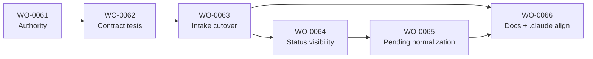

# WO Remediation Execution Decomposition

Source of truth: `docs/plans/2026-03-09-wo-remediation-plan-iteration-2.md` (lives on `codex/wo-remediation-plan`; retrieve with `git show codex/wo-remediation-plan:docs/plans/2026-03-09-wo-remediation-plan-iteration-2.md`)
Baseline persisted in commits: `ecc55f1`, `f2fba2e`, `d68366f`

## 1. Resumen ejecutivo

1. La secuencia minima segura empieza por la autoridad compartida, porque sin clasificacion y validacion unicas no existe base estable para intake, take ni finish.
2. Los contract tests P0 nacen junto con esa autoridad, no despues, para evitar que schema, lint y runtime vuelvan a separarse desde el primer merge.
3. El cutover de intake solo entra cuando autoridad + tests ya estan verdes; antes de eso, endurecer `pending/` seria romper el flujo activo con reglas todavia moviles.
4. La visibilidad de estado viene justo despues del cutover para que operadores vean `canonical_current`, `grandfathered` e incompatibles sin falsa salud.
5. No conviene empezar por normalizar los 7 hibridos activos porque hoy todavia no existe el normalizador ni el disparador on-write definitivo.
6. Si se normalizan antes del cutover, se corre el riesgo de reescribirlos contra un contrato que aun no esta fijado por tests cross-layer.
7. Eso multiplicaria retrabajo y podria reintroducir hybrids nuevos mientras el intake siga admitiendo formas ambiguas.
8. Primero hay que cerrar la admision de hybrids nuevos; despues se limpia el inventario activo bajo reglas estables y manifest explicito.
9. La normalizacion de `pending/` queda desbloqueada por el cutover y por `status/list`, no al reves.
10. La documentacion y `.claude` se actualizan al final porque deben enseñar el sistema ya endurecido, no anticiparlo.
11. La unica correccion operativa al memo es usar IDs repo-native `WO-0061..WO-0066` con alias semanticos, porque la toolchain viva aun privilegia `WO-XXXX`.

## 2. Epic propuesta

```yaml
id: E-0020
title: WO Contract Remediation Cutover
objective: Establish one shared WO authority, lock `pending/` to take-ready semantics, cut over hybrid admission safely, and normalize the active pending set without reopening forensic design.
scope:
  - Shared authority for parse/classify/validate/normalize/compatibility
  - P0 contract tests across schema, lint, preflight, take, finish, and status surfaces
  - Intake cutover with explicit grandfathering manifest
  - Active `pending/` normalization for tracked hybrids only
  - Final docs and `.claude` alignment to the hardened runtime contract
non-goals:
  - Reopening forensic analysis or redesigning the base memo
  - Full historical corpus cleanup for `done/failed`
  - Introducing a third WO system, draft state inside `pending/`, or a new heavy CLI/TUI
  - Mass rewriting all YAML outside the active pending set
success criteria:
  - One shared authority decides classification and stage validation
  - P0 tests keep schema/lint/runtime aligned on states, required_flow, IDs, pending semantics, and grandfathering rules
  - No new hybrids enter `pending/` after cutover
  - The 7 active hybrid WOs in `pending/` are normalized under the new contract
  - Docs and `.claude` stop teaching the old hybrid flow
risks:
  - Cutover blocks legitimate work if compatibility is too narrow
  - Grandfathering becomes a permanent escape hatch if trigger rules are weak
  - Normalization loses narrative if extraction destinations are not enforced
  - Numeric-vs-slug WO ID assumptions in tooling can create false take-ready plans
rollout strategy:
  - Wave 1: authority + contract tests
  - Wave 2: intake cutover + visibility
  - Wave 3: active pending normalization + manifest drain
  - Wave 4: docs and `.claude` alignment + residual policy checks
```

Operational note: the live repo still has multiple references and helpers biased toward `WO-XXXX`; for that reason the executable WO IDs below are numeric and carry semantic aliases instead of using slug-only IDs as the primary key.

## 3. Mapa de olas

| Ola | Objetivo | WOs | Salida |
| --- | --- | --- | --- |
| Ola 1 | Fijar la autoridad y blindar drift | `WO-0061`, `WO-0062` | Contrato vivo y tests P0 verdes |
| Ola 2 | Cerrar admision ambigua y exponer estado real | `WO-0063`, `WO-0064` | Cutover activo, no hybrids nuevos, surfaces honestas |
| Ola 3 | Limpiar el flujo activo bajo reglas estables | `WO-0065` | `pending/` 100% canonico y manifest vacio |
| Ola 4 | Alinear ensenanza y checks residuales | `WO-0066` | Docs y `.claude` sin drift doctrinal |

## 3.1 Decisiones de congelamiento antes de ejecutar

### Decision A: `WO-0061` se mantiene unido

Inspeccion del repo al 2026-03-10: el primer cableado real de la autoridad compartida sigue concentrado en cuatro entry points heterogeneos pero acotados:

- `scripts/ctx_wo_lint.py`
- `scripts/ctx_wo_preflight.py`
- `scripts/ctx_wo_take.py`
- `scripts/ctx_wo_finish.py`

Con ese ancho actual, dividir `WO-0061` en `core` + `first adapter wiring` agregaria coordinacion sin reducir riesgo material.

Regla de escape: partir `WO-0061` solo si durante implementacion aparece alguno de estos sintomas:

- el authority core no cabe limpio dentro de un cambio reviewable;
- el wiring necesita mas de esos cuatro entry points en la primera ola;
- o aparece una quinta surface heterogenea que obligue a separar contrato y adopcion inicial.

### Decision B: conjunto exacto de 7 hybrids activos congelado

Snapshot base: commit `250e131` en rama `codex/wo-remediation-plan`.

Los 7 WOs activos en `pending/` que `WO-0065` debe normalizar son exactamente:

1. `WO-0016`
2. `WO-0017`
3. `WO-0018C`
4. `WO-0020-formatter`
5. `WO-0021-verdict-generator`
6. `WO-0037`
7. `WO-0039`

Regla fuerte:

- `WO-0063` debe generar `_ctx/jobs/grandfathered_pending_ids.yaml` con exactamente estos 7 IDs.
- `WO-0065` no agrega ni sustituye IDs por observacion posterior.
- `WO-0040` y `WO-0043` quedan fuera porque hoy no son parte del set hibrido tracked a normalizar en esta ola.

## 4. WOs propuestos

### WO-0061 (`WO-AUTHORITY-P0`)

- `id`: `WO-0061`
- `title`: Shared WO authority core and classifier
- `objective`: Implement the small shared authority that owns parse, classify, stage validation, normalization triggers, and compatibility inspection.
- `scope`:
  - Add the shared authority module and stable findings/error surface.
  - Wire schema-critical adapters to consume shared classification and validation logic.
  - Keep side effects in existing scripts and adapters.
- `dependencies`: `[]`
- `acceptance criteria`:
  - A single API handles `parse_wo`, `classify_wo`, `validate_for_pending`, `validate_for_take`, `validate_for_finish`, `normalize_active_wo`, `extract_narrative`, `inspect_compatibility`, and `explain_error`.
  - Classification returns stable categories: `canonical_current`, `hybrid_tolerated`, `legacy_tolerated`, `runtime_incompatible`, `invalid_syntax`.
  - Shared authority excludes git/worktree/lock/verify side effects.
  - First-wave adapter wiring lands in exactly these entry points: `scripts/ctx_wo_lint.py`, `scripts/ctx_wo_preflight.py`, `scripts/ctx_wo_take.py`, and `scripts/ctx_wo_finish.py`.
- `out of scope`:
  - Cutover activation
  - Corpus normalization
  - Docs alignment
- `artifacts/files likely touched`:
  - `src/domain/wo_entities.py`
  - `src/domain/wo_transactions.py`
  - `src/application/**/wo*`
  - `scripts/ctx_wo_take.py`
  - `scripts/ctx_wo_finish.py`
  - `scripts/ctx_wo_lint.py`
  - `scripts/ctx_wo_preflight.py`
- `risks`:
  - Accidentally re-centralizing side effects inside the authority
  - Authority too abstract to be consumed by adapters
- `definition of done`:
  - Shared authority exists as one importable surface for parse/classify/validate/compatibility decisions.
  - `scripts/ctx_wo_lint.py`, `scripts/ctx_wo_preflight.py`, `scripts/ctx_wo_take.py`, and `scripts/ctx_wo_finish.py` consume that surface for first-wave decisions instead of re-implementing local classification rules.
  - Stable findings/errors are emitted through the shared authority with no script-specific reinterpretation of category names.
  - Validation commands for the WO pass.
- `rollback or fallback note`: Revert authority wiring only; do not widen hybrid admission as a fallback.

#### Post-implementation administrative note (2026-03-10)

`WO-0061` stayed unified and delivered its scoped contract on `feat/wo-WO-0061` at commit `aa87aa2`: shared authority plus first-wave wiring in the four agreed entry points. The split rule did not fire on authority size or adapter spread.

What did surface after implementation was a separate operational blocker: `ctx_wo_finish.py` resolves to the canonical runtime root while the live `WO-0061` running YAML sits in the remediation tree. That blocks official close, but it is outside the promised scope of the authority/wiring WO.

Administrative consequence:

- `WO-0061` is treated as scope-complete but not formally closed.
- No manual close or fake done-state is allowed.
- A separate follow-up WO, `WO-0067`, owns finish runtime-root/worktree semantics.

### WO-0062 (`WO-CONTRACT-TESTS-P0`)

- `id`: `WO-0062`
- `title`: P0 cross-layer contract tests and fixtures
- `objective`: Add the minimal P0 fixture matrix and tests that prevent drift between authority, schema, lint, take, finish, and status surfaces.
- `scope`:
  - Create canonical, hybrid, legacy, incompatible, and grandfathered fixtures.
  - Assert cross-layer invariants for states, required flow, IDs, pending semantics, and grandfathering triggers.
  - Add at least one test that captures local incompatible artifacts like `WO-0010`.
- `dependencies`: `WO-0061`
- `acceptance criteria`:
  - P0 tests cover at least these invariants: status classification, filename-id coherence, `required_flow`, pending take-ready fields, manifest-only grandfathering, rewrite-trigger normalization, and local incompatible handling (`WO-0010`-style).
  - Tests fail if schema/lint/runtime diverge on critical contract fields.
  - Grandfathering applies only to explicit manifest IDs.
- `out of scope`:
  - Activation of cutover on real pending WOs
  - Documentation policy checks beyond the minimum P0 surface
- `artifacts/files likely touched`:
  - `tests/unit/test_wo_*`
  - `tests/integration/test_wo_*`
  - `tests/fixtures/**/wo_*`
  - `docs/backlog/schema/work_order.schema.json`
- `risks`:
  - Tests encode the old contract by mistake
  - Fixtures under-specify rewrite triggers
- `definition of done`:
  - The P0 contract suite is green.
  - Every critical invariant in the memo is represented by at least one automated test in unit or integration scope.
  - At minimum there is one automated assertion each for: schema-vs-runtime pending semantics, schema-vs-lint pending semantics, explicit manifest-only grandfathering, and local runtime-incompatible artifact detection.
  - Validation commands for the WO pass.
- `rollback or fallback note`: If tests expose a contradiction, stop the sequence and tighten the authority; do not weaken tests to preserve legacy behavior.

### WO-0063 (`WO-INTAKE-CUTOVER-P0`)

- `id`: `WO-0063`
- `title`: Intake cutover and grandfathering manifest enforcement
- `objective`: Wire bootstrap/lint/preflight/take to the shared authority, block new hybrids, and activate explicit grandfathering for the tracked active pending set.
- `scope`:
  - Align bootstrap, linter, preflight, and take with `pending == take-ready`.
  - Add and enforce `_ctx/jobs/grandfathered_pending_ids.yaml`.
  - Reject new hybrids while tolerating only manifest-listed pending hybrids under compatibility rules.
- `dependencies`: `WO-0061`, `WO-0062`
- `acceptance criteria`:
  - `scripts/ctx_wo_bootstrap.py` does not create a new hybrid `pending/` WO.
  - `scripts/ctx_wo_lint.py` and `scripts/ctx_wo_preflight.py` reject non-manifest hybrids in `pending/`.
  - `scripts/ctx_wo_take.py` allows temporary compatibility only for manifest-listed IDs under the shared compatibility rules.
  - Structural rewrite triggers normalization before re-entry or take.
- `out of scope`:
  - Normalizing the 7 active hybrids
  - Docs and `.claude` cleanup
- `artifacts/files likely touched`:
  - `scripts/ctx_wo_bootstrap.py`
  - `scripts/ctx_wo_lint.py`
  - `scripts/ctx_wo_preflight.py`
  - `scripts/ctx_wo_take.py`
  - `_ctx/jobs/grandfathered_pending_ids.yaml`
  - `docs/backlog/WORKFLOW.md`
- `risks`:
  - Breakage on legitimate active work if manifest or compatibility checks are wrong
  - Silent bypasses that still admit hybrids via alternate paths
- `definition of done`:
  - `_ctx/jobs/grandfathered_pending_ids.yaml` exists with `cutover_commit`, `generated_at`, and `ids`.
  - The manifest `ids` set matches exactly the frozen 7-ID list from section 3.1.
  - No intake path accepts a new hybrid into `pending/`.
  - Manifest-based compatibility is test-covered and exercised by verification.
- `rollback or fallback note`: Revert the cutover commit if necessary, but keep hybrid creation closed; only temporary take compatibility for already-listed IDs may be re-enabled.

### WO-0064 (`WO-STATUS-VISIBILITY-P0`)

- `id`: `WO-0064`
- `title`: Status and parse visibility for active vs incompatible WO states
- `objective`: Make status/list/audit surfaces report canonical, grandfathered, and incompatible artifacts honestly so cutover can be operated safely.
- `scope`:
  - Update status/list/reporting surfaces to show classification output and incompatibility clearly.
  - Ensure local incompatible artifacts do not count as healthy state.
  - Keep outputs legible and stable for operators and audits.
- `dependencies`: `WO-0063`
- `acceptance criteria`:
  - `python scripts/ctx_wo_take.py --list` distinguishes canonical, grandfathered, and incompatible artifacts.
  - `python scripts/ctx_wo_take.py --status` distinguishes canonical, grandfathered, and incompatible artifacts.
  - `python scripts/wo_audit.py --out ...` reports incompatible artifacts without counting them as healthy state.
  - Local incompatible artifacts fail loudly and do not inflate healthy counts.
  - Operator-visible messages use the shared error surface.
- `out of scope`:
  - Rich dashboards or business reporting
  - Historical cleanup outside active flow
- `artifacts/files likely touched`:
  - `scripts/ctx_wo_take.py`
  - `scripts/wo_audit.py`
  - `scripts/ctx_reconcile_state.py`
  - `docs/backlog/TROUBLESHOOTING.md`
  - `docs/guides/work_orders_usage.md`
- `risks`:
  - Surface changes hide actionable detail behind cleaner wording
  - Status remains partially inferred from legacy heuristics
- `definition of done`:
  - Active status surfaces no longer report false health for incompatible artifacts.
  - Classification output is visible in `--list`, `--status`, and audit output strongly enough to drive normalization sequencing without manual YAML inspection.
  - Validation commands for the WO pass.
- `rollback or fallback note`: Revert output formatting changes only if needed; keep incompatibles visible and fail-closed.

### WO-0065 (`WO-PENDING-NORMALIZATION-P1`)

- `id`: `WO-0065`
- `title`: Normalize the active hybrid pending set
- `objective`: Normalize the 7 tracked hybrid WOs currently in `pending/`, extract long narrative out of active YAML, and drain the grandfathering manifest.
- `scope`:
  - Normalize only the tracked active hybrid pending set.
  - Extract long narrative to `docs/plans/` or `_ctx/handoff/`.
  - Remove IDs from the manifest as each WO becomes canonical.
  - Touch only this frozen set: `WO-0016`, `WO-0017`, `WO-0018C`, `WO-0020-formatter`, `WO-0021-verdict-generator`, `WO-0037`, `WO-0039`.
- `dependencies`: `WO-0063`, `WO-0064`
- `acceptance criteria`:
  - The targeted 7 `pending/` hybrids (`WO-0016`, `WO-0017`, `WO-0018C`, `WO-0020-formatter`, `WO-0021-verdict-generator`, `WO-0037`, `WO-0039`) become `canonical_current`.
  - `pending/` ends the wave at 100% canonical.
  - The grandfathering manifest is empty or reduced only by explicitly deferred tracked IDs with a documented reason.
- `out of scope`:
  - `done/failed` historical normalization
  - Broad corpus cleanup beyond the tracked active set
- `artifacts/files likely touched`:
  - `_ctx/jobs/pending/*.yaml`
  - `_ctx/jobs/grandfathered_pending_ids.yaml`
  - `docs/plans/*.md`
  - `_ctx/handoff/WO-*/handoff.md`
- `risks`:
  - Narrative extraction loses operator context
  - Active work gets blocked if a pending WO normalizes without preserving take-ready fields
- `definition of done`:
  - All 7 frozen IDs are normalized and validated.
  - Manifest entries are removed in the same changes that normalize the WOs.
  - Any deferred ID is named explicitly with a reason; no implicit carry-over is allowed.
  - Validation commands for the WO pass.
- `rollback or fallback note`: Revert individual WO normalizations if needed; never re-admit the old hybrid shape for new intake.

### WO-0066 (`WO-DOCS-CLAUDE-ALIGN-P1`)

- `id`: `WO-0066`
- `title`: Align docs and `.claude` with the cutover contract
- `objective`: Remove teaching drift after runtime behavior is stable so humans and agents learn the hardened system, not the transitional one.
- `scope`:
  - Update docs and `.claude` references that describe pending semantics, required flow, grandfathering, and draft handling.
  - Add minimum policy checks for critical docs snippets where practical.
  - Keep doc changes subordinate to the runtime contract already merged.
- `dependencies`: `WO-0063`, `WO-0065`
- `acceptance criteria`:
  - No critical doc or `.claude` guidance teaches hybrids as a valid new intake path.
  - Pending semantics and required flow match the runtime contract.
  - The old draft-in-pending idea is absent from official instructions.
  - The following critical paths are aligned: `docs/backlog/WORKFLOW.md`, `docs/backlog/OPERATIONS.md`, `docs/backlog/README.md`, `docs/backlog/TROUBLESHOOTING.md`, `docs/backlog/MANUAL_WO.md`, `docs/guides/work_orders_usage.md`, `_ctx/jobs/AGENTS.md`, `AGENTS.md`, `skill.md`, `.claude/commands/wo-start.md`, `.claude/skills/wo/create/SKILL.md`, `.claude/skills/wo/take/SKILL.md`, and `.claude/skills/wo/status/SKILL.md`.
- `out of scope`:
  - New wrappers or UX flows
  - Historical research cleanup unrelated to the active contract
- `artifacts/files likely touched`:
  - `docs/backlog/*.md`
  - `docs/guides/*.md`
  - `.claude/**`
  - `AGENTS.md`
  - `skill.md`
- `risks`:
  - Docs drift again if policy checks are too weak
  - Over-editing teaching material before runtime stabilizes
- `definition of done`:
  - Critical docs and `.claude` guidance align with cutover reality.
  - Minimum policy checks exist for the most drift-prone contract snippets in the paths listed above.
  - Validation commands for the WO pass.
- `rollback or fallback note`: Revert doc wording if needed, but never document hybrids or drafts in `pending/` as a supported path again.

## 5. Dependencias y orden de ejecucion

Recommended linear order:

1. `WO-0061` because every later WO depends on a single authority deciding parse/classify/validate/compatibility.
2. `WO-0062` because P0 tests must lock the contract before any cutover behavior is activated.
3. `WO-0063` because intake cutover is the gate that stops new hybrids and creates the explicit grandfathering boundary.
4. `WO-0064` because after cutover the repo needs truthful visibility to operate the transition and detect local incompatibles.
5. `WO-0065` because active pending normalization is only safe once new hybrids are blocked and visibility is honest.
6. `WO-0066` because docs should codify the stabilized runtime, not lead it.

Dependency graph:



Execution gates:

- Gate A: `WO-0061` and `WO-0062` both green before starting `WO-0063`.
- Gate B: `WO-0063` green before any active hybrid normalization starts.
- Gate C: `WO-0064` green before draining the manifest through `WO-0065`.
- Gate D: `WO-0065` green before declaring docs alignment final in `WO-0066`.

## 6. Gates por ola

### Ola 1 gate

- Shared authority merged and used by the first runtime adapters.
- P0 contract tests are green for states, required flow, IDs, pending semantics, schema/runtime/lint alignment, grandfathering, and incompatible local artifacts.
- No open contradiction remains between authority behavior and schema-critical fields.

### Ola 2 gate

- Intake cutover is active.
- No new hybrids can enter `pending/`.
- Manifest-based grandfathering is enforced only for explicit tracked IDs.
- `status`/`list`/equivalent surfaces classify canonical, grandfathered, and incompatible artifacts honestly.

### Ola 3 gate

- The tracked active hybrid pending set is normalized.
- `pending/` is 100% canonical.
- The grandfathering manifest is empty.
- Take compatibility for grandfathered pending WOs is no longer needed.

### Ola 4 gate

- Docs and `.claude` no longer teach the old hybrid or draft-in-pending model.
- Critical policy checks for contract snippets are green.
- The old system remains tolerated only as historical read-only data where explicitly allowed.

## 7. Riesgos y rollback/fallback

| Riesgo | Donde pega | Mitigacion | Fallback |
| --- | --- | --- | --- |
| Authority too big or side-effectful | Ola 1 | Keep authority pure and adapter-facing only | Revert wiring, not contract hardening |
| Tests freeze the wrong contract | Ola 1 | Build fixtures directly from the frozen memo invariants | Stop and tighten tests/authority before cutover |
| Cutover blocks valid active work | Ola 2 | Explicit manifest + compatibility rules for tracked IDs only | Temporary take compatibility for listed IDs only |
| Visibility still reports false health | Ola 2 | Drive surfaces from shared classification | Fail closed on incompatible artifacts |
| Hybrid normalization loses narrative | Ola 3 | Extract to `docs/plans/` or `_ctx/handoff/` in the same change | Revert individual normalization, not intake rules |
| Docs drift back to the old system | Ola 4 | Add minimum policy checks for critical snippets | Revert wording only; never restore old guidance |

## 8. Validacion de coherencia final

Checks applied in this decomposition:

- `pending/` remains take-ready; no WO here is framed as draft or parseable-only.
- Grandfathering is explicit, manifest-based, and temporary.
- Shared authority is intentionally small and side-effect free.
- Contract tests are placed in P0 with the authority, not after cutover.
- No hybrid cleanup of the full corpus is scheduled before intake hardening.
- No third WO system, draft folder inside `pending/`, or heavy CLI/TUI was introduced.

Resolved operational contradiction:

- The memo suggested semantic WO names such as `WO-AUTHORITY-P0`, but the live repo still has tooling and docs biased toward numeric `WO-XXXX` IDs. This decomposition resolves that by using numeric executable IDs with semantic aliases, avoiding a fresh take/branch/path ambiguity during remediation.

No remaining contradiction was found between the Epic, the six WOs, the frozen memo, and the execution order after applying that ID normalization rule.

## 9. Que queda listo para implementacion inmediata

- Epic `E-0020` can be registered directly in `_ctx/backlog/backlog.yaml`.
- Six executable WOs can be added to `_ctx/jobs/pending/` with explicit dependencies and wave ownership.
- The next safe implementation start is `WO-0061`, followed immediately by `WO-0062`.
- `WO-0063` is the cutover blocker.
- `WO-0065` is the item that unlocks the normalization of the 7 active hybrids.
- `WO-0066` can wait until runtime behavior and manifest drain are already stable.
