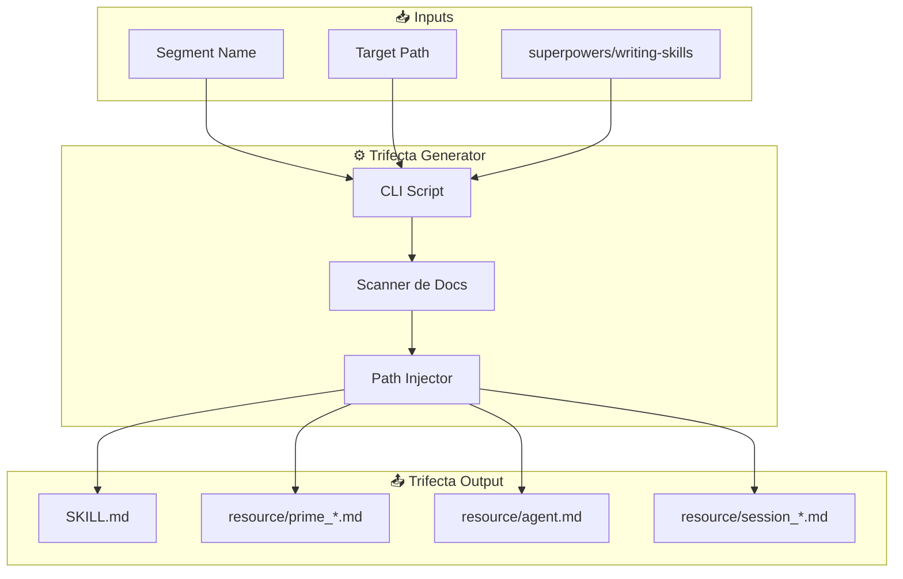

# 0) North Star (una frase)
**Queremos que:** Un agente entienda cualquier segmento del repo en <60 segundos leyendo solo 3 archivos + 1 log de sesión.
**Para:** Agentes de código (Claude, Gemini, Codex) y humanos onboarding.
**Porque hoy duele:** Los agentes parsean miles de líneas de código innecesariamente, consumen contexto, y terminan con información obsoleta o incompleta.

---

# 1) Estructura de Directorios (Genérica)

```
<cualquier-path>/<segment-name>/
├── SKILL.md                              # Reglas (MAX 100 líneas)
└── resource/
    ├── prime_<segment-name>.md           # Lista de lectura
    ├── agent.md                          # Stack técnico
    └── session_<segment-name>.md         # Log de handoff (runtime)
```

## Naming Convention
| Archivo | Patrón | Ejemplo |
|---------|--------|---------|
| Skill | `SKILL.md` | `SKILL.md` |
| Prime | `prime_<segment>.md` | `prime_eval-harness.md` |
| Agent | `agent.md` | `agent.md` |
| Session | `session_<segment>.md` | `session_eval-harness.md` |

## Ejemplos Concretos
```
eval/eval-harness/
├── SKILL.md
└── resource/
    ├── prime_eval-harness.md
    ├── agent.md
    └── session_eval-harness.md

hemdov/memory-system/
├── SKILL.md
└── resource/
    ├── prime_memory-system.md
    ├── agent.md
    └── session_memory-system.md
```

---

# 2) Flujo del Sistema Trifecta



---

# 3) Segment Contract Header

Todos los archivos de la trifecta llevan este header de 5-8 líneas:

```yaml
---
segment: <nombre-del-segmento>
scope: <descripción corta del alcance>
repo_root: <path absoluto a la raíz del repo>
last_verified: YYYY-MM-DD
depends_on:  # Archivos que invalidan esta trifecta si cambian
  - path/to/critical_file.py
---
```

---

# 4) Sistema de Perfiles (estilo nvim modeline)

## Catálogo de Perfiles (4 máximo)
| Profile | Propósito | Output Contract |
|---------|-----------|----------------|
| `diagnose_micro` | Máximo texto explicativo, código ≤3 líneas | `code_max_lines: 3` |
| `impl_patch` | Patch pequeño con verificación | `require: [FilesTouched, CommandsToVerify]` |
| `only_code` | Solo archivos + diff + comandos | `forbid: [explanations, essays]` |
| `plan` | DoD + pasos + gates (sin código) | `forbid: [code_blocks]` |
| `handoff_log` | Bitácora + handoff + next request | `append_only: true, require: [History, NextUserRequest]` |

## Frontmatter "Modeline"

```yaml
---
segment: eval
profile: impl_patch
profiles_allowed: [diagnose_micro, impl_patch, only_code, plan]
output_contract:
  code_max_lines: 60
  max_sections: 6
  require: [FilesTouched, CommandsToVerify]
---
```

## Herencia (como nvim)
- `SKILL.md` → Define `default_profile` del segmento.
- `prime_*.md` → Puede override para tareas específicas.
- `session_*.md` → Siempre usa `handoff_log`.

**Regla**: Si hay conflicto, gana el archivo más cercano a la tarea (session > prime > skill).

---

# 5) Rutas en `prime_*.md`

**Formato acordado**: Rutas desde la raíz del repo + header explícito.

```markdown
> **REPO_ROOT**: `/Users/felipe/Developer/agent_h`
> Todas las rutas son relativas a esta raíz.

## Documentos Obligatorios
1. `eval/docs/README.md` - Correcciones de diseño del harness
2. `eval/docs/ROUTER_CONTRACT.md` - Contrato del router
3. `eval/docs/METRICS.md` - Definición de KPIs
```

---

# 5) Source of Truth por Sección

En `agent.md`, cada sección declara su fuente:

```markdown
## LLM Roles
> **Source of Truth**: [SKILL.md](../SKILL.md)

## Providers & Timeouts
> **Source of Truth**: [providers.yaml](file:///.../providers.yaml)
```

Esto evita duplicación de verdad y contradicciones.

---

# 7) Session Log (`session_<segment>.md`) — Perfil `handoff_log`

Archivo de runtime con perfil fijo:

```markdown
---
segment: eval-harness
profile: handoff_log
output_contract:
  append_only: true
  require_sections: [History, NextUserRequest]
  max_history_entries: 10
  entry_fields: [user_prompt_summary, agent_response_summary]
  forbid: [refactors, long_essays]
---

# Active Session
- **Objetivo**:
- **Archivos a tocar**:
- **Gates a correr**:
- **Riesgos detectados**:

---

# History
```yaml
- session:
    timestamp: "2025-12-28T09:30:00"
    user_prompt_summary: "Fix memory tool selection gap"
    agent_response_summary: "Updated semantic_router.py, accuracy 95.5%"
    files_touched: ["semantic_router.py"]
    outcome: "Success"
```

# Next User Request
<!-- El siguiente agente comienza aquí -->
```

---

# 8) Fail Fast Contract Validation

El agente debe validar el contrato antes de responder:

1. **Leer** `profile` del frontmatter.
2. **Verificar** que su output cumple `output_contract`.
3. **Si falla**: Responder `ContractCheck: FAIL` y proponer perfil correcto.

---

# 9) Progressive Disclosure (Carga por Niveles)

## Los 3 Niveles de Carga
| Nivel | Trigger | Qué Carga | Tokens |
|-------|---------|-----------|--------|
| **L0: Metadata** | Score < 0.6 | Solo YAML frontmatter de `skill.md` | ~50 |
| **L1: Full Skill** | Score 0.6-0.9 | `skill.md` completo | ~500-1000 |
| **L2: Resources** | Score > 0.9 o Fase 0 | `_ctx/prime.md` + `_ctx/agent.md` | ~200-500 c/u |

## Multi-Channel Activation Signals
| Canal | Peso | Señal |
|-------|------|-------|
| `keywords` | 0.25 | Palabras en el prompt del usuario |
| `intent` | 0.25 | Patrones de intención ("evaluar router", "fix tool selection") |
| `path` | 0.25 | Rutas de archivos mencionadas o abiertas |
| `content` | 0.25 | Contenido del archivo activo |

## Mapeo a Fases
| Fase | Nivel de Carga | Condición |
|------|----------------|-----------|
| **Pre-Fase 0** | L0 (metadata only) | Score < 0.6 |
| **Fase 0 (Load)** | L1 + L2 (skill + prime + agent) | Score >= 0.6 |
| **Fase 1 (Execute)** | L2 completo + session.md | Fase 0 registrada |

---

# 10) Resource On-Demand Loading

## Formato de Referencias en SKILL.md
```markdown
## Resources (Load On-Demand)
- `@_ctx/prime_eval-harness.md` ← Lista de lectura
- `@_ctx/agent.md` ← Stack técnico
- `@_ctx/session_eval-harness.md` ← Log de handoff
```

## Hook Logic (Claude Code)
```python
import re
from pathlib import Path

def expand_resource_refs(skill_content: str, segment_path: Path) -> str:
    """Expande referencias @_ctx/... on-demand."""
    resource_refs = re.findall(r'@(_ctx/[^\s]+\.md)', skill_content)

    for ref in resource_refs:
        resource_path = segment_path / ref
        if resource_path.exists():
            resource_content = resource_path.read_text()
            skill_content = skill_content.replace(
                f'@{ref}',
                f'\n<!-- EXPANDED: {ref} -->\n{resource_content}\n<!-- END -->\n'
            )
    return skill_content
```

## Ahorro de Tokens
| Escenario | Sin On-Demand | Con On-Demand |
|-----------|---------------|---------------|
| Score < 0.6 | 0 | 0 |
| Score 0.6-0.9 | ~1500 | ~550 |
| Fase 0 completa | ~1500 | ~1200 |
| Fase 1 completa | ~2000 | ~1500 |

---

# 11) Decisiones Técnicas

| Opción | Pros | Contras |
|--------|------|---------|
| **Script Python (`uv run scripts/trifecta.py`)** | Compatible, interactivo | Requiere argparse/typer |
| **Makefile Target** | Simple | Menos interactivo |
| **Skill para Agente** | Meta: agente crea para otro | Puede confundir |

**Decisión**: Script Python con Typer.

## B) Tech Stack
- **Lenguaje**: Python 3.12
- **CLI**: `typer`
- **Template Engine**: String formatting (sin jinja2)
- **Scanner**: `pathlib` + glob

---

# 8) Templates

## SKILL.md
**Usar metodología de**: `@.claude/skills/superpowers/writing-skills/SKILL.md`
**Restricción**: MAX 100 líneas.

## AGENT_TEMPLATE.md
```markdown
<!-- TEMPLATE PEGADO POR USUARIO -->
```

---

# 9) CLI Esperado

```bash
# Crear nueva trifecta
uv run python scripts/trifecta.py create \
    --segment eval-harness \
    --path eval/eval-harness/ \
    --scan-docs eval/docs/

# Validar trifecta existente
uv run python scripts/trifecta.py validate --path eval/eval-harness/

# Actualizar solo prime (re-escanea docs)
uv run python scripts/trifecta.py refresh-prime --path eval/eval-harness/
```

---

# 10) Riesgos/Antipatrones

- ☠️ **Drift**: Pre-commit hook que checkea `depends_on`.
- 🧨 **Scope creep**: Generador SOLO crea 4 archivos (3 estáticos + 1 log).
- ☠️ **SKILL.md > 100 líneas**: CLI rechaza generación si excede.

---

# 14) Próximo Paso

1. **Ahora**: Crear `scripts/trifecta.py` con comandos `create`, `validate`, `refresh-prime`.
2. **Después**: Probar con segmento `eval-harness`.
3. **Futuro (MCP)**: Discovery Tool + Progressive Disclosure automático.

---

# 15) Fase Futura: MCP Discovery Tool

> **Estado**: Diseño completo, implementación diferida.

Sistema de activación automática con:
- Segment Registry (`.trifecta/registry.json`)
- Multi-channel signals (keywords, intent, path, content)
- Progressive Disclosure (L0, L1, L2)
- Resource On-Demand Loading

**Trigger**: Cuando el CLI básico esté estable y probado.
