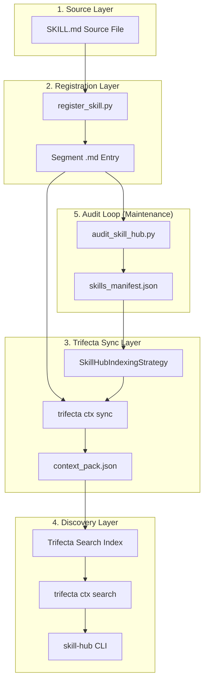

# Skill-Hub Configuration and Data Flow

This document details the configuration files, data structures, and the overall lifecycle of a skill entry within the global Skill-Hub.

### 01. sources.yaml
- **Path:** `/Users/felipe_gonzalez/.trifecta/segments/skills-hub/_ctx/sources.yaml`
- **Purpose:** Defines the root directories to be scanned for skills, their relative priorities, and global exclusion patterns.
- **Format:** yaml

```yaml
sources:
  - name: pi-agent-skills
    path: ~/.pi/agent/skills
    priority: 1
    type: directory
  - name: agents-skills
    path: ~/.agents/skills
    priority: 2
    type: directory
  - name: claude-skills
    path: ~/.claude/skills
    priority: 3
    type: directory
# ... other sources (codex, project-local, etc.)

exclusions:
  - "**/node_modules/**"
  - "**/__pycache__/**"
  - "**/skill-evals/**"

indexing:
  include_patterns:
    - "**/*.md"
    - "**/SKILL.md"
```

### 02. skills_manifest.json
- **Path:** `/Users/felipe_gonzalez/.trifecta/segments/skills-hub/_ctx/skills_manifest.json`
- **Purpose:** The central registry and "Source of Truth" for all indexed skills. It enables fast lookups and consistency checks.
- **Format:** json

```json
{
  "schema_version": 2,
  "skills": [
    {
      "id": "skill:agentic-constitution-anchor",
      "name": "agentic-constitution-anchor",
      "relative_path": "agentic-constitution-anchor.md",
      "description": "Use when the user explicitly wants to create or review artifacts under the Agentic Constitution...",
      "source": "pi-agent-skills",
      "canonical": true,
      "tags": []
    },
    {
      "id": "skill:agents-md-optimizer",
      "name": "agents-md-optimizer",
      "relative_path": "agents-md-optimizer.md",
      "description": "Use when creating, auditing, or refactoring AGENTS.md files for Codex...",
      "source": "pi-agent-skills",
      "canonical": true,
      "tags": []
    }
  ]
}
```

### 03. aliases.yaml
- **Path:** `/Users/felipe_gonzalez/.trifecta/segments/skills-hub/_ctx/aliases.yaml`
- **Purpose:** Provides query expansion and natural language mappings to specific skill IDs, improving search relevance for common terms in both English and Spanish.
- **Format:** yaml

```yaml
schema_version: 1
aliases:
  write:
    - article-writing
    - writing-clearly-and-concisely
  resumir:
    - article-writing
  agenticos:
    - tmux-plan-auditor
    - workorder-execution-base
    - strategic-compact
  "register skill hub":
    - indexing-skills-safely
```

### 04. context_pack.json
- **Path:** `/Users/felipe_gonzalez/.trifecta/segments/skills-hub/_ctx/context_pack.json`
- **Purpose:** A consolidated "build artifact" generated by Trifecta that contains the full text and metadata of all segments for high-speed context loading.
- **Format:** json

```json
{
  "schema_version": 1,
  "segment": "skills-hub",
  "created_at": "2026-04-16T10:17:26.593180",
  "source_files": [ ... metadata for each .md file ... ],
  "chunks": [
    {
      "id": "skill:agentic-constitution-anchor:95623e8ff8",
      "text": "<!-- managed-by:indexing-skills-safely:start -->\nread .../SKILL.md\n# Skill: agentic-constitution-anchor\n...",
      "source_path": "agentic-constitution-anchor.md"
    }
  ]
}
```

### 05. indexing-skills-safely.md
- **Path:** `/Users/felipe_gonzalez/.trifecta/segments/skills-hub/indexing-skills-safely.md`
- **Purpose:** A sample of a managed segment entry. It uses a "read" pointer to the actual source file to ensure the hub always serves the latest content.
- **Format:** markdown

```markdown
<!-- managed-by:indexing-skills-safely:start -->
read /Users/felipe_gonzalez/.pi/agent/skills/indexing-skills-safely/SKILL.md
# Skill: indexing-skills-safely

**Source**: pi-agent-skills

**Search Hints**: register a skill safely; refresh canonical hub entry; rebuild skills manifest; reconcile searchable skill count; fix skill-hub indexing

Use when you need to register a skill safely in the global `skill-hub`, refresh a canonical hub entry, or reconcile manifest and count drift with deterministic validation instead of ad-hoc manual indexing.
<!-- managed-by:indexing-skills-safely:end -->
```

### 06. tmux-fork-orchestrator.md
- **Path:** `/Users/felipe_gonzalez/.trifecta/segments/skills-hub/tmux-fork-orchestrator.md`
- **Purpose:** A recently-fixed managed entry showing rich search hints and detailed trigger conditions for parallel orchestration.
- **Format:** markdown

```markdown
<!-- managed-by:indexing-skills-safely:start -->
read /Users/felipe_gonzalez/.pi/agent/skills/tmux-fork-orchestrator/SKILL.md
# Skill: tmux-fork-orchestrator

**Source**: pi-agent-skills

**Search Hints**: tmux-fork orchestrator sub-agents parallel multi-agent delegation spawn monitor consolidate fork-memory opencode pi-backend code-review parallel-exploration

Use when you need to coordinate multiple AI sub-agents via tmux_fork's orchestration layer...
<!-- managed-by:indexing-skills-safely:end -->
```

### 07. skill.md
- **Path:** `/Users/felipe_gonzalez/.trifecta/segments/skills-hub/skill.md`
- **Purpose:** Defines the Skill-Hub segment itself, providing the system-level description and high-level workflows for the hub.
- **Format:** markdown

```markdown
---
name: skills-hub
description: Use when discovering, using, or adding skills to the global skills index.
---

# Skills Hub
Global skills index for discovering and managing skills across multiple agent runtimes.
...
```

### Data Flow Diagram

The following diagram illustrates the lifecycle of a skill from its source definition to its discovery via the CLI.


