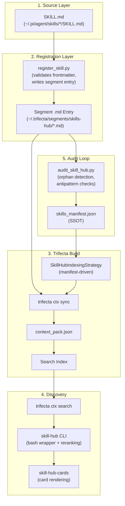

# Skill-Hub Ecosystem — Technical Reference

> **Generated:** 2026-04-16 | **Agents:** 4 parallel explorers (fork-doc-skills, fork-doc-cli, fork-doc-trifecta, fork-doc-config)  
> **Scope:** 22 components across 4 layers (Skills, CLI, Trifecta Infra, Config/Data)

---

## Table of Contents

1. [Architecture Overview](#architecture-overview)
2. [Data Flow](#data-flow)
3. [Layer 1: Skills](#layer-1-skills)
4. [Layer 2: CLI Tools](#layer-2-cli-tools)
5. [Layer 3: Trifecta Infrastructure](#layer-3-trifecta-infrastructure)
6. [Layer 4: Configuration & Data](#layer-4-configuration--data)
7. [Component Matrix](#component-matrix)

---

## Architecture Overview

```
┌─────────────────────────────────────────────────────────────────┐
│                     AGENT RUNTIMES                              │
│  pi-agent   │   Claude Code   │   Codex   │   Other agents     │
│  (priority 1)│  (priority 3)  │ (priority 4)│                   │
└──────┬───────┴────────┬───────┴─────┬─────┴────────────────────┘
       │                │             │
       ▼                ▼             ▼
┌─────────────────────────────────────────────────────────────────┐
│  SKILL.md files (source of truth for each skill)                │
└──────────────────────────┬──────────────────────────────────────┘
                           │ register_skill.py
                           ▼
┌─────────────────────────────────────────────────────────────────┐
│  SEGMENT ENTRIES (~/.trifecta/segments/skills-hub/*.md)         │
│  Managed pointers: managed-by:indexing-skills-safely            │
└──────────────────────────┬──────────────────────────────────────┘
                           │ trifecta ctx sync
                           ▼
┌─────────────────────────────────────────────────────────────────┐
│  TRIFECTA BUILD ENGINE                                          │
│  SkillHubIndexingStrategy → context_pack.json → Search Index   │
└──────────────────────────┬──────────────────────────────────────┘
                           │ trifecta ctx search
                           ▼
┌─────────────────────────────────────────────────────────────────┐
│  CLI LAYER                                                      │
│  skill-hub → skill-hub-cards → skill_hub_cards_core.py          │
│  skill-hub-health (smoke test)                                  │
└─────────────────────────────────────────────────────────────────┘
```

---

## Data Flow



---

## Layer 1: Skills

### 1.1 indexing-skills-safely (pi-agent)

- **Path:** `~/.pi/agent/skills/indexing-skills-safely/SKILL.md`
- **Source:** pi-agent-skills (priority 1)
- **Description:** Use when you need to register a skill safely in the global `skill-hub`, refresh a canonical hub entry, or reconcile manifest and count drift with deterministic validation instead of ad-hoc manual indexing.
- **Search hints:** `register a skill safely; refresh canonical hub entry; rebuild skills manifest; reconcile searchable skill count; fix skill-hub indexing`

**Workflow:** validate SKILL.md → write segment entry → ctx sync → rebuild manifest → verify search hit

**Scripts:**

| Script | Size | Purpose |
|--------|------|---------|
| `register_skill.py` | 13,912 bytes | Single-skill registration with frontmatter validation, source priority, and search verification |
| `audit_skill_hub.py` | 11,943 bytes | Bulk audit: orphan detection, antipattern checks, manifest rebuild |
| `bulk_register.sh` | 2,849 bytes | Batch register all skills from a directory |

**Resources:** `resources/antipatterns-and-patterns.md` — 6 anti-patterns and 5 patterns from real debugging sessions

```yaml
# Frontmatter
name: indexing-skills-safely
description: "Use when you need to register a skill safely..."
search_hints: register a skill safely; refresh canonical hub entry...
metadata:
  triggers: ["register", "a", "skill", "safely;", "refresh"]
  role: specialist
  scope: implementation
version: 1.0.0
```

```python
# register_skill.py — Source priority system
SOURCE_ROOTS = [
    ("pi-agent-skills", Path("~/.pi/agent/skills").expanduser()),
    ("agents-skills", Path("~/.agents/skills").expanduser()),
    ("claude-skills", Path("~/.claude/skills").expanduser()),
    ("codex-skills", Path("~/.codex/skills").expanduser()),
    ("examen_grado", Path("~/Developer/examen_grado/skills").expanduser()),
    ("skills-fabrik", Path("~/Developer/skills-fabrik/skills").expanduser()),
    ("superpowers-marketplace", Path("~/.claude/plugins/cache/superpowers-marketplace").expanduser()),
]
SOURCE_PRIORITY = {name: index for index, (name, _) in enumerate(SOURCE_ROOTS)}
```

```python
# audit_skill_hub.py — Antipattern detection (added 2026-04-16)
suspect_descriptions = [
    {"name": skill.get("name", ""), "description": skill.get("description", ""), "issue": "truncated_or_empty"}
    for skill in manifest_skills
    if isinstance(skill, dict) and len(skill.get("description", "")) <= 2
]

entries_missing_hints = [
    {"name": entry.name, "entry_file": str(entry.entry_file)}
    for entry in registered_entries
    if "**Search Hints**:" not in entry.entry_file.read_text(encoding="utf-8")
]
```

---

### 1.2 skill-workflow (pi-agent)

- **Path:** `~/.pi/agent/skills/skill-workflow/SKILL.md`
- **Source:** pi-agent-skills
- **Description:** Use for installing external skills from GitHub: clone, analyze, refactor, register in skill-hub. Do NOT use for creating new skills.
- **Search hints:** `install skill github onboard import register external skill-hub progressive disclosure trigger test catalog`

**Workflow (8 phases):**

| Phase | Description | Output |
|-------|-------------|--------|
| 1. Fetch | Clone repo to temp location | Temp directory path |
| 2. Analyze | Validate structure, frontmatter, size | Analysis report |
| 3. Refactor | Progressive disclosure if needed | Restructured skill |
| 4. Agnosticize | Remove vendor-specific references | Clean skill |
| 5. Optimize | Improve description + search_hints | Optimized frontmatter |
| 6. Register | Add to skill-hub and manifest | Hub entry created |
| 7. Test | Trigger tests for searchability | Test results |
| 8. Catalog | Update skills_catalog CSV | Catalog updated |

```yaml
# Frontmatter
name: skill-workflow
description: "Use for installing external skills from GitHub..."
search_hints: install skill github onboard import register external...
metadata:
  triggers: ["install skill", "import skill", "onboard skill", "register skill", "skill from GitHub"]
```

---

### 1.3 skill-hub-repeat (pi-agent + codex)

- **Path (pi):** `~/.pi/agent/skills/skill-hub-repeat/SKILL.md`
- **Path (codex):** `~/.codex/skills/skill-hub-repeat/SKILL.md`
- **Source:** pi-agent-skills + codex-skills
- **Description:** Use when the user explicitly wants `skill-hub` used on every task and phase of a multi-step workflow.
- **Search hints:** `use skill-hub on every task and phase; repeat skill-hub lookup across workflow phases`

**Core rule:** Run `skill-hub "<current task instruction>"` before EVERY material phase and before EVERY new concrete task inside that phase.

```yaml
# pi frontmatter
name: skill-hub-repeat
description: "Use when the user explicitly wants `skill-hub` used on every task..."
search_hints: use skill-hub on every task and phase...
```

---

### 1.4 find-skills (pi-agent)

- **Path:** `~/.pi/agent/skills/find-skills/SKILL.md`
- **Source:** pi-agent-skills
- **Description:** Helps users discover and install agent skills when they ask questions like "how do I do X", "find a skill for X", "is there a skill that can..."
- **Search hints:** `discover install skills npx search ecosystem package capabilities extend`

**Workflow:** `npx skills find [query]` → present options → `npx skills add <package> -g -y`

```yaml
name: find-skills
description: Helps users discover and install agent skills...
search_hints: discover install skills npx search ecosystem package capabilities extend
metadata:
  triggers: ["discover", "install", "skills", "npx", "search"]
  version: "1.0.0"
```

---

### 1.5 skills-hub (claude)

- **Path:** `~/.claude/skills/skills-hub/SKILL.md`
- **Source:** claude-skills (priority 3)
- **Description:** Use when searching for skills in the global skills index. Teaches HOW to search effectively.
- **Search hints:** `search find discover skills hub global index query`

**Role:** The "user guide" for skill-hub. Teaches query tips, result interpretation, and skill access patterns.

```yaml
name: skills-hub
description: "Use when searching for skills in the global skills index..."
search_hints: search find discover skills hub global index query
metadata:
  triggers: [find skill], [search skills], [skill-hub], [discover skills]
  version: 2.0.0
```

---

### 1.6 indexing-skills-safely (codex)

- **Path:** `~/.codex/skills/indexing-skills-safely/SKILL.md`
- **Source:** codex-skills
- **Description:** Use when adding or updating Codex skills and you need them discoverable in skill-hub quickly.
- **Note:** Simplified version of the pi-agent skill. Has its own `register_skill.py` (7,542 bytes) with fewer source roots.

```python
# Codex version — fewer source roots
SOURCE_ROOTS = [
    ("pi-agent-skills", Path("~/.pi/agent/skills").expanduser()),
    ("agents-skills", Path("~/.agents/skills").expanduser()),
    ("claude-skills", Path("~/.claude/skills").expanduser()),
    ("codex-skills", Path("~/.codex/skills").expanduser()),
    ("examen-grado-skills", Path("~/Developer/examen_grado/skills").expanduser()),
]
```

---

### 1.7 checkpoint-codex (codex, peripheral)

- **Path:** `~/.codex/skills/checkpoint-codex/SKILL.md`
- **Relation to skill-hub:** Uses `skill-hub "checkpoint handoff"` to discover context and follows `indexing-skills-safely` patterns.

```python
# Key script: checkpoint_codex.py
REQUIRED_FIELDS = ("name", "current_plan", "completed_tasks", "pending_tasks", "pending_errors", "next_agent_prompt")
```

---

### 1.8 learned-contract-drift-fail-open-diagnosis (codex, peripheral)

- **Path:** `~/.codex/skills/learned-contract-drift-fail-open-diagnosis/SKILL.md`
- **Relation to skill-hub:** Born from incidents where skill-hub appeared broken due to segment-state corruption and weak manifest contracts.

---

## Layer 2: CLI Tools

### 2.1 skill-hub

- **Path:** `~/.local/bin/skill-hub`
- **Type:** Bash (4,073 bytes, 153 lines)
- **Purpose:** Primary CLI entry point for searching global skills with lightweight alias-aware reranking.
- **Dependencies:** `trifecta`, `skill-hub-cards`, `python3`
- **Called by:** Manual user invocation, agentic workflows

```bash
# Query parsing
while [ $# -gt 0 ]; do
    case "$1" in
        --cards|-c) USE_CARDS=1; shift ;;
        --limit|-l) LIMIT="$2"; shift 2 ;;
        *) QUERY="$QUERY $1"; shift ;;
    esac
done

# Reranking decision: multi-word queries trigger reranking
RERANK_MODE="${SKILL_HUB_RERANK:-auto}"
case "$RERANK_MODE" in
  1|true|always) SHOULD_RERANK=1 ;;
  0|false|never) SHOULD_RERANK=0 ;;
  *) [[ "$QUERY" == *" "* ]] && SHOULD_RERANK=1 ;;
esac

# Alias matching via Python inline
CANONICAL_ALIAS_MATCH="$(EXPLAIN_JSON="$EXPLAIN_JSON" python3 - <<'PY'
import json, os, re
data = json.loads(os.environ.get("EXPLAIN_JSON", ""))
expanded_terms = data.get("expansions", {}).get("expanded_terms", [])
hits = data.get("hits", [])
for term in expanded_terms:
    if not re.fullmatch(r"[a-z0-9-]+", term): continue
    for hit in hits:
        if hit.get("ref", "").startswith(f"skill:{term}:"):
            print(term if hit != hits[0] else "")
            raise SystemExit(0)
PY
)"

# Final search execution
MAIN_OUTPUT="$(run_search_capture --query "$QUERY")"
printf '%s\n' "$MAIN_OUTPUT"
```

---

### 2.2 skill-hub-cards

- **Path:** `~/.local/bin/skill-hub-cards`
- **Type:** Python (326 bytes, 15 lines)
- **Purpose:** Thin entry point for the card rendering engine.
- **Dependencies:** `skill_hub_cards_core.py`

```python
#!/usr/bin/env python3
from __future__ import annotations
import sys
from pathlib import Path

SCRIPT_DIR = Path(__file__).resolve().parent
if str(SCRIPT_DIR) not in sys.path:
    sys.path.insert(0, str(SCRIPT_DIR))

from skill_hub_cards_core import cli  # noqa: E402

if __name__ == "__main__":
    raise SystemExit(cli())
```

---

### 2.3 skill_hub_cards_core.py

- **Path:** `~/.local/bin/skill_hub_cards_core.py`
- **Type:** Python (19,128 bytes, 606 lines)
- **Purpose:** Core engine for skill discovery, result normalization, and multi-style rendering.
- **Dependencies:** `trifecta` (subprocess), `rich` (optional)

**Key data structures:**

```python
@dataclass(frozen=True)
class RawSearchHit:
    ref: str
    raw_type: str
    title: str
    score: float

@dataclass(frozen=True)
class NormalizedResult:
    ref: str
    raw_type: str
    raw_title: str
    score: float
    stable_id: str | None
    visible_title: str | None
    path: str | None
```

**Rendering pipeline:**

```python
def cli(argv: list[str] | None = None) -> int:
    raw_search_output = _load_search_payload(args)
    hits = parse_search_output(raw_search_output)
    chunk_texts = run_get(hit.ref for hit in hits)
    plan = build_render_plan(raw_search_output, chunk_texts)
    
    rendered = output_json(plan) if args.json else (
        render_rich(plan) if args.style == "rich" else render_plain(plan)
    )
```

**Design tokens (4px grid system):**

```python
SPACE_1 = 1  # micro (4px)
SPACE_2 = 2  # tight (8px)
SPACE_3 = 3  # standard (12px)
BORDER_SUBTLE = "grey37"
BG_CTA = "grey19"
```

---

### 2.4 skill-hub-health

- **Path:** `~/.local/bin/skill-hub-health`
- **Type:** Bash (3,386 bytes, 114 lines)
- **Purpose:** Smoke test utility for CLI responsiveness and correctness.
- **Dependencies:** `skill-hub`, `timeout`, `grep`

```bash
run_tests() {
    check "single word, plain"     'skill-hub "security" --plain --limit 3'
    check "multi word, plain"      'skill-hub "how to debug async code" --plain --limit 3'
    check "compact style"          'skill-hub "python" --limit 3 --compact'
    check "cards mode"             'skill-hub "python" --cards --limit 3'
    check "health no hang"         'timeout 10 skill-hub "test" 2>&1'
}
```

---

## Layer 3: Trifecta Infrastructure

### 3.1 skill_hub_indexing_strategy.py

- **Path:** `~/Developer/agent_h/trifecta_dope/src/application/skill_hub_indexing_strategy.py`
- **Purpose:** Manifest-driven indexing strategy. Only entries in `skills_manifest.json` are indexed. Segment metadata excluded. Fail-closed if manifest invalid.

```python
class SkillHubIndexingStrategy:
    def build_from_manifest(self, manifest: SkillManifest) -> Result[ContextPack, list[str]]:
        for skill_entry in manifest.skills:
            if not skill_entry.canonical:
                continue

            skill_file_path = self.segment_path / skill_entry.relative_path
            content = skill_file_path.read_text(encoding="utf-8")
            
            chunk = ContextChunk(
                id=skill_entry.chunk_id,
                doc="skill",
                title_path=[skill_file_path.name],
                text=content,
                source_path=skill_entry.relative_path,
                chunking_method="whole_file",
            )
            chunks.append(chunk)
        return Ok(ContextPack(..., chunks=chunks, ...))
```

---

### 3.2 skill_lint_use_case.py

- **Path:** `~/Developer/agent_h/trifecta_dope/src/application/skill_lint_use_case.py`
- **Purpose:** Orchestrates skill validation/linting pipeline (discovery + domain validation).

```python
def lint_skills(paths: list[Path]) -> SkillLintReport:
    discovered = discover_skills_from_paths(paths)
    results: list[SkillLintResult] = []
    for skill in discovered:
        validation = validate_skill_meta(skill.meta)
        # ... aggregate results ...
    return SkillLintReport(skills=results, total=len(results))
```

---

### 3.3 skills_fs.py

- **Path:** `~/Developer/agent_h/trifecta_dope/src/infrastructure/skills_fs.py`
- **Purpose:** Discovers SKILL.md files from filesystem, extracts YAML frontmatter.

```python
def parse_frontmatter(content: str) -> tuple[dict[str, Any], str]:
    lines = content.strip().split("\n")
    if not lines or lines[0].strip() != "---":
        return {}, content
    end_idx = -1
    for i in range(1, len(lines)):
        if lines[i].strip() == "---":
            end_idx = i
            break
    frontmatter_text = "\n".join(lines[1:end_idx])
    frontmatter = yaml.safe_load(frontmatter_text) or {}
    return frontmatter, body
```

---

### 3.4 skill_cards.py

- **Path:** `~/Developer/agent_h/trifecta_dope/src/cli/skill_cards.py`
- **Purpose:** Card rendering with Rich, following 4px grid design system.

```python
def _render_rich(card: SkillCard, file: IO[str] | None = None) -> None:
    panel = Panel(
        body,
        title=header,
        border_style=BORDER_SUBTLE,
        box=box.ROUNDED,
        padding=(SPACE_1, SPACE_2),
        expand=False,
    )
    console.print(panel)
```

---

### 3.5 cli_skills.py

- **Path:** `~/Developer/agent_h/trifecta_dope/src/infrastructure/cli_skills.py`
- **Purpose:** CLI command for keyword/alias extraction → `aliases.generated.yaml`.

```python
def run_extract_keywords(segment, output, min_frequency, max_skills_per_alias, ...):
    skills = load_skills_manifest(segment_path)
    extractor = KeywordExtractor(min_frequency=min_frequency, max_skills_per_alias=max_skills_per_alias)
    extracted = extractor.extract_from_skills(skills)
    alias_map = extractor.build_alias_map(extracted)
    writer = GeneratedAliasWriter(segment_path=segment_path, output_path=output_path)
    writer.write(alias_map.aliases)
```

---

### 3.6 skill_contracts.py

- **Path:** `~/Developer/agent_h/trifecta_dope/src/domain/skill_contracts.py`
- **Purpose:** Domain layer: defines `SkillMeta`, `SkillInput`, and validation rules. SSOT for "what a skill is".

```python
def validate_skill_meta(meta: SkillMeta) -> Result[SkillMeta, list[SkillValidationError]]:
    errors: list[SkillValidationError] = []
    if not meta.name or not meta.name.strip():
        errors.append(SkillValidationError("name", "name cannot be empty"))
    if not meta.description or not meta.description.strip():
        errors.append(SkillValidationError("description", "description cannot be empty"))
    return Err(errors) if errors else Ok(meta)
```

---

## Layer 4: Configuration & Data

### 4.1 sources.yaml

- **Path:** `~/.trifecta/segments/skills-hub/_ctx/sources.yaml`
- **Purpose:** Defines root directories to scan for skills, priorities, and exclusions.

```yaml
sources:
  - name: pi-agent-skills
    path: ~/.pi/agent/skills
    priority: 1
    type: directory
  - name: agents-skills
    path: ~/.agents/skills
    priority: 2
    type: directory
  - name: claude-skills
    path: ~/.claude/skills
    priority: 3
    type: directory
  - name: codex-skills
    path: ~/.codex/skills
    priority: 4
    type: directory
  - name: examen-grado-skills
    path: ~/Developer/examen_grado/skills
    type: directory
  - name: skills-fabrik
    path: ~/Developer/skills-fabrik/skills
    type: directory
  - name: superpowers-marketplace
    path: ~/.claude/plugins/cache/superpowers-marketplace
    type: directory
```

---

### 4.2 skills_manifest.json

- **Path:** `~/.trifecta/segments/skills-hub/_ctx/skills_manifest.json`
- **Purpose:** SSOT for all indexed skills. 172 entries. Manifest-driven indexing means only entries here are discoverable.

```json
{
  "schema_version": 1,
  "generated_at": "2026-04-16T10:17:26Z",
  "total_skills": 172,
  "sources": ["codex-skills", "pi-agent-skills"],
  "skills": [
    {
      "name": "agentic-constitution-anchor",
      "source_path": "/Users/.../.pi/agent/skills/agentic-constitution-anchor/SKILL.md",
      "source": "pi-agent-skills",
      "description": "Use when the user explicitly wants...",
      "tags": []
    }
  ]
}
```

---

### 4.3 aliases.yaml

- **Path:** `~/.trifecta/segments/skills-hub/_ctx/aliases.yaml`
- **Purpose:** Query expansion mappings for search relevance (English + Spanish).

```yaml
aliases:
  "register skill hub":
    - indexing-skills-safely
  agenticos:
    - tmux-plan-auditor
    - workorder-execution-base
  write:
    - article-writing
```

---

### 4.4 context_pack.json

- **Path:** `~/.trifecta/segments/skills-hub/_ctx/context_pack.json`
- **Purpose:** Build artifact containing full text and metadata of all segments for search indexing.

```json
{
  "schema_version": 1,
  "segment": "skills-hub",
  "chunks": [
    {
      "id": "skill:agentic-constitution-anchor:95623e8ff8",
      "text": "<!-- managed-by:indexing-skills-safely:start -->...",
      "source_path": "agentic-constitution-anchor.md"
    }
  ]
}
```

---

### 4.5 Segment Entry Format

Every segment `.md` follows this template:

```markdown
<!-- managed-by:indexing-skills-safely:start -->
read /absolute/path/to/skills/skill-name/SKILL.md
# Skill: skill-name

**Source**: pi-agent-skills

**Search Hints**: keyword1 keyword2 keyword3

Use when <trigger conditions>. Do NOT trigger for <negative cases>.
<!-- managed-by:indexing-skills-safely:end -->
```

---

## Component Matrix

| # | Component | Layer | Path | Size | Type |
|---|-----------|-------|------|------|------|
| 1 | indexing-skills-safely | Skill (pi) | `~/.pi/agent/skills/indexing-skills-safely/` | SKILL.md + 3 scripts | Agent instruction |
| 2 | skill-workflow | Skill (pi) | `~/.pi/agent/skills/skill-workflow/` | SKILL.md only | Agent instruction |
| 3 | skill-hub-repeat | Skill (pi+codex) | `~/.pi/agent/skills/skill-hub-repeat/` | SKILL.md only | Agent instruction |
| 4 | find-skills | Skill (pi) | `~/.pi/agent/skills/find-skills/` | SKILL.md only | Agent instruction |
| 5 | skills-hub | Skill (claude) | `~/.claude/skills/skills-hub/` | SKILL.md only | Agent instruction |
| 6 | indexing-skills-safely | Skill (codex) | `~/.codex/skills/indexing-skills-safely/` | SKILL.md + 1 script | Agent instruction |
| 7 | checkpoint-codex | Skill (codex) | `~/.codex/skills/checkpoint-codex/` | SKILL.md + 2 scripts | Peripheral |
| 8 | learned-contract-drift | Skill (codex) | `~/.codex/skills/learned-contract-drift-fail-open-diagnosis/` | SKILL.md only | Peripheral |
| 9 | skill-hub | CLI | `~/.local/bin/skill-hub` | 4,073 bytes | Bash wrapper |
| 10 | skill-hub-cards | CLI | `~/.local/bin/skill-hub-cards` | 326 bytes | Python entry point |
| 11 | skill_hub_cards_core.py | CLI | `~/.local/bin/skill_hub_cards_core.py` | 19,128 bytes (606 lines) | Python core |
| 12 | skill-hub-health | CLI | `~/.local/bin/skill-hub-health` | 3,386 bytes | Bash smoke test |
| 13 | skill_hub_indexing_strategy.py | Trifecta | `trifecta_dope/src/application/` | — | Manifest indexing |
| 14 | skill_lint_use_case.py | Trifecta | `trifecta_dope/src/application/` | — | Skill validation |
| 15 | skills_fs.py | Trifecta | `trifecta_dope/src/infrastructure/` | — | SKILL.md discovery |
| 16 | skill_cards.py | Trifecta | `trifecta_dope/src/cli/` | — | Card rendering |
| 17 | cli_skills.py | Trifecta | `trifecta_dope/src/infrastructure/` | — | Keyword extraction |
| 18 | skill_contracts.py | Trifecta | `trifecta_dope/src/domain/` | — | Domain contracts |
| 19 | sources.yaml | Config | `segments/skills-hub/_ctx/` | 7 sources | Source roots |
| 20 | skills_manifest.json | Config | `segments/skills-hub/_ctx/` | 172 entries | Skill registry |
| 21 | aliases.yaml | Config | `segments/skills-hub/_ctx/` | — | Query expansion |
| 22 | context_pack.json | Data | `segments/skills-hub/_ctx/` | — | Build artifact |
