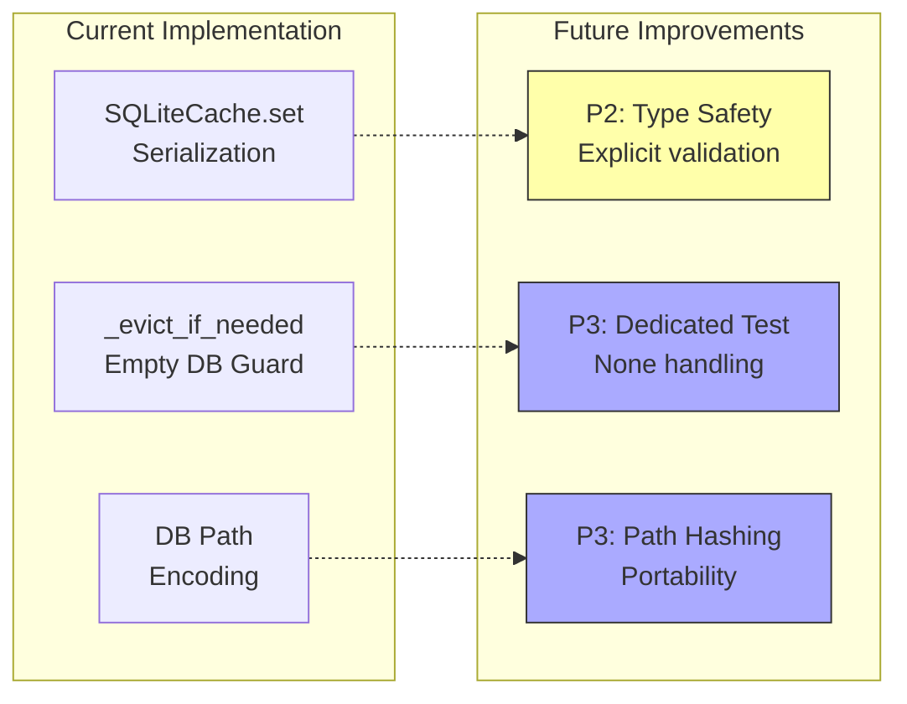

# Tech Debt: AST Cache Improvements

**Related PR**: Fix AST Cache --persist-cache Serialization Bug  
**Date**: 2026-01-05

## Tech Debt Overview



---

## P2: Type Safety in SQLiteCache.set()

**Current Issue**:
The serialization logic in `SQLiteCache.set()` uses duck-typing with a fallthrough:

```python
if isinstance(value, list) and value and hasattr(value[0], "to_dict"):
    value_serialized = [v.to_dict() for v in value]
# ... more checks ...
else:
    value_serialized = value  # ⚠️ ANY JSON-serializable type passes
```

This permits unexpected types to be stored without validation.

**Tasks**:
1. Add test: `test_sqlite_cache_set_rejects_unexpected_type`
   - Try to store non-SymbolInfo objects (e.g., arbitrary dict, custom class)
   - Verify appropriate error handling

2. Change fallthrough to fail-loud:
   - Option A: Log warning when fallthrough is used
   - Option B: Raise TypeError for unexpected types
   - Option C: Add explicit allow-list of acceptable types

**Priority**: P2 (Nice-to-have, not blocking)

---

## P3: Test for _evict_if_needed Empty DB

**Current Fix**:
Added guard in `_evict_if_needed`:
```python
current_bytes = current_bytes or 0  # Handle None from SUM when table is empty
```

**Issue**: This fix has no dedicated test.

**Task**:
Add test: `test_evict_if_needed_handles_empty_db`
- Set up empty SQLite cache
- Call method that triggers eviction logic
- Verify no TypeError on None arithmetic

**Priority**: P3 (Low - fix is simple and verified manually)

---

## P3: DB Path Encoding

**Observation**:
Cache DB path includes full absolute segment path in filename:
```
ast_cache__Users_felipe_gonzalez_Developer_agent_h_trifecta_dope.db
```

This makes the cache:
- Non-portable between machines
- Leaks filesystem structure
- Creates long filenames

**Potential Solutions**:
1. Hash the segment path → `ast_cache_a1b2c3d4.db`
2. Use relative path from repo root
3. Accept current behavior (low impact)

**Priority**: P3 (Cosmetic, current behavior works)

---

## Notes

All tech debt items are documented here to avoid scope creep in the P0 fix.
Each can be addressed independently in future PRs.
