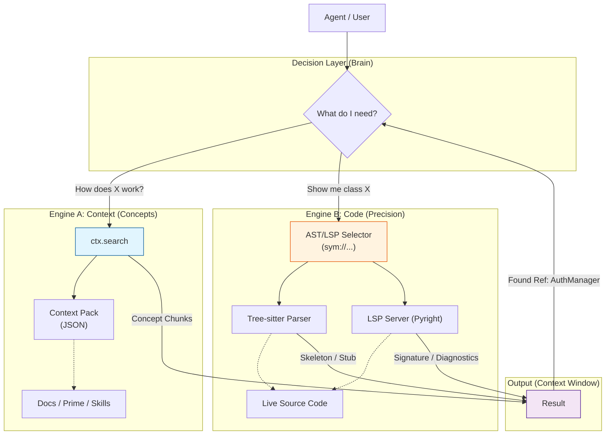

# Architecture Visualization: Trifecta v2 Dual-Engine

This diagram clarifies the relationship between the existing `ctx.search` (Context Engine) and the new AST/LSP logic (Code Engine).

**Key Takeaway**: AST/LSP does **not** replace `ctx.search`. They are parallel tools for different intents.

## Workflow Explanation (Progressive Disclosure)

1.  **Phase 1: Discovery (Engine A)**
    *   Agent uses `ctx.search("auth")`.
    *   **Result**: Receives `prime_auth.md` explaining the *concept* of Auth and mentioning `AuthManager` class.

2.  **Phase 2: Navigation (Engine B)**
    *   Agent sees `AuthManager` is relevant.
    *   Instead of `read_file(auth.py)`, Agent uses `ast symbols AuthManager`.
    *   **Result**: Receives **Skeleton** (methods list) of `AuthManager`.

3.  **Phase 3: Inspection (Engine B)**
    *   Agent wants the logic of `login()`.
    *   Agent uses `ast snippet sym://python/AuthManager.login`.
    *   **Result**: Receives only the 10 lines of code for that method.

**Conclusion**: `ctx.search` is the map; AST/LSP is the magnifying glass.
