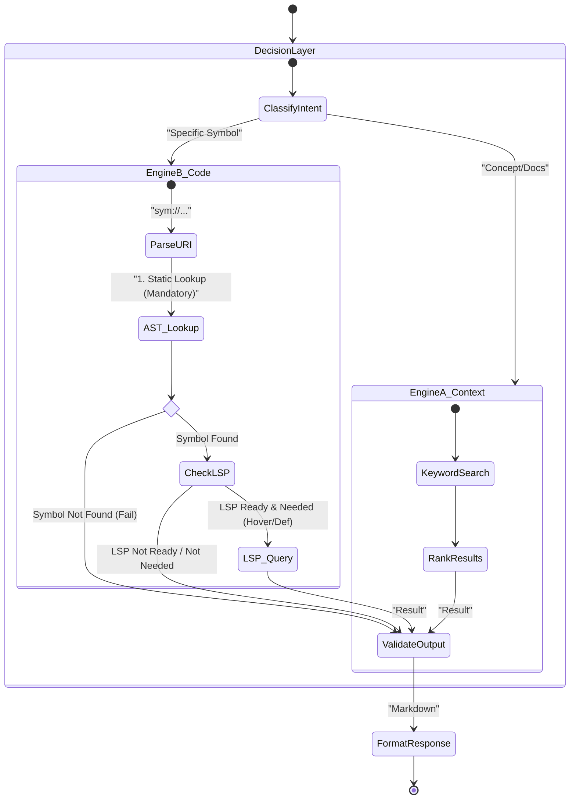

# Audit & Architecture: AST/LSP Dual-Engine Strategy v2

**Date**: 2026-01-01
**Role**: Auditor/Architect
**Scope**: Logic Analysis of AST+LSP Plan vs. Trifecta Philosophy
**Version**: 2.0 (Strict Contracts)

---

## 1. Trifecta Philosophy Alignment

The integration MUST adhere to these core principles to avoid "Second System Effect":

1.  **Simplicity & Tool-First**: The Agent is the user. The tool (`trifecta ast`) MUST be "dumb", deterministic, and predictable. No magic "auto-complete" functionality; strictly "fetch this symbol".
2.  **Fail-Closed Security**: If a symbol cannot be resolved explicitly (exact match), fail. It MUST NOT fuzzy-guess. We prefer a `SYMBOL_NOT_FOUND` error over hallucinating a line number.
3.  **Progressive Disclosure (The "Zoom" Metaphor)**:
    *   **L0 (Map)**: `ctx.search` (Files/Concepts)
    *   **L1 (Skeleton)**: `ast symbols` (Class/Func names) -> **Lightweight**
    *   **L2 (Snippet)**: `ast snippet` (Implementation) -> **Medium**
    *   **L3 (Full)**: `ctx.get` (Raw Source) -> **Heavy**
4.  **No "IDE Replacement"**: Usage of LSP is strictly for *read-only navigation* (Go to Definition, Hover), NOT for writing/refactoring. Use standard tools (`sed`, `grep`) for writes.

---

## 2. State Machine (Flow)

The system operates as a **Parallel Dispatch** based on Intent, with AST serving as the mandatory gate for Code Engine operations.



---

## 3. Selector DSL Contract (`sym://`)

To eliminate ambiguity between module paths vs. class names, we enforce **Option A (Explicit Prefixes)**.

The Selector URI MUST conform to the following EBNF grammar. Invalid URIs MUST be rejected immediately with `INVALID_SELECTOR_SYNTAX`.

### 3.1 Grammar (EBNF)
```ebnf
URI         = "sym://" Language "/" Kind "/" Path ("#" Member)?
Language    = "python"
Kind        = "mod" | "type"
Path        = Identifier ("/" Identifier)*
Member      = Identifier ("." Identifier)*
Identifier  = [a-zA-Z_][a-zA-Z0-9_]*
```

### 3.2 Semantic Rules
1.  **`mod`**: Targets a File Skeleton. `Path` represents the file path (relative to source root, no extension needed if unambiguous, or explicit).
2.  **`type`**: Targets a Top-Level Symbol (Class/Func). `Path` is the File, `Member` (or last part of path?) -- *Clarification*: In this scheme, `Path` locates the file, and the Symbol is purely within the file.
    *   *Refined Rule*: `sym://python/type/<FileStem>/<SymbolName>` relies on `FileStem` finding a file.
    *   To support `sym://python/type/pkg/module/Class`, we use: `sym://python/type/<dotted_or_slashed_path_to_symbol>`.
    *   **Decision**: We split path from symbol.
    *   `sym://python/mod/<path/to/file>`
    *   `sym://python/type/<path/to/file>/<TopLevelSymbol>`
    *   `sym://python/type/<path/to/file>/<Class>#<Method>`

### 3.3 Examples
| URI | Validity | Intent |
| :--- | :--- | :--- |
| `sym://python/mod/user_model` | **VALID** | File Skeleton (`user_model.py`) |
| `sym://python/type/user_model/User` | **VALID** | Class Skeleton (`class User` in `user_model.py`) |
| `sym://python/type/user_model/User#get_email` | **VALID** | Method Snippet |
| `sym://python/User` | **INVALID** | Missing Kind (`mod` or `type`) |
| `sym://python/mod/User` | **VALID** | Looks for file `User.py` |

### 3.4 Errors & Ambiguity
If `path/to/file` matches multiple files (e.g., `utils.py` and `pkg/utils.py` for input `utils`), return `AMBIGUOUS_SYMBOL`.

**Ambiguous Candidate Format**:
```json
{
  "sym": "sym://python/mod/utils",
  "candidates": [
    { "sym": "sym://python/mod/root/utils", "file_rel": "root/utils.py", "kind": "mod" },
    { "sym": "sym://python/mod/pkg/utils", "file_rel": "pkg/utils.py", "kind": "mod" }
  ]
}
```

---

## 4. Output Contract (JSON)

The CLI and Internal API MUST return this exact JSON structure.

### 4.1 Error Codes (Enum)
*   `INVALID_SELECTOR_SYNTAX`: URI malformed or missing parts.
*   `LANGUAGE_NOT_SUPPORTED`: Only `python` is supported in v0.
*   `SYMBOL_NOT_FOUND`: AST parse succeeded but requested symbol absent.
*   `AMBIGUOUS_SYMBOL`: Path matches multiple files.
*   `BUDGET_EXCEEDED`: Content size exceeds policy limits.

### 4.2 Response Structure
```json
{
  "status": "ok",  // or "error" IF AND ONLY IF errors is not empty
  "kind": "skeleton | snippet | hover",
  "data": {
    "uri": "sym://python/type/foo/bar",
    "range": { "start_line": 10, "end_line": 25 },
    "content": "def bar():\n    pass",
    "signature": "def bar() -> None",
    "children": ["baz", "qux"]
  },
  "refs": [ 
    { "kind": "definition", "uri": "sym://python/mod/other" } 
  ],
  "errors": [],
  "next_actions": [
    "ast snippet sym://python/type/foo/bar"
  ]
}
```

---

## 5. Budget Policy (Bytes/Lines)

To protect the context window, the system MUST enforce strict **Byte/Line** limits. Tokens are for observation only.

| Limit Name | Safe Value | Action if Exceeded |
| :--- | :--- | :--- |
| `max_bytes_total_per_command` | **32,000 bytes** (~8k chars) | Return `BUDGET_EXCEEDED` error. |
| `max_snippet_bytes` | **2,000 bytes** | Truncate content, append comment `# ... truncated`. |
| `max_snippets_per_command` | **5** | Drop subequent results. |
| `max_lines_per_snippet` | **50 lines** | Truncate, append `# ... X lines hidden`. |

*Tokens*: MAY be calculated for telemetry (`telemetry.ast_tokens`), but MUST NOT determine logic flow.

---

## 6. System Invariants (The "Never" List)

1.  **AST-First**: The system MUST always perform AST resolution before any other operation (LSP).
2.  **Deterministic Failure**: If resolution fails, return `SYMBOL_NOT_FOUND`. **Never** return nearest match.
3.  **Read-Only**: The Dual-Engine NEVER modifies source code.
4.  **Isolation**: An LSP crash **NEVER** crashes the CLI/Agent. Wrap in `try/catch`.
5.  **Fail-Closed**: If `AMBIGUOUS_SYMBOL` occurs, return the error list, do not pick one.

---

## 7. Implementation Gate (Merge Requirements)

Before merging Phase 2a (AST Integration), the following performance targets and tests MUST be met.

### 7.1 Performance Targets (Buckets)
*Non-binding targets, but telemetry must observe them.*

| Bucket | Size Range | Target (p95) AST Parse |
| :--- | :--- | :--- |
| **Small** | < 5 KB | < 10ms |
| **Medium** | 5 KB - 50 KB | < 50ms |
| **Large** | 50 KB - 200 KB | < 200ms |

### 7.2 Verification
*   [ ] **Test**: `tests/integration/test_selector_dsl.py` verifies `sym://python/mod` vs `type`.
*   [ ] **Test**: `tests/integration/test_output_contract.py` validates `AMBIGUOUS_SYMBOL` format.
*   [ ] **Audit**: `RecursionError` in `ast_parser.py` is fixed.

---

## Decision Matrix

| Item | Decision | Justification | Impact | Risk |
| :--- | :--- | :--- | :--- | :--- |
| **Split PR** | **YES** | AST is low-risk/high-value. | Faster release. | Low. |
| **Wiring** | **CLI-First** | Explicit Agent Control. | Explicit Control. | Low. |
| **LSP** | **DEFER** | `lsp_manager` needs hardening. | Delay "Hover". | None. |

---

## PASS CHECKLIST

- [ ] Selector sin ambigüedad módulo/clase (Split `mod`/`type`)
- [ ] AmbiguousSymbol definido y candidates format especificado
- [ ] Budget basado en bytes/lines (tokens solo observación)
- [ ] Error codes normalizados (`INVALID_SELECTOR_SYNTAX`, etc.)
- [ ] Performance targets separados de invariantes
