# North Star Strict Validation - Implementation Plan (FP Edition)

> **For Claude:** REQUIRED SUB-SKILL: Use superpowers:executing-plans to implement this plan task-by-task.

**Goal:** Reforzar la validación "North Star" (3+1 files) como un gate de calidad inmutable usando **Programación Funcional**.

**Architecture:** Pipeline de transformación pura con **Result Monads**. No hay excepciones; los errores se encapsulan como valores. La validación retorna `Ok(ValidationResult)` o `Err(ValidationError)`, permitiendo composición limpia con otros pasos del pipeline.

**Tech Stack:**
- Python 3.12+
- `dataclasses(frozen=True)` para inmutabilidad
- Pattern matching (`match/case`) para manejo de Result
- No `try/except` en lógica de negocio

**FP Principles Applied:**
1.  **Inmutabilidad**: `ValidationResult` es un frozen dataclass.
2.  **Funciones Puras**: `validate_segment_structure` no tiene side effects.
3.  **Result Monad**: Patrón `Ok[T] | Err[E]` para manejo explícito de errores.
4.  **Pipeline Composition**: Los gates se encadenan sin excepciones.

---

## Pre-Requisitos Confirmados (Step 0)

| Componente | Estado | Path |
| :--- | :--- | :--- |
| `validate_segment_structure` | ✅ Existe (Puro) | `src/infrastructure/validators.py:45-110` |
| `ValidationResult` | ✅ Existe (Frozen) | `src/infrastructure/validators.py:22-42` |
| `detect_legacy_context_files` | ✅ Existe | `src/infrastructure/validators.py:113-122` |

---

### Task 1: Implementar Result Monad Type

**Files:**
- Create: `src/domain/result.py`

**Step 1.1: Write the failing test**

```python
# tests/unit/test_result_monad.py
import pytest
from src.domain.result import Ok, Err, Result

class TestResultMonad:
    def test_ok_is_success(self) -> None:
        result: Result[int, str] = Ok(42)
        assert result.is_ok() is True
        assert result.is_err() is False
        assert result.unwrap() == 42

    def test_err_is_failure(self) -> None:
        result: Result[int, str] = Err("Something failed")
        assert result.is_ok() is False
        assert result.is_err() is True
        assert result.unwrap_err() == "Something failed"

    def test_map_on_ok(self) -> None:
        result: Result[int, str] = Ok(10)
        mapped = result.map(lambda x: x * 2)
        assert mapped.unwrap() == 20

    def test_map_on_err_does_nothing(self) -> None:
        result: Result[int, str] = Err("error")
        mapped = result.map(lambda x: x * 2)
        assert mapped.is_err()
        assert mapped.unwrap_err() == "error"

    def test_and_then_chains_ok(self) -> None:
        result: Result[int, str] = Ok(5)
        chained = result.and_then(lambda x: Ok(x + 1) if x > 0 else Err("negative"))
        assert chained.unwrap() == 6

    def test_and_then_short_circuits_err(self) -> None:
        result: Result[int, str] = Err("first error")
        chained = result.and_then(lambda x: Ok(x + 1))
        assert chained.unwrap_err() == "first error"
```

**Step 1.2: Run test to verify it fails**

Run: `uv run pytest tests/unit/test_result_monad.py -v`
Expected: FAIL (ModuleNotFoundError)

**Step 1.3: Implement the Result Monad**

```python
# src/domain/result.py
"""
Functional Result Monad for Railway Oriented Programming.

Inspired by Rust's Result<T, E> and Haskell's Either.
"""
from __future__ import annotations
from dataclasses import dataclass
from typing import TypeVar, Generic, Callable

T = TypeVar('T')  # Success type
E = TypeVar('E')  # Error type
U = TypeVar('U')  # Mapped type


@dataclass(frozen=True)
class Ok(Generic[T]):
    """Represents a successful result."""
    value: T

    def is_ok(self) -> bool:
        return True

    def is_err(self) -> bool:
        return False

    def unwrap(self) -> T:
        return self.value

    def unwrap_err(self) -> None:
        raise ValueError("Called unwrap_err on Ok")

    def map(self, fn: Callable[[T], U]) -> Ok[U]:
        return Ok(fn(self.value))

    def and_then(self, fn: Callable[[T], Result[U, E]]) -> Result[U, E]:
        return fn(self.value)


@dataclass(frozen=True)
class Err(Generic[E]):
    """Represents a failed result."""
    error: E

    def is_ok(self) -> bool:
        return False

    def is_err(self) -> bool:
        return True

    def unwrap(self) -> None:
        raise ValueError(f"Called unwrap on Err: {self.error}")

    def unwrap_err(self) -> E:
        return self.error

    def map(self, fn: Callable) -> Err[E]:
        return self  # Error propagates unchanged

    def and_then(self, fn: Callable) -> Err[E]:
        return self  # Short-circuit


# Type alias for convenience
Result = Ok[T] | Err[E]
```

**Step 1.4: Run test to verify it passes**

Run: `uv run pytest tests/unit/test_result_monad.py -v`
Expected: PASS

**Step 1.5: Commit**

```bash
git add src/domain/result.py tests/unit/test_result_monad.py
git commit -m "feat(domain): Add Result monad for FP error handling"
```

---

### Task 2: Refactorizar validate_segment_structure a FP

**Files:**
- Modify: `src/infrastructure/validators.py`

**Step 2.1: Write the failing test**

```python
# tests/unit/test_validators_fp.py
import pytest
from pathlib import Path
from src.infrastructure.validators import validate_segment_fp
from src.domain.result import Ok, Err

class TestValidatorFP:
    def test_valid_segment_returns_ok(self, tmp_path: Path) -> None:
        seg = tmp_path / "valid_seg"
        seg.mkdir()
        (seg / "skill.md").touch()
        ctx = seg / "_ctx"
        ctx.mkdir()
        (ctx / "agent_valid_seg.md").touch()
        (ctx / "prime_valid_seg.md").touch()
        (ctx / "session_valid_seg.md").touch()

        result = validate_segment_fp(seg)

        assert result.is_ok(), f"Expected Ok, got Err: {result}"

    def test_invalid_segment_returns_err(self, tmp_path: Path) -> None:
        seg = tmp_path / "invalid_seg"
        seg.mkdir()
        # Missing everything

        result = validate_segment_fp(seg)

        assert result.is_err(), "Expected Err for invalid segment"
        errors = result.unwrap_err()
        assert len(errors) > 0
```

**Step 2.2: Run test to verify it fails**

Run: `uv run pytest tests/unit/test_validators_fp.py -v`
Expected: FAIL (ImportError: cannot import validate_segment_fp)

**Step 2.3: Implement validate_segment_fp**

```python
# In src/infrastructure/validators.py - Add new FP version

from src.domain.result import Ok, Err, Result

def validate_segment_fp(path: Path) -> Result[ValidationResult, list[str]]:
    """
    FP version of validate_segment_structure.
    
    Returns:
        Ok(ValidationResult) if valid
        Err(list[str]) with error messages if invalid
    """
    # Delegate to existing pure function
    result = validate_segment_structure(path)
    
    if result.valid:
        return Ok(result)
    else:
        return Err(result.errors)
```

**Step 2.4: Run test to verify it passes**

Run: `uv run pytest tests/unit/test_validators_fp.py -v`
Expected: PASS

**Step 2.5: Commit**

```bash
git add src/infrastructure/validators.py tests/unit/test_validators_fp.py
git commit -m "feat(validators): Add FP wrapper returning Result monad"
```

---

### Task 3: Integrar Gate FP en CLI

**Files:**
- Modify: `src/infrastructure/cli.py`

**Step 3.1: Write the failing test**

```python
# tests/unit/test_cli_fp_gate.py
import subprocess
from pathlib import Path

class TestCLIFPGate:
    def test_ctx_build_uses_fp_validation(self, tmp_path: Path) -> None:
        """ctx build should use FP validation and fail cleanly."""
        segment = tmp_path / "bad_fp_seg"
        segment.mkdir()
        
        result = subprocess.run(
            ["uv", "run", "trifecta", "ctx", "build", "--segment", str(segment)],
            capture_output=True, text=True
        )
        
        assert result.returncode != 0
        assert "validation" in result.stdout.lower() or "error" in result.stdout.lower()
```

**Step 3.2: Run test**

Run: `uv run pytest tests/unit/test_cli_fp_gate.py -v`
Expected: FAIL (currently no early exit)

**Step 3.3: Implement FP Gate in CLI**

```python
# In src/infrastructure/cli.py - build() command

from src.infrastructure.validators import validate_segment_fp

@ctx_app.command("build")
def build(...):
    path = Path(segment).resolve()
    
    # FP Gate: Pattern matching on Result
    match validate_segment_fp(path):
        case Err(errors):
            typer.echo("❌ Validation Failed (North Star Gate):")
            for err in errors:
                typer.echo(f"   - {err}")
            raise typer.Exit(code=1)
        case Ok(validation_result):
            # Check for legacy warnings
            legacy = detect_legacy_context_files(path)
            if legacy:
                typer.echo("⚠️  Legacy files detected (consider renaming):")
                for lf in legacy:
                    typer.echo(f"   - _ctx/{lf}")
    
    # ... rest of build logic
```

**Step 3.4: Run test**

Run: `uv run pytest tests/unit/test_cli_fp_gate.py -v`
Expected: PASS

**Step 3.5: Commit**

```bash
git add src/infrastructure/cli.py tests/unit/test_cli_fp_gate.py
git commit -m "feat(cli): Integrate FP validation gate with pattern matching"
```

---

### Task 4: Final Verification

**Step 4.1: Run full test suite**

```bash
uv run pytest tests/ -v
```

Expected: All tests PASS.

**Step 4.2: Run mypy**

```bash
uv run mypy src/domain/result.py src/infrastructure/validators.py --strict
```

Expected: 0 errors.

**Step 4.3: Manual E2E Test**

```bash
# Test with bad segment
mkdir /tmp/fp_bad
uv run trifecta ctx build --segment /tmp/fp_bad
# Expected: ❌ Validation Failed...

# Test with valid segment
uv run trifecta ctx build --segment .
# Expected: ✅ Success
```

**Step 4.4: Commit**

```bash
git add .
git commit -m "docs: Complete FP North Star validation implementation"
```

---

## 📊 FP Architecture (Visual)

### Pipeline de Validación

```mermaid
flowchart LR
    subgraph INPUT["📥 Input"]
        PATH["segment path"]
    end
    
    subgraph PURE["🔷 Pure Functions"]
        V1["validate_segment_fp()"]
        V2["detect_legacy_files()"]
    end
    
    subgraph RESULT["📦 Result Monad"]
        OK["Ok(ValidationResult)"]
        ERR["Err(errors)"]
    end
    
    subgraph CLI["🖥️ CLI"]
        MATCH["match/case"]
        SUCCESS["✅ Proceed to build"]
        FAIL["❌ Exit code 1"]
    end
    
    PATH --> V1
    V1 --> OK
    V1 --> ERR
    OK --> V2
    V2 --> MATCH
    ERR --> MATCH
    MATCH --> SUCCESS
    MATCH --> FAIL
```



### Railway Oriented Programming


### Task Dependencies


### North Star Structure (3+1 Files)

```mermaid
graph TB
    subgraph SEGMENT["📁 Segment Directory"]
        SKILL["skill.md<br/>(Entry Point)"]
        subgraph CTX["📂 _ctx/"]
            AGENT["agent_{name}.md<br/>(Tech Stack)"]
            PRIME["prime_{name}.md<br/>(Reading List)"]
            SESSION["session_{name}.md<br/>(Runtime Log)"]
        end
    end
    
    SKILL --> CTX
    
    style SKILL fill:#4CAF50,color:white
    style AGENT fill:#2196F3,color:white
    style PRIME fill:#2196F3,color:white
    style SESSION fill:#FF9800,color:white
```



---

**No `try/except` en el flujo principal.** Los errores son valores de primera clase.
