# North Star Strict Validation - Implementation Walkthrough

**Date**: 2025-12-31
**Engineer**: Trifecta CLI Team
**Objective**: Implement FP-based validation gate and Strict Naming Contract (Milestone B: Config/CLI/UseCases).

---

## 🎯 What Was Built

A **deterministic validation gate** that enforces the North Star structure (3+1 files) with **Functional Programming** safety. The system ensures **no exceptions in business logic; errors are values (Ok/Err). Exceptions allowed only at boundaries (CLI exits) and in tests.** It enforces a "Fail-Closed" policy for legacy files and naming ambiguity.

---

## 📦 Milestone A: FP Gate (Result Monad)

### 1. Result Monad (`src/domain/result.py`)

Pure domain type for Railway Oriented Programming.

- **Immutable**: Frozen dataclasses (`Ok[T]`, `Err[E]`).
- **No Exceptions**: Enforces error handling via types.
- **Type-Safe**: `mypy --strict` compliant.

### 2. FP Validator Wrapper (`src/infrastructure/validators.py`)

Wraps pure validation logic (`validate_segment_structure`) into the Result Monad context.

- Returns `Ok(ValidationResult)` or `Err(list[str])`.
- Enables safe composition.

### 3. CLI Gate Integration (`src/infrastructure/cli.py`)

Pattern matching replaces try/except blocks.

```python
match validate_segment_fp(path):
    case Err(errors):
        # ... logic ...
        raise typer.Exit(code=1)
    case Ok(_):
        # Proceed to Contract Checks
```

---

## 🔒 Milestone B: Naming Contract (Strict Mode)

### 1. Fail-Closed Legacy Enforcement

The system now treats legacy files (`agent.md` without suffix) as a **Critical Error**.
- **Old Behavior**: Warning (yellow).
- **New Behavior**: Exit Code 1 (Fail-Closed).

### 2. Symmetric Ambiguity Loop

Extended strict 3+1 validation to all context layers:
- **Agents**: Must have exactly one `agent_<segment_id>.md`.
- **Sessions**: Must have **exactly one** `session_<segment_id>.md` (REQUIRED).
   - Missing session: **FAIL** (North Star Compliance).
   - Multiple sessions: **FAIL** (Ambiguity).
- **Contamination**: Presence of `agent_other.md` triggers immediate failure.

### 3. Deterministic Build

`segment_id = normalize_segment_id(path.name)`
(strip, spaces->-, sanitize, lower, fallback)

- **Components Applying Rule**: `BuildContextPackUseCase (consumes TrifectaConfig.segment_id)`, `CLI (create/reset)`, `TrifectaConfig`.
- This prevents path drift.
- All filenames MUST use `_<segment_id>.md` suffix.

---

## 🧪 Verification Results

### 📊 Strict Control Flow Diagram

```mermaid
flowchart LR
    INPUT["segment path"] --> VALIDATE["validate_segment_fp()"]
    VALIDATE --"Err(errors)"--> EXIT_FAIL["❌ Exit(1)"]
    VALIDATE --"Ok(_)"--> LEGACY["detect_legacy_context_files()"]
    LEGACY --"Found"--> EXIT_LEGACY["❌ Error (Fail-Closed)"]
    LEGACY --"None"--> PROCEED["✅ Build Context Pack"]
```



### Test Suite

```bash
$ uv run pytest tests/ -v
============================= 144 passed in 0.28s ==============================
```

**Coverage Breakdown**:

1. **Code Discipline**: `test_codebase_discipline.py` (Prohibits `.unwrap()` in src).
2. **FP Gate**: 17 tests (Result Monad, FP Validators, CLI Gate).
3. **Strict Contract**: 7 tests (Symmetric/Determinism).
    - `test_build_fails_with_multiple_session_files` (Multiple Sessions: FAIL)
    - `TODO: add test_missing_session_fails` (Missing Session: FAIL)
    - `test_build_fails_with_contaminated_agent_suffix` (Contamination: FAIL)
    - `test_build_fails_with_multiple_agent_files` (Ambiguity: FAIL)
4. **Legacy Failure**: 3 tests (Integration scenarios).

### Type Safety

```bash
$ uv run mypy src/domain/result.py src/infrastructure/validators.py src/infrastructure/cli.py src/domain/models.py src/application/use_cases.py --strict
Success: no issues found in 5 source files
```
*(Includes `src/domain/models.py` for TrifectaConfig contract verification)*

---

## 🔧 Commits

| Commit | Description |
| :--- | :--- |
| `b32fdaf` | feat(naming): add normalize_segment_id + tests |
| `a01a7e3` | fix(validators): strict 3+1 gate + legacy as error + ambiguity fail-closed |
| `1b26fc4` | fix(config): accept segment paths + derive segment_id deterministically |
| `085391c` | fix(cli): create/reset use segment_id for all ctx filenames |
| `1642313` | docs+feat: strict determinism (use_cases) + unwrap ban + walkthrough |

---

## ✅ Definition of Done

| Requirement | Status |
| :--- | :--- |
| **FP Gate** blocks invalid segments | ✅ Verified |
| **Legacy Files** cause Error (Exit 1) | ✅ Verified |
| **Code Discipline** (No unwrap in src) | ✅ Verified (test_codebase_discipline) |
| **Tests Pass** | ✅ 144/144 |
| **Documentation** Aligned | ✅ walkthrough.md |

---

## 🚀 Next Steps

1. **AGENTS.md Constitution** (Roadmap Phase 1)
2. **Linter-Driven Loop** (Roadmap Phase 1)
